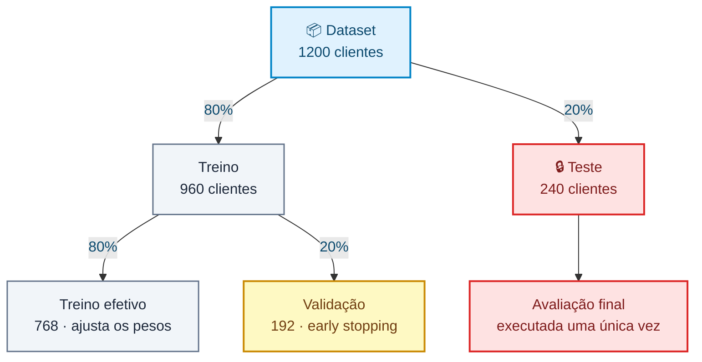

# 🧠 TFJS Credit Risk Classifier

Laboratório didático de classificação de risco de crédito com **Node.js**, **TensorFlow.js** e uma rede neural **MLP (Multilayer Perceptron)**.

Todo o ciclo de um projeto de Machine Learning supervisionado cabe em um único arquivo de código (`index.js`), do dado sintético até a inferência:

```mermaid
flowchart LR
    A(["🎯 Problema"]) --> B["📥 Geração dos dados<br/>1200 clientes sintéticos"]
    B --> B2["📄 CSV<br/>dados brutos em disco"]
    B2 --> C["⚙️ Pré-processamento<br/>normalização 0–1"]
    C --> D["🏋️ Treinamento<br/>MLP 4 → 16 → 8 → 1"]
    D --> E{"📊 Validação<br/>val_loss melhorou?"}
    E -->|"sim — próxima época"| D
    E -->|"não há 5 épocas — early stopping"| F["🧪 Teste<br/>matriz, F1, AUC<br/>e ajuste do limiar"]
    F --> G["💾 Persistência<br/>model.save / loadLayersModel"]
    G --> H(["🔮 Predição"])

    classDef start fill:#e0f2fe,stroke:#0284c7,stroke-width:2px,color:#0c4a6e
    classDef step  fill:#f1f5f9,stroke:#64748b,stroke-width:1.5px,color:#1e293b
    classDef check fill:#fef9c3,stroke:#ca8a04,stroke-width:2px,color:#713f12
    classDef final fill:#dcfce7,stroke:#16a34a,stroke-width:2px,color:#14532d

    class A start
    class B,B2,C,D step
    class E check
    class F,G step
    class H final
```



O laço entre **Treinamento** e **Validação** é o coração do processo: a cada época o modelo é medido em dados que não usou para ajustar pesos, e o *early stopping* corta o ciclo quando essa medida para de melhorar. **Teste**, **Persistência** e **Predição** acontecem uma única vez, depois que o treino terminou.

> ⚠️ Dados **sintéticos**, finalidade **exclusivamente educacional**. Não use para decisões financeiras reais.

---

## 📑 Sumário

- [Objetivo](#-objetivo)
- [Início rápido](#-início-rápido)
- [Testes](#testes)
- [Solução de problemas](#-solução-de-problemas)
- [Features de entrada](#-features-de-entrada)
- [Geração dos dados sintéticos](#-geração-dos-dados-sintéticos)
- [Carregando dados de um CSV](#-carregando-dados-de-um-csv)
- [Arquitetura da rede](#-arquitetura-da-rede)
- [Treinamento](#-treinamento)
- [Divisão dos dados](#-divisão-dos-dados)
- [Matriz de confusão](#-matriz-de-confusão)
- [Precision, recall e F1-score](#-precision-recall-e-f1-score)
- [Curva ROC e AUC](#-curva-roc-e-auc)
- [Ajuste do limiar de decisão](#-ajuste-do-limiar-de-decisão)
- [Inferência](#-inferência)
- [Persistência do modelo](#-persistência-do-modelo)
- [API do módulo](#-api-do-módulo)
- [Exemplo de saída](#-exemplo-de-saída)
- [Gerenciamento de memória](#-gerenciamento-de-memória)
- [Limitações conhecidas](#-limitações-conhecidas)
- [Próximas evoluções](#-próximas-evoluções)

---

## 🎯 Objetivo

Treinar uma rede neural capaz de estimar a probabilidade de um cliente ser de **alto risco** de inadimplência.

A rede recebe quatro características financeiras e devolve **um único número entre `0` e `1`**:

| Saída da rede | Interpretação          | Classificação |
| ------------: | ---------------------- | ------------- |
|        `0.12` | 12% de chance de risco | ✅ BAIXO RISCO |
|        `0.91` | 91% de chance de risco | ⚠️ ALTO RISCO  |

O corte é feito em `0.5`:

```javascript
const DECISION_THRESHOLD = 0.5;

const classify = (probability) =>
  (probability >= DECISION_THRESHOLD ? 'ALTO RISCO' : 'BAIXO RISCO');
```

Esse limiar é uma **escolha de negócio**, não uma verdade do modelo — baixá-lo captura mais inadimplentes ao custo de mais falsos positivos.

---

## 🚀 Início rápido

**Requisitos:** Node.js **20 ou 22** (LTS). O projeto traz um `.nvmrc`, então basta:

```bash
nvm use
```

O `@tensorflow/tfjs-node` baixa binários nativos na instalação — o primeiro `npm install` demora.

> ⛔ **Não use Node 23 ou superior.** Veja [Solução de problemas](#-solução-de-problemas).

```bash
git clone https://github.com/Felps03/tfjs-credit-risk-classifier.git
cd tfjs-credit-risk-classifier
npm install
npm start
```

O dataset (`data/customers.csv`) vem versionado, então ele **não** muda entre execuções. Os pesos iniciais continuam aleatórios, então as métricas variam um pouco a cada rodada — isso é esperado. Para trocar os dados de propósito: `npm run seed`.

### Estrutura

```text
tfjs-credit-risk-classifier/
├── index.js               # dataset, modelo, treino, avaliação, persistência e predição
├── test/
│   └── index.test.js      # testes com o runner nativo do Node
├── package.json
├── package-lock.json
├── .nvmrc                 # versão do Node suportada
├── .gitignore
├── data/
│   └── customers.csv      # dataset versionado, em unidades brutas
├── model/                 # gerado por `npm start` — ignorado pelo git
│   ├── model.json         # topologia + training config
│   └── weights.bin        # pesos e estado do otimizador
└── README.md
```

### Testes

```bash
npm test           # roda a suíte uma vez
npm run test:watch # re-executa a cada alteração
npm run seed       # regenera data/customers.csv com dados novos
```

Os testes usam o **runner nativo do Node** (`node:test` + `node:assert`) — nenhuma dependência de desenvolvimento — e são escritos no formato **Given / When / Then**:

```javascript
it('dada a probabilidade exatamente no limiar, quando classificada, então retorna ALTO RISCO', () => {
  // Given — o corte usa >=, então o limiar pertence à classe positiva
  const probability = DECISION_THRESHOLD;

  // When
  const label = classify(probability);

  // Then
  assert.equal(label, 'ALTO RISCO');
});
```

A suíte cobre o que é determinístico e verificável sem treinar a rede:

| Alvo                   | O que é verificado                                                          |
| ---------------------- | --------------------------------------------------------------------------- |
| `normalizeIncome`      | Piso, teto e meio da faixa mapeiam para `0`, `1` e `0.5`                      |
| `normalizeLatePayments`| `0` atrasos → `0`; máximo de atrasos → `1`                                    |
| `toFeatureVector`      | Vetor esperado, largura 4 e determinismo (proteção contra *skew*)             |
| `classify`             | Comportamento no limiar `0.5`, inclusive logo abaixo dele                     |
| `createDataset`        | Tamanho, features dentro de `[0, 1]`, rótulos binários, ambas as classes presentes |
| `createCustomers` / `toDataset` | Unidades brutas dentro das faixas, rótulos binários e equivalência com `createDataset` |
| `toCsv`                | Cabeçalho, contagem de linhas e precisão por coluna (inteiros saem inteiros)   |
| `writeCustomersCsv` / `readCustomersCsv` | Criação da pasta, ida e volta dos valores, parse numérico, colunas fora de ordem e arquivo inexistente |
| `ensureCsv`            | Cria quando falta, **não altera** quando já existe, e sobrescreve só na chamada explícita |
| `loadDatasetCsv`       | Formato igual ao de `createDataset`, features em `[0, 1]`, mesma `toFeatureVector` e treino rodando a partir do arquivo |
| `splitDataset`         | Proporções, nada perdido e **ausência de sobreposição entre treino e teste**  |
| `buildModel`           | 3 camadas, entrada `[null, 4]`, saída `[null, 1]`, **225 parâmetros**, ativações e loss |
| `computeConfusionMatrix` | TP/TN/FP/FN contra predições conhecidas, layout da matriz, efeito do limiar, coerência com a `accuracy` do `evaluate` e ausência de vazamento de tensores |
| `formatConfusionMatrix` | Estrutura da tabela, as quatro contagens presentes e colunas alinhadas |
| `computeMetrics` | Fórmulas contra cálculo manual, F1 conferido pelas duas formas, casos degenerados sem `NaN` e a média harmônica abaixo da aritmética |
| `formatMetrics` | Uma linha por métrica, valores com 4 casas decimais |
| `computeRocCurve` | AUC de classificadores perfeito/invertido/aleatório, coerência com Mann-Whitney, invariância a reescala monotônica, monotonicidade dos pontos, empates agrupados e classe única sem divisão por zero |
| `formatRocCurve` | Estrutura do gráfico, largura da área, curva, diagonal e marcador do limiar |
| `chooseThresholdByYouden` | Maximização de `TPR - FPR` e corte sem erros no classificador perfeito |
| `chooseThresholdByCost` | Custo mínimo global, corte que desce com FN caro, divergência em relação a Youden, recusa total quando FP é proibitivo e confirmação na matriz recomputada |
| `formatTable` / `formatThresholdComparison` | Alinhamento com larguras variadas, estrutura da tabela e limiar infinito legível |
| `saveModel` / `loadModel` | Arquivos gerados, `trainingConfig` gravado, arquitetura preservada, **predição idêntica** após recarregar, modelo já compilado e treino retomável |

### 🩺 Solução de problemas

**`TypeError: (0 , util_1.isNullOrUndefined) is not a function`**

Você está em um Node novo demais. O **Node 23 removeu** os type-checkers legados do módulo `util` (depreciados desde o Node 4), e o `@tensorflow/tfjs-node@4.22.0` ainda os utiliza em 5 pontos do backend nativo.

| Node | `util.isNullOrUndefined` | Projeto |
| ---- | ------------------------ | ------- |
| 20 (LTS)  | presente  | ✅ funciona |
| 22 (LTS)  | presente  | ✅ funciona |
| 23        | removido  | ❌ quebra   |
| 24 (LTS)  | removido  | ❌ quebra   |

O `tfjs-node` não recebe release desde **janeiro de 2025**, e o `4.23.0-rc.0` mantém as mesmas chamadas — não há correção upstream. Por isso o projeto fixa **Node 22** no `.nvmrc` e declara `"engines": { "node": ">=20.0.0 <23.0.0" }`.

Solução:

```bash
nvm install 22 && nvm use
rm -rf node_modules package-lock.json && npm install
```

---

## 📥 Features de entrada

O cliente é descrito por quatro campos brutos:

| Campo               | Descrição                           | Faixa gerada     |
| ------------------- | ----------------------------------- | ---------------- |
| `income`            | Renda mensal do cliente             | `2.000 – 15.000` |
| `debtRatio`         | Percentual de endividamento         | `0.0 – 1.0`      |
| `latePayments`      | Quantidade de pagamentos atrasados  | `0 – 5`          |
| `creditUtilization` | Percentual de utilização do crédito | `0.0 – 1.0`      |

Dois deles precisam ser **normalizados** antes de entrar na rede, para que todas as features fiquem na mesma escala (`0` a `1`) e nenhuma domine o gradiente só por ter números maiores:

```javascript
const normalizeIncome = (income) => (income - INCOME_MIN) / INCOME_RANGE;

const normalizeLatePayments = (latePayments) => latePayments / MAX_LATE_PAYMENTS;
```

`debtRatio` e `creditUtilization` já nascem entre `0` e `1` e vão direto.

O vetor que a rede realmente enxerga é montado por uma única função:

```javascript
const toFeatureVector = ({
  income,
  debtRatio,
  latePayments,
  creditUtilization,
}) => [
  normalizeIncome(income),
  debtRatio,
  normalizeLatePayments(latePayments),
  creditUtilization,
];
```

> 🔑 `toFeatureVector` é a **fonte única de verdade** da normalização: quem a chama é tanto a geração do dataset quanto a inferência do cliente novo. Duplicar essa lógica em dois lugares é a origem clássica do *training-serving skew* — o modelo passa a receber, em produção, números em escala diferente da que viu no treino.

> 💡 Aqui as constantes de normalização (`2000`, `13000`, `5`) são conhecidas de antemão porque nós geramos os dados. **Em um projeto real elas devem ser calculadas apenas no conjunto de treino** e depois reaplicadas em validação/teste — caso contrário há vazamento de dados (*data leakage*).

---

## 🧪 Geração dos dados sintéticos

O projeto cria automaticamente **1.200 clientes** com características aleatórias. Para cada um, uma regra determinística define o rótulo:

```javascript
const riskScore =
  1.4 * debtRatio +
  1.2 * latePaymentsNormalized +
  1.0 * creditUtilization -
  0.8 * incomeNormalized;

const highRisk = riskScore > RISK_RULE_THRESHOLD ? 1 : 0;  // 1.35 · 0 = baixo, 1 = alto
```

**A rede neural nunca vê essa fórmula.** Ela recebe só as quatro features e os rótulos `0`/`1`, e precisa descobrir sozinha o padrão a partir dos exemplos. É exatamente por isso que a acurácia alta no teste é um resultado interessante: significa que a MLP reconstruiu, nos seus pesos, uma aproximação da regra escondida.

---

## 📄 Carregando dados de um CSV

Gerar o dataset em memória é conveniente, mas esconde a etapa que todo projeto real tem: **os dados chegam de um arquivo**. O pipeline agora passa por disco — o CSV é escrito uma vez e, a partir dele, tudo é lido.

```javascript
ensureCsv();                              // cria só se ainda não existir
const dataset = await loadDatasetCsv();   // daqui em diante, vem do arquivo
```

### O CSV guarda dados BRUTOS

Esta é a decisão que sustenta a seção inteira:

```text
income,debtRatio,latePayments,creditUtilization,risk
11465.21,0.764368,0,0.941555,1
4230.33,0.640292,1,0.280455,0
```

Renda em reais, atrasos em contagem — **não** os valores normalizados. Salvar já normalizado congelaria `INCOME_MIN` e `INCOME_RANGE` dentro do arquivo: qualquer ajuste na normalização exigiria reexportar tudo, e um CSV antigo lido com constantes novas produziria features silenciosamente erradas.

Com dados brutos, o arquivo é a **fonte**, e a normalização continua sendo do código.

### A refatoração que isso exigiu

Antes, `createDataset` gerava clientes brutos e os descartava, devolvendo só as features normalizadas. Para exportar, foi preciso separar as duas responsabilidades:

| Função | Devolve |
| ------ | ------- |
| `createCustomers` | Clientes em unidades brutas — `{ income, debtRatio, latePayments, creditUtilization, risk }` |
| `toDataset` | Clientes → `{ features, labels }` prontos para o TensorFlow |
| `createDataset` | `toDataset(createCustomers(total))` — a API antiga, intacta |

O ganho: **um só caminho de normalização**, seja o dado gerado em memória ou lido do arquivo.

```javascript
const loadDatasetCsv = async (filePath = CSV_PATH) =>
  toDataset(await readCustomersCsv(filePath));
```

`loadDatasetCsv` devolve exatamente o mesmo formato de `createDataset` — `splitDataset` e o treino funcionam sem qualquer adaptação.

### Lendo com tf.data.csv

O `tfjs-node` registra o esquema `file://` também aqui:

```javascript
const dataset = tf.data.csv(`file://${path.resolve(filePath)}`, {
  columnConfigs: { risk: { isLabel: true } },
});

const rows = await dataset.toArray();
```

Dois comportamentos úteis: o parse numérico já vem pronto (nada de `parseFloat`), e as colunas são casadas **pelo nome**, não pela posição — um CSV com as colunas em outra ordem carrega igual. Há teste para isso.

### Precisão é uma escolha

CSV é texto, então cada coluna grava um número fixo de casas:

```javascript
const CSV_PRECISION = {
  income: 2,          // centavos bastam para renda
  debtRatio: 6,
  latePayments: 0,    // contagem, não fração
  creditUtilization: 6,
  risk: 0,
};
```

Isso mantém o arquivo legível e evita `3.0000000000000004` em uma coluna de contagem. Em troca, a ida e volta **não é bit a bit** — é por isso que o teste de round-trip compara com tolerância explícita em vez de igualdade, ao contrário do teste de [persistência do modelo](#-persistência-do-modelo), onde os pesos voltam idênticos.

### O arquivo é versionado

`data/customers.csv` **está no repositório** (36 KB). É o que dá ao laboratório algo que ele não tinha: um dataset **estável**.

Antes, cada execução sorteava 1200 clientes novos, então os números do README nunca batiam com os da sua tela. Agora o dataset é o mesmo — o que varia entre execuções é só a inicialização dos pesos.

Para isso funcionar, a geração precisa ser **idempotente**:

```javascript
const ensureCsv = (filePath = CSV_PATH, total = 1200) => {
  if (fs.existsSync(filePath)) {
    return { path: filePath, created: false };
  }

  writeCustomersCsv(createCustomers(total), filePath);

  return { path: filePath, created: true };
};
```

Sem esse `existsSync`, versionar o CSV seria um incômodo: todo `npm start` reescreveria o arquivo e deixaria 1200 linhas de diff aleatório no `git status`.

| Comando | Efeito no CSV |
| ------- | ------------- |
| `npm start` | Usa o que está lá; só cria se o arquivo faltar |
| `npm run seed` | **Regenera** com dados novos — mudança deliberada, que você commita se quiser |

Um dataset real — que você recebe em vez de gerar — entraria exatamente aqui, e o `createCustomers` sairia do caminho.

---

## 🧠 Arquitetura da rede

Uma **MLP** com duas camadas ocultas:


Total: **225 parâmetros treináveis** — é o que o `model.summary()` imprime ao rodar.

```javascript
const buildModel = () => {
  const model = tf.sequential();

  model.add(tf.layers.dense({ inputShape: [4], units: 16, activation: 'relu' }));
  model.add(tf.layers.dense({ units: 8, activation: 'relu' }));
  model.add(tf.layers.dense({ units: 1, activation: 'sigmoid' }));

  model.compile({
    optimizer: tf.train.adam(0.001),
    loss: 'binaryCrossentropy',
    metrics: ['accuracy'],
  });

  return model;
};
```

| Escolha       | Por quê                                                                                   |
| ------------- | ----------------------------------------------------------------------------------------- |
| **ReLU**      | Introduz não-linearidade barata e evita o desaparecimento de gradiente das camadas ocultas |
| **Sigmoid**   | Garante uma saída em `[0, 1]`, legível como probabilidade                                  |
| **16 → 8**    | Funil: capacidade suficiente para o padrão, pequena o bastante para não decorar o dataset  |

O `main()` chama `model.summary()` logo após construir o modelo, então a contagem de parâmetros por camada aparece no início de cada execução.

---

## ⚙️ Treinamento

```javascript
model.compile({
  optimizer: tf.train.adam(0.001),
  loss: 'binaryCrossentropy',
  metrics: ['accuracy'],
});

await model.fit(xTrain, yTrain, {
  epochs: 40,
  batchSize: 32,
  validationSplit: 0.2,
  shuffle: true,
  callbacks: [
    tf.callbacks.earlyStopping({ monitor: 'val_loss', patience: 5 }),
  ],
});
```

| Parâmetro            | Valor                  | Papel                                                            |
| -------------------- | ---------------------- | ---------------------------------------------------------------- |
| **Optimizer**        | Adam (`lr = 0.001`)    | Ajusta os pesos com taxa de aprendizado adaptativa por parâmetro  |
| **Loss**             | `binaryCrossentropy`   | Função de erro padrão para classificação binária (`0` ou `1`)     |
| **Métrica**          | `accuracy`             | Percentual de acertos — legível para humanos, não usada no treino |
| **Epochs**           | 40 (máximo)            | Quantas vezes o dataset inteiro passa pela rede                   |
| **Batch size**       | 32                     | Exemplos processados antes de cada atualização de pesos           |
| **Validation split** | 20% do treino          | Fatia usada só para medir generalização durante o treino          |
| **Shuffle**          | `true`                 | Embaralha a cada época, evitando que a ordem vire um viés         |

### ⏹️ Early Stopping

O treino monitora a `val_loss` e **para sozinho** se ela não melhorar por 5 épocas seguidas (`patience: 5`) — ou seja, raramente chega às 40 épocas.

É a defesa contra **overfitting**: o momento em que o modelo continua melhorando no treino enquanto piora na validação, porque passou a decorar exemplos em vez de aprender o padrão.

---

## 📊 Divisão dos dados



```javascript
const splitDataset = ({ features, labels }, trainRatio = 0.8) => {
  const trainSize = Math.floor(features.length * trainRatio);

  return {
    trainFeatures: features.slice(0, trainSize),
    trainLabels: labels.slice(0, trainSize),
    testFeatures: features.slice(trainSize),
    testLabels: labels.slice(trainSize),
  };
};
```

A segunda divisão — treino efetivo vs. validação — não aparece aqui: quem faz é o próprio `model.fit()`, via `validationSplit: 0.2`.

O conjunto de **teste nunca participa do treinamento nem do early stopping**. Ele é a única medida honesta de como o modelo se comporta com dados que jamais viu, e a suíte de testes verifica que não há sobreposição entre as duas fatias.

---

## 🧮 Matriz de confusão

A `accuracy` diz **quanto** o modelo acerta. A matriz de confusão diz **como ele erra** — e em risco de crédito os dois erros custam coisas muito diferentes:

| Erro | O que aconteceu | Custo real |
| ---- | --------------- | ---------- |
| **Falso positivo (FP)** | Cliente bom classificado como alto risco | Crédito negado a quem pagaria → receita perdida |
| **Falso negativo (FN)** | Cliente ruim classificado como baixo risco | Crédito concedido a quem não paga → prejuízo direto |

Uma acurácia de 96% pode esconder qualquer distribuição entre esses dois. Só a matriz separa.

### Como é calculada

```javascript
const computeConfusionMatrix = (model, xTest, yTest, threshold = DECISION_THRESHOLD) =>
  tf.tidy(() => {
    const probabilities = model.predict(xTest);

    const predicted = probabilities.greaterEqual(threshold).cast('int32').reshape([-1]);
    const actual = yTest.cast('int32').reshape([-1]);

    const [[trueNegatives, falsePositives], [falseNegatives, truePositives]] =
      tf.math.confusionMatrix(actual, predicted, 2).arraySync();

    return { truePositives, trueNegatives, falsePositives, falseNegatives, /* ... */ };
  });
```

O `tf.math.confusionMatrix` do core (não confundir com o `tfvis.render.confusionMatrix`, que é de navegador) devolve um tensor `2×2` em que **a linha é a classe real e a coluna é a predita**:

```text
[[TN, FP],
 [FN, TP]]
```

Todo o cálculo roda dentro de `tf.tidy()`, então nenhum tensor intermediário sobrevive à chamada — a função devolve apenas números.

### O papel do limiar

Repare no parâmetro `threshold`. **A matriz depende do limiar de decisão; a `loss` não.**

O modelo devolve sempre a mesma probabilidade — o que muda é onde você corta. Subir o corte de `0.5` para `0.7` torna o classificador mais exigente: menos falsos positivos, mais falsos negativos. É exatamente esse trade-off que a matriz torna visível, e ele se ajusta **sem retreinar nada**:

```javascript
computeConfusionMatrix(model, xTest, yTest, 0.7); // mais conservador na aprovação
```

Por isso o limiar é uma decisão de negócio: quem escolhe é o custo relativo de FP e FN, não o modelo.

### Saída

```text
Matriz de confusão (limiar 0.5):
           | Predito BAIXO | Predito ALTO
-----------+---------------+-------------
Real BAIXO |      112 (TN) |       2 (FP)
Real ALTO  |        1 (FN) |     125 (TP)
```

A diagonal principal (TN e TP) são os acertos; fora dela, os erros. Uma checagem útil: `(TP + TN) / total` tem que reproduzir a `accuracy` do `evaluate` — no exemplo acima, `(125 + 112) / 240 = 0.9875`. A suíte de testes verifica justamente isso.

---

## 📏 Precision, recall e F1-score

A matriz mostra os erros; estas três métricas os **resumem em números comparáveis**. Todas derivam direto das mesmas contagens — nenhuma predição nova é feita:

| Métrica | Fórmula | Pergunta que responde |
| ------- | ------- | --------------------- |
| **Precision** | `TP / (TP + FP)` | Dos que o modelo marcou como ALTO RISCO, quantos eram de fato? |
| **Recall** | `TP / (TP + FN)` | Dos clientes que eram ALTO RISCO, quantos o modelo pegou? |
| **F1-score** | `2 · (P · R) / (P + R)` | Média harmônica das duas |

```javascript
const computeMetrics = ({ truePositives, falsePositives, falseNegatives }) => {
  const precision = safeDivide(truePositives, truePositives + falsePositives);
  const recall = safeDivide(truePositives, truePositives + falseNegatives);

  return {
    precision,
    recall,
    f1Score: safeDivide(2 * precision * recall, precision + recall),
  };
};
```

### Por que as três juntas

Cada uma isolada é **trivialmente manipulável**:

| Estratégia degenerada | Precision | Recall | F1 |
| --------------------- | --------- | ------ | -- |
| Marcar como ALTO RISCO só o caso mais óbvio | ~`1.00` | ~`0.01` | ~`0.02` |
| Marcar **todo mundo** como ALTO RISCO | baixa | `1.00` | baixa |

O F1 é **média harmônica**, não aritmética, exatamente por isso: ela é puxada pelo menor dos dois valores. Com precision `0.25` e recall `1.00`, a média aritmética daria `0.62` — o F1 dá `0.40`. Um modelo só consegue F1 alto quando acerta **nas duas pontas**.

### Divisão por zero

Um lote sem nenhum positivo previsto zeraria o denominador da precision. O projeto segue a convenção do scikit-learn (`zero_division=0`) — denominador zero vira `0`, nunca `NaN`:

```javascript
const safeDivide = (numerator, denominator) =>
  (denominator === 0 ? 0 : numerator / denominator);
```

Sem isso, um único lote degenerado contamina o relatório inteiro com `NaN`.

### Saída

```text
Precision: 0.9643 - dos marcados como ALTO RISCO, quantos eram
Recall:    0.9818 - dos que eram ALTO RISCO, quantos foram pegos
F1-score:  0.9730 - média harmônica entre precision e recall
```

Conferindo contra a matriz da seção anterior: `108 / (108 + 4) = 0.9643` e `108 / (108 + 2) = 0.9818`.

### E o limiar, de novo

Como precision e recall vêm da matriz, **elas herdam a dependência do limiar**. Subir o corte tipicamente sobe a precision e derruba o recall; baixá-lo faz o contrário. Escolher o corte é escolher onde parar nessa gangorra — e é isso que a **curva ROC**, próximo item da lista, permite fazer visualmente em vez de no chute.

---

## 📈 Curva ROC e AUC

Matriz, precision e recall descrevem **um** limiar. A curva ROC descreve **todos**.

Cada ponto da curva é um corte possível, com o que ele entrega e o que ele custa:

| Eixo | Nome | Fórmula | Leitura |
| ---- | ---- | ------- | ------- |
| Y | **TPR** (recall) | `TP / (TP + FN)` | Quanto do risco real o modelo captura |
| X | **FPR** | `FP / (FP + TN)` | Quanto de cliente bom ele queima no caminho |

A **AUC** — área sob a curva — resume tudo em um número e, por ser calculada sobre a curva inteira, **não depende do limiar**. Ela mede a capacidade de **ordenar**: é a probabilidade de um cliente de alto risco receber score maior que um de baixo risco.

| AUC | Significado |
| --- | ----------- |
| `1.00` | Separação perfeita — todo positivo pontua acima de todo negativo |
| `0.50` | Moeda: o score não ordena nada |
| `0.00` | Ordenação invertida (o modelo sabe separar, só trocou os rótulos) |

### Como é calculada

Não existe AUC no `@tensorflow/tfjs-node` — `tf.math` só expõe `confusionMatrix`. O cálculo é feito na mão, em três passos:

```javascript
// 1. Ordena do score mais alto para o mais baixo. Descer nessa lista
//    é ir afrouxando o limiar.
const ranked = scores
  .map((score, index) => ({ score, label: actuals[index] }))
  .sort((a, b) => b.score - a.score);

// 2. Acumula TP e FP a cada passo, registrando um ponto (FPR, TPR).
//    Scores empatados viram um único ponto: nenhum limiar os separa.
if (isLast || score !== ranked[index + 1].score) {
  points.push({ fpr: falsePositives / negatives, tpr: truePositives / positives, threshold: score });
}

// 3. Integra por trapézios — a curva é linear entre pontos consecutivos.
const auc = points.slice(1).reduce((total, point, index) => {
  const previous = points[index];

  return total + ((point.fpr - previous.fpr) * (point.tpr + previous.tpr)) / 2;
}, 0);
```

O tratamento de empates não é detalhe: sem ele a AUC fica dependente da ordem em que os dados chegaram. Com ele, o resultado coincide com a definição de **Mann-Whitney** (empate vale meio ponto) — e a suíte de testes compara as duas formas justamente para travar isso.

### Saída

```text
Curva ROC (O = limiar 0.5, . = aleatório):
    TPR
1.0 | O**************************************|
    |                                 ...    |
    |                              ...       |
    |                           ...          |
    |                       ....             |
0.5 |                    ...                 |
    |                 ...                    |
    |              ...                       |
    |          ....                          |
    |       ...                              |
    |    ...                                 |
    |*...                                    |
0.0 +----------------------------------------+
    0.0                               FPR 1.0
AUC: 0.9999
```

- `*` é a curva, `.` é a diagonal do classificador aleatório (`AUC = 0.5`);
- `O` marca **onde o limiar `0.5` colocou o modelo** na curva — o elo entre esta seção e a matriz de confusão;
- quanto mais a curva se descola da diagonal rumo ao canto superior esquerdo, maior a AUC.

### Por que a AUC não substitui as outras métricas

AUC alta significa que o modelo **ordena bem** — não que o limiar em uso é o certo. Um modelo com AUC `0.99` ainda pode estar operando num corte péssimo, com recall alto e precision no chão. A AUC diz que existe um bom ponto na curva; **escolher** esse ponto continua sendo decisão de negócio, guiada pelo custo relativo de FP e FN.

É por isso que as quatro medidas convivem no relatório:

| Medida | Depende do limiar? | Responde |
| ------ | ------------------ | -------- |
| `loss` | ❌ | Quão calibradas estão as probabilidades |
| Matriz / precision / recall / F1 | ✅ | Como o modelo se comporta **no corte escolhido** |
| AUC | ❌ | Quão bem o modelo **ordena**, em qualquer corte |

---

## 🧭 Ajuste do limiar de decisão

Até aqui o corte era **herdado**: `0.5`, porque é o meio do intervalo. Com a curva na mão dá para **escolhê-lo** — e há dois critérios, que respondem a perguntas diferentes.

### Youden: o melhor ponto quando os erros custam igual

O índice de Youden é `J = TPR - FPR` — geometricamente, o ponto da curva **mais distante da diagonal**:

```javascript
const chooseThresholdByYouden = (roc) => roc.points
  .map((point) => ({ ...point, youdenJ: point.tpr - point.fpr }))
  .reduce((best, point) => (point.youdenJ > best.youdenJ ? point : best));
```

É a referência neutra. E é o critério **errado** para crédito, porque parte de uma hipótese que não se sustenta: que recusar um bom pagador dói tanto quanto aprovar um inadimplente.

### Menor custo esperado: o critério que leva o negócio em conta

```javascript
const FALSE_POSITIVE_COST = 1;  // cliente bom recusado → receita perdida
const FALSE_NEGATIVE_COST = 5;  // cliente ruim aprovado → prejuízo direto
```

Números do laboratório — o que importa é a **razão** entre eles. Com FN valendo 5× FP, o corte ótimo desce: vale aceitar mais alarmes falsos para não deixar passar inadimplente.

Para pôr preço nos erros é preciso converter as **taxas** da curva de volta em **contagens absolutas** — por isso `computeRocCurve` devolve também `positives` e `negatives`:

```javascript
const scorePoint = (point, { positives, negatives }, costs) => {
  const falsePositives = Math.round(point.fpr * negatives);
  const falseNegatives = Math.round((1 - point.tpr) * positives);

  return {
    ...point,
    falsePositives,
    falseNegatives,
    cost: falsePositives * costs.falsePositive + falseNegatives * costs.falseNegative,
  };
};
```

### Saída

```text
Ajuste do limiar (FP custa 1, FN custa 5):
Estratégia     | Limiar |    FPR |    TPR | FP | FN | Custo
---------------+--------+--------+--------+----+----+------
Padrão (0.5)   | 0.5000 | 0.0492 | 0.9576 |  6 |  5 |    31
Youden (max J) | 0.4027 | 0.0492 | 0.9915 |  6 |  1 |    11
Menor custo    | 0.2993 | 0.0738 | 1.0000 |  9 |  0 |     9

Matriz no limiar escolhido (0.2993):
           | Predito BAIXO | Predito ALTO
-----------+---------------+-------------
Real BAIXO |      113 (TN) |       9 (FP)
Real ALTO  |        0 (FN) |     118 (TP)
```

Duas leituras dessa tabela:

1. **O corte herdado era caro.** Sair de `0.5` derrubou o custo de `31` para `9` — sem retreinar nada. A rede é a mesma; só a régua mudou.
2. **Youden e custo discordam, e a discordância faz sentido.** Youden para em `0.4027`, onde o ganho de TPR começa a não compensar o de FPR *em taxa*. O critério de custo continua descendo até `0.2993`: aceita **3 falsos positivos a mais** para eliminar o **último falso negativo** — troca que só é boa porque FN vale 5×. A `0.5` no numerário do problema, Youden pararia no mesmo lugar.

O efeito da razão de custos, isolado numa curva difícil:

| Critério | Limiar | FPR | TPR | FP | FN | Custo |
| -------- | ------ | --- | --- | -- | -- | ----- |
| Youden | `0.5000` | `0.4286` | `1.0000` | 3 | 0 | 3 |
| Menor custo, `FN = 1` | `0.9000` | `0.0000` | `0.3333` | 0 | 2 | 2 |
| Menor custo, `FN = 20` | `0.5000` | `0.4286` | `1.0000` | 3 | 0 | 3 |

Com FN barato o corte **sobe** (aprova pouco, erra pouco por excesso); com FN caro **desce** até capturar todos os positivos. Youden fica no mesmo lugar nos dois casos, porque não enxerga custo nenhum.

### O caso extremo

Se o falso positivo for proibitivo, o ponto `(0, 0)` da curva — **não aprovar ninguém** — é um candidato legítimo, e o `threshold` sai como `Infinity`. A tabela imprime `(nenhum)` em vez de `Infinity`, e o comportamento está coberto por teste. Um classificador que se recusa a classificar é uma resposta válida quando o erro custa caro o suficiente.

### O que isso muda no projeto

O `DECISION_THRESHOLD = 0.5` continua sendo o corte da inferência: a escolha do limiar é **exibida como recomendação**, não aplicada automaticamente. Trocar o corte em produção é decisão de quem responde pelo custo — o código entrega a evidência, não a decisão.

---

## 🔮 Inferência

Um cliente novo passa pela **mesma normalização** usada no treino:

```javascript
const newCustomer = {
  income: 3500,
  debtRatio: 0.72,
  latePayments: 3,
  creditUtilization: 0.88,
};

const input = tf.tensor2d([toFeatureVector(newCustomer)]);

const prediction  = model.predict(input);
const probability = prediction.dataSync()[0];

console.log('Classificação:', classify(probability));
```

Repare que é **a mesma `toFeatureVector`** usada na geração do dataset — não há uma segunda cópia da fórmula de normalização no caminho da inferência.

Renda baixa, endividamento alto, atrasos e crédito quase estourado — o modelo deve devolver uma probabilidade próxima de `1`.

---

## 💾 Persistência do modelo

Treinar a rede toda vez que o processo sobe é inviável fora de um laboratório. Depois de avaliar, o `main` grava o modelo em disco e o recarrega para provar que nada se perdeu no caminho.

### Salvar

O `@tensorflow/tfjs-node` registra o esquema `file://`, então `model.save` escreve direto no sistema de arquivos:

```javascript
const MODEL_DIR = path.join(__dirname, 'model');

await model.save(`file://${MODEL_DIR}`, { includeOptimizer: true });
```

Dois arquivos são gerados na pasta:

| Arquivo | Conteúdo |
| ------- | -------- |
| `model.json` | Topologia das camadas, metadados e o `trainingConfig` (loss, métricas e otimizador) |
| `weights.bin` | Os pesos em binário — e, com `includeOptimizer`, também os momentos do Adam |

O `includeOptimizer: true` é o detalhe que costuma escapar. **Sem ele**, o modelo recarregado volta *sem compilação*: `predict` funciona, mas `evaluate` e `fit` quebram até você chamar `compile` de novo. **Com ele**, o estado do otimizador (`iter`, `m`, `v`) viaja junto e o treino pode ser retomado exatamente de onde parou.

### Recarregar

```javascript
const model = await tf.loadLayersModel(`file://${MODEL_DIR}/model.json`);
```

Repare no caminho: para **salvar** aponta-se a **pasta**; para **carregar**, o arquivo **`model.json`**.

O `loadModel` do projeto ainda mantém uma rede de segurança — se o artefato tiver vindo sem otimizador, ele recompila com a mesma configuração do treino:

```javascript
const loadModel = async (dir = MODEL_DIR) => {
  const model = await tf.loadLayersModel(`${toFileUrl(dir)}/model.json`);

  if (!model.optimizer) {
    compileModel(model);
  }

  return model;
};
```

É por isso que `compileModel` foi extraída de `buildModel`: a configuração de compilação existe em um só lugar e serve tanto para o modelo novo quanto para o restaurado — o mesmo princípio de fonte única que vale para a normalização.

### Como o projeto verifica que funcionou

O `main` executa o ciclo completo — salva, dá `dispose` no modelo original, recarrega e mede de novo:

```javascript
await saveModel(model);
model.dispose();

const loadedModel = await loadModel();

evaluateModel(loadedModel, xTest, yTest); // mesmas loss e accuracy
predictRisk(loadedModel, newCustomer);    // mesma probabilidade, bit a bit
```

A comparação é por igualdade exata, não por tolerância: os pesos lidos do disco são os mesmos bytes que estavam na memória, então a probabilidade tem que bater até o último dígito. Se divergir, algo se perdeu na serialização.

> ⚠️ O que **não** é salvo junto: as constantes de normalização (`INCOME_MIN`, `INCOME_RANGE`, `MAX_LATE_PAYMENTS`). Elas vivem no código. Em produção, o pré-processamento precisa ser versionado junto com o modelo — carregar pesos novos com normalização antiga é uma das formas mais silenciosas de training-serving skew.

A pasta `/model/` está no `.gitignore`: artefato de build, não código-fonte.

---

## 🧩 API do módulo

O `index.js` só executa o treino quando chamado direto (`node index.js`); ao ser importado, apenas expõe suas funções:

```javascript
if (require.main === module) {
  main();
}
```

É isso que permite testar as partes sem treinar a rede. O que ele exporta:

| Export | Tipo | Papel |
| ------ | ---- | ----- |
| `INCOME_MIN`, `INCOME_RANGE`, `MAX_LATE_PAYMENTS` | constantes | Faixas usadas na normalização |
| `RISK_RULE_THRESHOLD` | constante | Corte `1.35` da regra que gera os rótulos |
| `DECISION_THRESHOLD` | constante | Corte `0.5` do classificador |
| `normalizeIncome`, `normalizeLatePayments` | função | Normalizações min-max individuais |
| `toFeatureVector` | função | Cliente bruto → vetor de 4 features |
| `classify` | função | Probabilidade → `'ALTO RISCO'` / `'BAIXO RISCO'` |
| `MODEL_DIR` | constante | Pasta `./model` onde o modelo é persistido |
| `CSV_PATH`, `CSV_COLUMNS`, `CSV_LABEL_COLUMN`, `CSV_PRECISION` | constantes | Caminho, esquema e precisão do arquivo |
| `createCustomers` | função | Gera clientes em unidades brutas, com `risk` |
| `toDataset` | função | Clientes brutos → `{ features, labels }` |
| `createDataset` | função | Gera `{ features, labels }` sintéticos |
| `toCsv` | função | Clientes → texto CSV |
| `writeCustomersCsv` | função | Grava o CSV, criando a pasta se preciso |
| `ensureCsv` | função | Cria o CSV só se ele não existir → `{ path, created }` |
| `readCustomersCsv` | função async | Lê o CSV via `tf.data.csv` → clientes brutos |
| `loadDatasetCsv` | função async | CSV → `{ features, labels }` normalizados |
| `splitDataset` | função | Divide em treino e teste |
| `compileModel` | função | Aplica optimizer, loss e métricas a um modelo |
| `buildModel` | função | Monta e compila a MLP |
| `saveModel` | função async | Salva o modelo em `file://<dir>` com o otimizador |
| `loadModel` | função async | Carrega de `model.json` e garante que vem compilado |
| `predictRisk` | função | Cliente bruto → probabilidade, já liberando os tensores |
| `computeConfusionMatrix` | função | `{ truePositives, trueNegatives, falsePositives, falseNegatives, matrix }` |
| `formatConfusionMatrix` | função | Matriz → tabela alinhada para o terminal |
| `computeMetrics` | função | Matriz → `{ precision, recall, f1Score }` |
| `formatMetrics` | função | Métricas → três linhas comentadas para o terminal |
| `computeRocCurve` | função | `{ points: [{ fpr, tpr, threshold }], auc }` varrendo todos os limiares |
| `formatRocCurve` | função | Pontos → gráfico ASCII, com marcador opcional do limiar |
| `FALSE_POSITIVE_COST`, `FALSE_NEGATIVE_COST` | constantes | Custos relativos dos dois erros (`1` e `5`) |
| `scorePoint` | função | Ponto da curva → contagens absolutas e custo |
| `chooseThresholdByYouden` | função | Corte que maximiza `TPR - FPR` |
| `chooseThresholdByCost` | função | Corte de menor custo esperado |
| `formatTable` | função | Cabeçalho + linhas → tabela alinhada |
| `formatThresholdComparison` | função | Candidatos → tabela comparativa de limiares |
| `evaluateModel` | função | Roda `evaluate` e devolve `{ loss, accuracy }` |
| `main` | função async | Pipeline completo: treina, avalia, salva, recarrega e prevê |

---

## 📤 Exemplo de saída

```text
Dataset lido de: /caminho/do/projeto/data/customers.csv
Clientes lidos do CSV: 1200

Test loss: 0.1439
Test accuracy: 0.9750

Matriz de confusão (limiar 0.5):
           | Predito BAIXO | Predito ALTO
-----------+---------------+-------------
Real BAIXO |      126 (TN) |       4 (FP)
Real ALTO  |        2 (FN) |     108 (TP)

Precision: 0.9643 - dos marcados como ALTO RISCO, quantos eram
Recall:    0.9818 - dos que eram ALTO RISCO, quantos foram pegos
F1-score:  0.9730 - média harmônica entre precision e recall

Curva ROC (O = limiar 0.5, . = aleatório):
    TPR
1.0 | O**************************************|
    |                                 ...    |
    |                           ......       |
    |                     ......             |
0.5 |               ......                   |
    |         ......                         |
    |   ......                               |
    |*..                                     |
0.0 +----------------------------------------+
    0.0                               FPR 1.0
AUC: 0.9985

Ajuste do limiar (FP custa 1, FN custa 5):
Estratégia     | Limiar |    FPR |    TPR | FP | FN | Custo
---------------+--------+--------+--------+----+----+------
Padrão (0.5)   | 0.5000 | 0.0492 | 0.9576 |  6 |  5 |    31
Youden (max J) | 0.4027 | 0.0492 | 0.9915 |  6 |  1 |    11
Menor custo    | 0.2993 | 0.0738 | 1.0000 |  9 |  0 |     9

Matriz no limiar escolhido (0.2993):
           | Predito BAIXO | Predito ALTO
-----------+---------------+-------------
Real BAIXO |      113 (TN) |       9 (FP)
Real ALTO  |        0 (FN) |     118 (TP)

Probabilidade de alto risco: 0.9999
Classificação: ALTO RISCO

Modelo salvo em: /caminho/do/projeto/model
Modelo recarregado — test loss: 0.1439
Modelo recarregado — test accuracy: 0.9750
Modelo recarregado — probabilidade: 0.9999
Mesma predição do modelo original? sim
```

Os valores exatos não importam. O que se observa é o **comportamento**:

- ✅ `loss` de treino diminui ao longo das épocas;
- ✅ `val_loss` acompanha (se subir enquanto a de treino cai → overfitting);
- ✅ `accuracy` sobe;
- ✅ a acurácia de teste fica próxima da de validação → o modelo **generalizou**;
- ✅ as métricas antes e depois do `save`/`load` são **idênticas** → a persistência não perdeu nada;
- ✅ a diagonal da matriz concentra as contagens, e `(TP + TN) / total` reproduz a acurácia;
- ✅ precision e recall ficam próximas → o modelo não está trocando um erro pelo outro;
- ✅ a curva ROC se descola da diagonal e a AUC fica bem acima de `0.5` → o score **ordena** os clientes;
- ✅ o limiar sugerido custa menos que o `0.5` herdado → havia margem na régua, não no modelo.

---

## 🧹 Gerenciamento de memória

Tensores do TensorFlow.js vivem fora do garbage collector do JavaScript e precisam ser liberados explicitamente:

```javascript
tf.dispose([xTrain, yTrain, xTest, yTest]);

loadedModel.dispose();
```

O `dispose` do modelo é separado: libera os pesos, que não estão na lista de tensores avulsos. E são **dois** modelos ao longo do `main` — o treinado é descartado logo após o `save`, e o recarregado no fim.

Os tensores de curta duração (entrada, predição, métricas do `evaluate`) não aparecem nessa lista porque `predictRisk` e `evaluateModel` já os liberam internamente — quem chama recebe apenas números:

```javascript
const predictRisk = (model, customer) => {
  const input = tf.tensor2d([toFeatureVector(customer)]);
  const prediction = model.predict(input);
  const probability = prediction.dataSync()[0];

  tf.dispose([input, prediction]);

  return probability;
};
```

Em um script curto isso é apenas boa prática; em uma API de longa duração, esquecer o `dispose` vaza memória a cada requisição. Para blocos intermediários, `tf.tidy()` faz a limpeza automaticamente.

---

## ⚠️ Limitações conhecidas

Coisas deliberadamente simplificadas — cada uma é um bom exercício de correção:

| Simplificação                                                  | Por que importaria em produção                              |
| -------------------------------------------------------------- | ----------------------------------------------------------- |
| Normalização com constantes fixas em vez de estatísticas do treino | Vazamento de dados                                       |
| CSV sem validação de esquema, faixas ou valores ausentes        | Dado real vem com coluna faltando, texto onde deveria haver número e `NaN` |
| Split por fatiamento (`slice`) sem embaralhar antes             | Seguro aqui (dados aleatórios), perigoso em dados ordenados  |
| Rótulos gerados por regra determinística e sem ruído            | Dados reais têm ruído, sobreposição de classes e desbalanceamento |
| Limiar escolhido no **mesmo** conjunto em que é medido           | Calibrar e avaliar no mesmo hold-out otimiza para aquele split; o certo é um conjunto de validação separado |
| Custos de FP e FN fixos no código (`1` e `5`)                    | Em produção vêm de ticket médio, taxa de recuperação e margem — não de constante |
| Limiar fixo em `0.5`                                            | O corte deveria vir do custo real de falso positivo/negativo |
| Modelo salvo sem versionar as constantes de normalização        | Pesos novos com pré-processamento antigo → training-serving skew |

---

## 🛠️ Próximas evoluções

**Métricas e avaliação**
- [x] ~~matriz de confusão~~ — feito, veja [Matriz de confusão](#-matriz-de-confusão);
- [x] ~~precision, recall e F1-score~~ — feito, veja [Precision, recall e F1-score](#-precision-recall-e-f1-score);
- [x] ~~curva ROC e AUC~~ — feito, veja [Curva ROC e AUC](#-curva-roc-e-auc);
- [x] ~~ajuste do limiar de decisão a partir da curva~~ — feito, veja [Ajuste do limiar de decisão](#-ajuste-do-limiar-de-decisão).

**Modelo e dados**
- [x] ~~carregar dados de um CSV~~ — feito, veja [Carregando dados de um CSV](#-carregando-dados-de-um-csv);
- [ ] usar um dataset real de crédito;
- [ ] adicionar ruído e desbalanceamento aos dados sintéticos;
- [ ] regularização L2 e dropout;
- [ ] comparar arquiteturas diferentes.

**Produto**
- [x] ~~testes automatizados~~ — feito, veja [Testes](#testes);
- [x] ~~salvar e recarregar o modelo (`model.save` / `tf.loadLayersModel`)~~ — feito, veja [Persistência do modelo](#-persistência-do-modelo);
- [ ] API REST com endpoint `POST /risk-score`;
- [ ] frontend para simular clientes;
- [ ] inferência no navegador com TensorFlow.js.

### 🌐 Esboço da API

```http
POST /risk-score
Content-Type: application/json
```

```json
{ "income": 3500, "debtRatio": 0.72, "latePayments": 3, "creditUtilization": 0.88 }
```

```json
{ "riskProbability": 0.9142, "classification": "HIGH_RISK" }
```


O ponto crítico: o serviço precisa aplicar **exatamente a mesma normalização** do treino. Divergência entre treino e inferência (*training-serving skew*) é uma das falhas mais comuns em ML em produção.

---

## 📚 Conceitos demonstrados

`Redes neurais` · `Perceptron` · `MLP` · `Dense Layers` · `ReLU` · `Sigmoid` · `Classificação binária` · `Binary Crossentropy` · `Adam` · `Learning rate` · `Batch size` · `Epoch` · `Train/Validation/Test` · `Early Stopping` · `Overfitting` · `Normalização` · `Inferência` · `Gerenciamento de tensores` · `Testes automatizados`

---

## 🔒 Aviso

Projeto criado para **estudo de redes neurais e TensorFlow.js**. Os dados são sintéticos e o modelo **não deve ser usado para decisões financeiras reais**.

Modelos de crédito em produção exigem, entre outros pontos: dados representativos, validação estatística, análise de viés, explicabilidade, governança, monitoramento contínuo, segurança e conformidade regulatória.

---

## 📖 Referências

- *Deep Learning* — Ian Goodfellow, Yoshua Bengio, Aaron Courville
- *Deep Learning with Python* — François Chollet
- [TensorFlow.js — Documentação](https://www.tensorflow.org/js)
- [`@tensorflow/tfjs-node`](https://www.npmjs.com/package/@tensorflow/tfjs-node)

---

## 📄 Licença

Uso livre para fins de estudo e experimentação.
