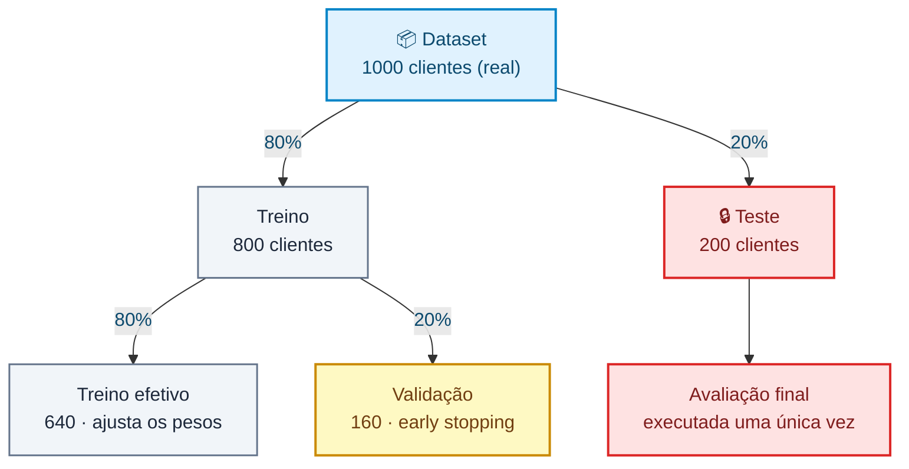
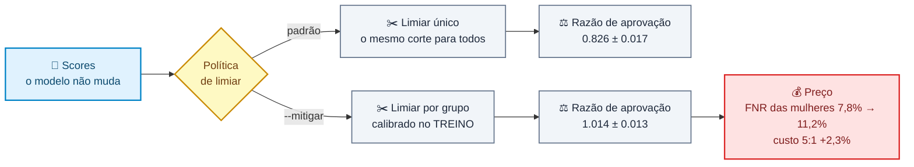

# 🧠 TFJS Credit Risk Classifier

Laboratório didático de classificação de risco de crédito com **Node.js**, **TensorFlow.js** e uma rede neural **MLP (Multilayer Perceptron)**.

Todo o ciclo de um projeto de Machine Learning supervisionado cabe em um único arquivo de código (`index.js`), do dado bruto até a inferência — sobre um **dataset real de crédito** ou sobre um dataset sintético gerado aqui:

```mermaid
flowchart LR
    A(["🎯 Problema"]) --> B["🏦 Dados<br/>German Credit (UCI)<br/>ou sintéticos"]
    B --> B2["📄 CSV<br/>dados brutos em disco"]
    B2 --> S["✂️ Split<br/>treino / teste"]
    S --> C["⚙️ Pré-processamento<br/>escala medida no treino"]
    C --> D["🏋️ Treinamento<br/>MLP 8 → 16 → 8 → 1"]
    D --> E{"📊 Validação<br/>val_loss melhorou?"}
    E -->|"sim — próxima época"| D
    E -->|"não há 5 épocas — early stopping"| F["🧪 Teste<br/>matriz, F1, AUC<br/>e ajuste do limiar"]
    F --> G["💾 Persistência<br/>model.save / loadLayersModel"]
    G --> H(["🔮 Predição"])

    classDef start fill:#e0f2fe,stroke:#0284c7,stroke-width:2px,color:#0c4a6e
    classDef step  fill:#f1f5f9,stroke:#64748b,stroke-width:1.5px,color:#1e293b
    classDef check fill:#fef9c3,stroke:#ca8a04,stroke-width:2px,color:#713f12
    classDef final fill:#dcfce7,stroke:#16a34a,stroke-width:2px,color:#14532d

    class A start
    class B,B2,S,C,D step
    class E check
    class F,G step
    class H final
```



O laço entre **Treinamento** e **Validação** é o coração do processo: a cada época o modelo é medido em dados que não usou para ajustar pesos, e o *early stopping* corta o ciclo quando essa medida para de melhorar. **Teste**, **Persistência** e **Predição** acontecem uma única vez, depois que o treino terminou.

> ⚠️ Finalidade **exclusivamente educacional**. O dataset real é de 1994 e serve de estudo, não de base para decisões financeiras.

---

## 📑 Sumário

- [Objetivo](#-objetivo)
- [Início rápido](#-início-rápido)
- [Testes](#testes)
- [Solução de problemas](#-solução-de-problemas)
- [Features de entrada](#-features-de-entrada)
- [Geração dos dados sintéticos](#-geração-dos-dados-sintéticos)
  - [Desbalanceamento: o limiar virou um quantil](#desbalanceamento-o-limiar-virou-um-quantil)
  - [Ruído de medição: um teto que nenhum modelo ultrapassa](#ruído-de-medição-um-teto-que-nenhum-modelo-ultrapassa)
  - [O que cada botão fez com as métricas](#o-que-cada-botão-fez-com-as-métricas)
- [Carregando dados de um CSV](#-carregando-dados-de-um-csv)
- [Dataset real: German Credit](#-dataset-real-german-credit)
  - [Por que one-hot e não ordinal](#por-que-one-hot-e-não-ordinal)
  - [A coluna que o modelo não recebeu](#a-coluna-que-o-modelo-não-recebeu)
  - [Uma divisão não é o dataset](#uma-divisão-não-é-o-dataset)
- [Arquitetura da rede](#-arquitetura-da-rede)
- [Regularização: L2 e dropout](#-regularização-l2-e-dropout)
  - [A grade inteira](#a-grade-inteira)
  - [Cada dataset pede uma dose diferente](#cada-dataset-pede-uma-dose-diferente)
  - [O que a regularização não conserta](#o-que-a-regularização-não-conserta)
- [Treinamento](#-treinamento)
- [Divisão dos dados](#-divisão-dos-dados)
- [Matriz de confusão](#-matriz-de-confusão)
- [Precision, recall e F1-score](#-precision-recall-e-f1-score)
- [Curva ROC e AUC](#-curva-roc-e-auc)
- [Ajuste do limiar de decisão](#-ajuste-do-limiar-de-decisão)
- [Validação cruzada e split estratificado](#-validação-cruzada-e-split-estratificado)
- [Mitigação da disparidade](#-mitigação-da-disparidade)
- [Inferência](#-inferência)
- [Persistência do modelo](#-persistência-do-modelo)
- [API do módulo](#-api-do-módulo)
- [Exemplo de saída](#-exemplo-de-saída)
- [Gerenciamento de memória](#-gerenciamento-de-memória)
- [Limitações conhecidas](#-limitações-conhecidas)
- [Próximas evoluções](#-próximas-evoluções)

---

## 🎯 Objetivo

Treinar uma rede neural capaz de estimar a probabilidade de um cliente ser de **alto risco** de inadimplência.

A rede recebe as características financeiras do cliente — **57** no dataset real, **4** no sintético — e devolve **um único número entre `0` e `1`**:

| Saída da rede | Interpretação          | Classificação |
| ------------: | ---------------------- | ------------- |
|        `0.12` | 12% de chance de risco | ✅ BAIXO RISCO |
|        `0.91` | 91% de chance de risco | ⚠️ ALTO RISCO  |

O corte é feito em `0.5`:

```javascript
const DECISION_THRESHOLD = 0.5;

const classify = (probability) =>
  (probability >= DECISION_THRESHOLD ? 'ALTO RISCO' : 'BAIXO RISCO');
```

Esse limiar é uma **escolha de negócio**, não uma verdade do modelo — baixá-lo captura mais inadimplentes ao custo de mais falsos positivos.

---

## 🚀 Início rápido

**Requisitos:** Node.js **20 ou 22** (LTS). O projeto traz um `.nvmrc`, então basta:

```bash
nvm use
```

O `@tensorflow/tfjs-node` baixa binários nativos na instalação — o primeiro `npm install` demora.

> ⛔ **Não use Node 23 ou superior.** Veja [Solução de problemas](#-solução-de-problemas).

```bash
git clone https://github.com/Felps03/tfjs-credit-risk-classifier.git
cd tfjs-credit-risk-classifier
npm install
npm start
```

`npm start` roda sobre o **[German Credit](#-dataset-real-german-credit)**, um dataset real da UCI. Os dois CSVs vêm versionados, então isso funciona **offline** logo após o clone.

```bash
npm start                # dataset real (German Credit) — padrão
npm run start:synthetic  # dataset sintético gerado pelo projeto
npm run fetch:german     # rebaixa o dataset real da UCI e reconverte
npm run seed             # regenera o dataset sintético a partir do código
```

Uma execução mede **uma** divisão. Para a estimativa com barra de erro — k treinos, cada cliente pontuado por um modelo que não o viu — existe um comando à parte:

```bash
npm run cv               # 5 dobras estratificadas no dataset real
npm run cv:synthetic     # o mesmo no sintético
node index.js --cv=10    # escolhendo o k
```

É [essa medição](#-validação-cruzada-e-split-estratificado) que responde "quanto o modelo acerta?" sem depender de qual sorteio calhou.

Os dois freios contra *overfitting* são ajustáveis pela linha de comando, para que o efeito possa ser **visto** em vez de lido:

```bash
node index.js --l2=0 --dropout=0   # a rede sem regularização nenhuma
node index.js --dropout=0.5        # só dropout, e forte
```

E a disparidade medida pela auditoria pode ser **corrigida** em vez de só reportada, com um limiar por grupo calibrado no treino:

```bash
npm start -- --mitigar             # a decisão passa a ler o sexo do cliente
```

A comparação entre as duas políticas aparece em toda execução, com ou sem a flag; o que a flag muda é qual delas decide. O padrão é **desligado**, e [a seção sobre mitigação explica por quê](#-mitigação-da-disparidade) — com números.

Cada fonte declara a **sua** dose — o dataset real vem com os freios ligados, o sintético não —, e as flags sobrescrevem o que a fonte declara. Cada execução imprime `Diferença treino − teste` logo abaixo das acurácias. É o termômetro do *overfitting*, e é o número que [a regularização existe para encolher](#-regularização-l2-e-dropout).

Os dados **não** mudam entre execuções, e agora nem entre máquinas: o CSV real é fixo, e o sintético é gerado por um [PRNG com semente](#-geração-dos-dados-sintéticos) — `npm run seed` reproduz o arquivo versionado byte a byte. Os pesos iniciais da rede continuam aleatórios, então as métricas oscilam um pouco a cada rodada; é esperado, e é por isso que os números deste README são **médias de 15 execuções** com erro padrão.

### Estrutura

```text
tfjs-credit-risk-classifier/
├── index.js               # fontes de dados, modelo, treino, avaliação, persistência e predição
├── scripts/
│   ├── fetch-german.js    # baixa o German Credit da UCI e converte
│   └── seed.js            # regera o CSV sintético (ruído e balanço configuráveis)
├── test/
│   └── index.test.js      # testes com o runner nativo do Node
├── package.json
├── package-lock.json
├── .nvmrc                 # versão do Node suportada
├── .gitignore
├── data/
│   ├── german-credit.csv  # dataset REAL (UCI/Statlog), convertido e versionado
│   └── customers.csv      # dataset sintético versionado, reproduzível pela semente
├── model/                 # gerado por `npm start` — ignorado pelo git
│   ├── model.json         # topologia + training config
│   └── weights.bin        # pesos e estado do otimizador
└── README.md
```

### Testes

```bash
npm test           # roda a suíte uma vez
npm run test:watch # re-executa a cada alteração
```

Os testes usam o **runner nativo do Node** (`node:test` + `node:assert`) — nenhuma dependência de desenvolvimento — e são escritos no formato **Given / When / Then**:

```javascript
it('dada a probabilidade exatamente no limiar, quando classificada, então retorna ALTO RISCO', () => {
  // Given — o corte usa >=, então o limiar pertence à classe positiva
  const probability = DECISION_THRESHOLD;

  // When
  const label = classify(probability);

  // Then
  assert.equal(label, 'ALTO RISCO');
});
```

A suíte cobre o que é determinístico e verificável sem treinar a rede:

| Alvo                   | O que é verificado                                                          |
| ---------------------- | --------------------------------------------------------------------------- |
| `normalizeIncome`      | Piso, teto e meio da faixa mapeiam para `0`, `1` e `0.5`                      |
| `normalizeLatePayments`| `0` atrasos → `0`; máximo de atrasos → `1`                                    |
| `toFeatureVector`      | Vetor esperado, largura 4 e determinismo (proteção contra *skew*)             |
| `classify`             | Comportamento no limiar `0.5`, inclusive logo abaixo dele                     |
| `createDataset`        | Tamanho, features dentro de `[0, 1]`, rótulos binários, ambas as classes presentes |
| `createCustomers` / `toDataset` | Unidades brutas dentro das faixas, rótulos binários, equivalência com `createDataset` e **mesma semente → mesmos clientes** |
| `createGaussian`       | Média `≈ 0` e desvio `≈ 1` em 20 mil sorteios, simetria em torno de zero, reprodutibilidade e `log(0)` que não vira infinito |
| `clamp` / `quantile`   | Limites, ordenação interna, **entrada não modificada** e o corte no percentil 85 produzindo 15% acima |
| `riskScore`            | Monotonicidade em dívida e renda (o único coeficiente negativo) e determinismo |
| `measureCustomer`      | Ruído zero → identidade, nada fora dos limites válidos nem com ruído enorme, atrasos ainda inteiros e nenhuma coluna extra vazando |
| Desbalanceamento       | A taxa pedida é entregue em `0.05`, `0.25` e `0.5`, e o baseline do dataset padrão passa de `0.8` |
| Ruído de rótulo        | Sem ruído a regra reproduz o rótulo exatamente, `0.05` troca ~5% e `1.0` inverte **todos** |
| Teto imposto pelo ruído | Com ruído, a **própria regra geradora** erra ao ver só a medida (`< 100%`); sem ruído acerta tudo |
| `data/customers.csv`   | O arquivo versionado é **idêntico** ao que o gerador produz, e a minoria fica entre 10% e 20% |
| `toCsv`                | Cabeçalho, contagem de linhas e precisão por coluna (inteiros saem inteiros)   |
| `writeCustomersCsv` / `readCustomersCsv` | Criação da pasta, ida e volta dos valores, parse numérico, colunas fora de ordem e arquivo inexistente |
| `ensureCsv`            | Cria quando falta, **não altera** quando já existe, e sobrescreve só na chamada explícita |
| `loadDatasetCsv`       | Formato igual ao de `createDataset`, features em `[0, 1]`, mesma `toFeatureVector` e treino rodando a partir do arquivo |
| `splitDataset`         | Proporções, nada perdido e **ausência de sobreposição entre treino e teste**  |
| `parseDelimited`       | Cabeçalho vira chave, CRLF do Windows e quebra de linha final sem gerar linha vazia |
| `toOrdinal`            | Código conhecido vira posição, `A41` não é confundido com `A410` e código desconhecido **lança** em vez de virar `0` |
| `toGermanCustomer`     | Numéricos → `Number`, códigos → índices, `class 2` → `risk 1`, cobertura de todas as colunas e o atributo 9 indo para a coluna de auditoria |
| `oneHotEncode` / `ordinalEncode` | Posição acesa, soma sempre `1`, largura correta e categoria única sem divisão por zero |
| `germanFeatureNames` / `toGermanVector` | **57** entradas em one-hot e **19** em ordinal, nomes `campo=código`, vetor do mesmo tamanho dos nomes, numéricas primeiro e bloco categórico só com `0` e `1` |
| Atributo protegido | **Nenhuma feature vem do sexo**, a coluna existe no CSV mas não no modelo, e o scaler não a mede |
| `isFemale` / `summarizeGroup` / `auditByGroup` | Identificação do grupo, taxa real separada da marcada, FNR sem `NaN`, paridade quando o tratamento é igual e razão infinita quando um grupo não tem aprovação |
| `rateThreshold` | Fração pedida vira fração marcada, corte no ponto médio, listas vazias e frações `0`/`1` nos extremos, e **empate na fronteira que transforma a fração em piso** |
| `fitGroupThresholds` | O grupo marcado demais recebe o limiar mais alto, grupo vazio vira limiar inalcançável, **os scores não são tocados** e calibrar no conjunto auditado devolve paridade por construção |
| `thresholdFor` / auditoria por grupo | Número vale para os dois, par vale um para cada, a razão sobe com limiares por grupo e os dois limiares ficam registrados na auditoria |
| `summarizeDecisions` | Acurácia e custo a partir dos erros, o falso negativo pesando 5×, corte por grupo acertando os quatro casos e custos próprios substituindo os do laboratório |
| `formatMitigation` | Limiares, razão e custo das duas políticas na mesma tabela |
| `resolveMitigation` | Ausência é desligado, `--mitigar` liga e **`--mitigar=false` lança em vez de ligar a política que o usuário quis desligar** |
| `createGermanSource` | As duas variantes diferem só na codificação e a ordinal é alcançável por `--source` |
| `parseGermanCsv`       | Texto bruto da UCI → clientes prontos, ponta a ponta |
| `data/german-credit.csv` | O arquivo versionado tem as 1.000 linhas, **300 maus pagadores**, as 21 colunas declaradas e nenhum valor não-finito |
| `fitMinMaxScaler` / `applyMinMaxScaler` | Mínimo e amplitude, coluna constante sem divisão por zero, valor fora da faixa **não** cortado, ordem do vetor e **ausência de vazamento do teste para a escala** |
| `createRandom` / `shuffle` | Mesma semente → mesma sequência, faixa `[0, 1)`, permutação, entrada não modificada e embaralhamento reproduzível |
| `splitCustomers`       | Proporções e ausência de sobreposição, agora sobre clientes brutos |
| `stratifiedSplitCustomers` | Proporção de classes **idêntica** nos dois lados, tamanhos, ausência de sobreposição, **ordem preservada dentro de cada parte** e um caso em que o corte cru entrega um teste 100% inadimplente |
| `stratifiedFolds` | Mesma proporção em cada dobra, cada cliente em exatamente uma, e diferença de no máximo uma linha quando o k não divide a classe |
| `summarize` | Média, erro padrão e amplitude; uma amostra só dá erro `0` e não `NaN`; valores idênticos dão erro exatamente `0` |
| `resolveFolds` | Ausência é `null`, `--cv` usa o padrão, `--cv=k` usa o pedido, e `k = 1`, `k = 2.5`, `k = 999` ou `abc` **lançam** |
| `rocFromScores` | Curva sem modelo nenhum, AUC `1` e `0` nos extremos, classe única sem divisão por zero e `computeRocCurve` delegando para ela |
| `crossValidate` | Cada cliente testado exatamente uma vez, **baseline idêntico em todas as dobras**, resumo com média e erro padrão, e fonte sem atributo protegido não produzindo auditoria |
| `TRAINING` | A configuração de treino é **uma só** para o fluxo principal e a validação cruzada |
| `majorityBaseline`     | Piso da classe majoritária com maioria negativa, positiva e empate |
| `SOURCES` / `resolveSourceId` | Padrão, seleção por flag, fonte inválida, **contrato cumprido por todas as fontes**, tamanho do vetor, escala medida e mensagem acionável quando o CSV real falta |
| Regularização por fonte | Sintético com os freios **desligados**, German com as constantes do laboratório, as duas variantes diferindo **só** na codificação e a linha de comando vencendo a fonte na mesclagem |
| `toCsv` com schema     | Cabeçalho do German Credit e compatibilidade da chamada sem opções |
| `buildModel`           | 3 densas + 2 de dropout, entrada `[null, 4]` ou `[null, 57]`, saída `[null, 1]`, **225** e **1.073 parâmetros**, ativações e loss |
| `createRegularizer`    | Lambda chega intacto na camada e `λ = 0` devolve **`null`**, não uma penalidade inerte |
| `buildModel` — regularização | L2 em **todas** as densas, dropout **só** depois das ocultas, `dropout: 0` restaura a topologia de 3 camadas e o total de parâmetros **não muda** |
| `parseNumericFlag` / `resolveRegularization` | Padrões, leitura, limites inclusivos, valor negativo, dropout acima de `0.9` e **`--l2=` vazio que não vira zero em silêncio** |
| Comportamento de L2 e dropout | Dropout **desligado na inferência** (duas predições idênticas com taxa `0.9`), `evaluate` **não** cobra a penalidade e o modelo regularizado sobrevive ao salvar/recarregar |
| `computeConfusionMatrix` | TP/TN/FP/FN contra predições conhecidas, layout da matriz, efeito do limiar, coerência com a `accuracy` do `evaluate` e ausência de vazamento de tensores |
| `formatConfusionMatrix` | Estrutura da tabela, as quatro contagens presentes e colunas alinhadas |
| `computeMetrics` | Fórmulas contra cálculo manual, F1 conferido pelas duas formas, casos degenerados sem `NaN` e a média harmônica abaixo da aritmética |
| `formatMetrics` | Uma linha por métrica, valores com 4 casas decimais |
| `computeRocCurve` | AUC de classificadores perfeito/invertido/aleatório, coerência com Mann-Whitney, invariância a reescala monotônica, monotonicidade dos pontos, empates agrupados e classe única sem divisão por zero |
| `formatRocCurve` | Estrutura do gráfico, largura da área, curva, diagonal e marcador do limiar |
| `chooseThresholdByYouden` | Maximização de `TPR - FPR` e corte sem erros no classificador perfeito |
| `chooseThresholdByCost` | Custo mínimo global, corte que desce com FN caro, divergência em relação a Youden, recusa total quando FP é proibitivo e confirmação na matriz recomputada |
| `formatTable` / `formatThresholdComparison` | Alinhamento com larguras variadas, estrutura da tabela e limiar infinito legível |
| `saveModel` / `loadModel` | Arquivos gerados, `trainingConfig` gravado, arquitetura preservada, **predição idêntica** após recarregar, modelo já compilado e treino retomável |

### 🩺 Solução de problemas

**`TypeError: (0 , util_1.isNullOrUndefined) is not a function`**

Você está em um Node novo demais. O **Node 23 removeu** os type-checkers legados do módulo `util` (depreciados desde o Node 4), e o `@tensorflow/tfjs-node@4.22.0` ainda os utiliza em 5 pontos do backend nativo.

| Node | `util.isNullOrUndefined` | Projeto |
| ---- | ------------------------ | ------- |
| 20 (LTS)  | presente  | ✅ funciona |
| 22 (LTS)  | presente  | ✅ funciona |
| 23        | removido  | ❌ quebra   |
| 24 (LTS)  | removido  | ❌ quebra   |

O `tfjs-node` não recebe release desde **janeiro de 2025**, e o `4.23.0-rc.0` mantém as mesmas chamadas — não há correção upstream. Por isso o projeto fixa **Node 22** no `.nvmrc` e declara `"engines": { "node": ">=20.0.0 <23.0.0" }`.

Solução:

```bash
nvm install 22 && nvm use
rm -rf node_modules package-lock.json && npm install
```

---

## 📥 Features de entrada

O cliente é descrito por quatro campos brutos:

| Campo               | Descrição                           | Faixa gerada     |
| ------------------- | ----------------------------------- | ---------------- |
| `income`            | Renda mensal do cliente             | `2.000 – 15.000` |
| `debtRatio`         | Percentual de endividamento         | `0.0 – 1.0`      |
| `latePayments`      | Quantidade de pagamentos atrasados  | `0 – 5`          |
| `creditUtilization` | Percentual de utilização do crédito | `0.0 – 1.0`      |

Dois deles precisam ser **normalizados** antes de entrar na rede, para que todas as features fiquem na mesma escala (`0` a `1`) e nenhuma domine o gradiente só por ter números maiores:

```javascript
const normalizeIncome = (income) => (income - INCOME_MIN) / INCOME_RANGE;

const normalizeLatePayments = (latePayments) => latePayments / MAX_LATE_PAYMENTS;
```

`debtRatio` e `creditUtilization` já nascem entre `0` e `1` e vão direto.

O vetor que a rede realmente enxerga é montado por uma única função:

```javascript
const toFeatureVector = ({
  income,
  debtRatio,
  latePayments,
  creditUtilization,
}) => [
  normalizeIncome(income),
  debtRatio,
  normalizeLatePayments(latePayments),
  creditUtilization,
];
```

> 🔑 `toFeatureVector` é a **fonte única de verdade** da normalização: quem a chama é tanto a geração do dataset quanto a inferência do cliente novo. Duplicar essa lógica em dois lugares é a origem clássica do *training-serving skew* — o modelo passa a receber, em produção, números em escala diferente da que viu no treino.

> 💡 Aqui as constantes de normalização (`2000`, `13000`, `5`) são conhecidas de antemão porque nós geramos os dados. **Em um projeto real elas devem ser calculadas apenas no conjunto de treino** e depois reaplicadas em validação/teste — caso contrário há vazamento de dados (*data leakage*).
>
> É exatamente o que o [dataset real](#agora-a-normalização-precisa-ser-medida) obrigou a fazer: lá as faixas são **medidas**, e só sobre o treino.

As features acima descrevem o dataset sintético. O dataset real tem [as suas próprias dezenove](#as-19-colunas-usadas) — e o pipeline atende as duas sem saber qual está em uso.

---

## 🧪 Geração dos dados sintéticos

O projeto cria **1.200 clientes** com características aleatórias, e uma regra determinística define o rótulo de cada um. Só que gerar dados *perfeitos* ensina pouco: um dataset limpo e equilibrado faz qualquer modelo parecer excelente e esconde justamente os dois problemas que aparecem em quase todo projeto real.

Então o gerador cria os dois de propósito, cada um com um botão próprio:

| Parâmetro | Padrão | O que simula |
| --------- | -----: | ------------ |
| `positiveRate` | `0.15` | **Desbalanceamento** — inadimplente é minoria |
| `featureNoise` | `0.05` | **Ruído de medição** — o dado observado não é o dado real |
| `labelNoise` | `0.02` | **Ruído de rótulo** — o desfecho registrado está errado |

São argumentos, não constantes escondidas. Dá para desligar um de cada vez e ver o efeito isolado — é exatamente o que a [tabela do 2×2](#o-que-cada-botão-fez-com-as-métricas) mais abaixo faz.

### A verdade que ninguém observa

A mudança estrutural está aqui: o gerador passou a distinguir **o cliente verdadeiro** do **cliente medido**.

```javascript
// 1. O estado VERDADEIRO do cliente. No mundo real ele existe e ninguém
//    o enxerga; aqui ele existe, é usado para rotular, e é descartado.
const truths = Array.from({ length: total }, () => ({
  income: INCOME_MIN + random() * INCOME_RANGE,
  debtRatio: random(),
  latePayments: Math.floor(random() * (MAX_LATE_PAYMENTS + 1)),
  creditUtilization: random(),
}));

// 2. O corte que produz a taxa de inadimplência pedida.
const scores = truths.map(riskScore);
const cut = quantile(scores, 1 - positiveRate);

// 3. O que vai para o arquivo é a MEDIDA e o desfecho REGISTRADO.
return truths.map((truth, index) => {
  const label = scores[index] > cut ? 1 : 0;
  const mistaken = random() < labelNoise;

  return {
    ...measureCustomer(truth, featureNoise, gaussian),
    risk: mistaken ? 1 - label : label,
  };
});
```

O rótulo é calculado sobre `truth`, e o que chega ao CSV é `measureCustomer(truth, ...)`. **A resposta certa depende de um valor que nunca entra no arquivo.** É isso que cria um teto: nem a fórmula que gerou os rótulos consegue reconstruí-los a partir do que o modelo vê.

A regra em si não mudou — e a rede continua sem vê-la:

```javascript
const riskScore = (customer) => {
  const [income, debtRatio, latePayments, creditUtilization] =
    toFeatureVector(customer);

  return (
    1.4 * debtRatio +
    1.2 * latePayments +
    1.0 * creditUtilization -
    0.8 * income
  );
};
```

### Desbalanceamento: o limiar virou um quantil

Antes o corte era a constante `RISK_RULE_THRESHOLD = 1.35`, escolhida na mão, e a taxa de inadimplência era o que desse — cerca de 46%. Um número mágico cujo efeito só aparecia rodando.

Agora o corte é **derivado da taxa que se pede**:

```javascript
const quantile = (values, fraction) => {
  const sorted = [...values].sort((a, b) => a - b);
  const index = clamp(Math.floor(fraction * sorted.length), 0, sorted.length - 1);

  return sorted[index];
};

const cut = quantile(scores, 1 - positiveRate);   // 0.15 → percentil 85
```

`positiveRate: 0.15` produz 15% de inadimplentes porque *é assim que quantil funciona*, não porque alguém calibrou um número até a conta fechar. Desbalancear mais é só empurrar a fração para cima.

Com 15% de positivos, o dataset ganha a propriedade que faltava: **a acurácia deixa de significar alguma coisa sozinha**. Chutar "bom pagador" para todo mundo já acerta `0.8250` no conjunto de teste. É por isso que o projeto imprime o [baseline da classe majoritária](#-matriz-de-confusão) ao lado da acurácia — sem ele, `0.9517` parece ótimo, e são só 13 pontos de ganho sobre não fazer nada.

### Ruído de medição: um teto que nenhum modelo ultrapassa

Cada coluna recebe um desvio normal proporcional à sua faixa e volta para dentro dos limites válidos:

```javascript
const measureCustomer = (customer, noise, gaussian) => {
  const measured = Object.fromEntries(
    Object.entries(SYNTHETIC_BOUNDS).map(([column, [lowest, highest]]) => {
      const drift = gaussian() * noise * (highest - lowest);

      return [column, clamp(customer[column] + drift, lowest, highest)];
    }),
  );

  return { ...measured, latePayments: Math.round(measured.latePayments) };
};
```

Três decisões pequenas que importam:

- **A normal vem de Box-Muller**, não de `Math.random()`. Ruído de medição costuma ser a soma de muitos erros pequenos e independentes, e o Teorema Central do Limite diz que essa soma tende à normal.
- **O `clamp` não é detalhe**: sem ele apareceriam renda negativa e utilização de crédito de 130%, e a normalização passaria a devolver valores fora de `[0, 1]`.
- **`latePayments` é arredondado** — "2,3 atrasos" não existe no sistema de nenhum banco.

O efeito é medível sem treinar nada. Aplicando a **própria regra que gerou os rótulos** aos dados medidos, ela erra:

| Dataset | A regra recupera o rótulo |
| ------- | ------------------------: |
| Sem ruído nenhum | `100,0%` |
| Só `featureNoise: 0.05` | `98,0%` |
| Medição + rótulo (o CSV atual) | `96,8%` |

Esses 2 pontos da segunda linha são **irredutíveis**. Não existe arquitetura, otimizador ou quantidade de épocas que os recupere, porque a informação não está no arquivo. É o análogo controlado do que o [German Credit](#-dataset-real-german-credit) mostra sem pedir licença: o teto raramente é o modelo.

Dois testes guardam exatamente essa afirmação — um exige teto `< 100%` com ruído, o outro exige teto `= 100%` sem ele.

### Ruído de rótulo: a resposta certa também erra

`labelNoise: 0.02` troca 2% dos desfechos. Um bom pagador que ficou desempregado, uma baixa lançada na conta errada, um `1` digitado onde era `0`.

Em um dataset desbalanceado isso tem um efeito assimétrico que vale notar. Como 85% das linhas são negativas, trocar 2% delas gera *muito* mais positivos falsos do que se perde de positivos verdadeiros — no arquivo versionado, **12 rótulos viraram `1` e só 2 viraram `0`**. (São 14 trocas em 1.200 linhas, e não as 24 que 2% sugerem: cada linha é um sorteio independente, e esta semente calhou de dar poucas. Em 40 sementes a taxa média é `0.0196`.) A taxa de inadimplência sobe de `14,9%` para `15,8%`, e cerca de **um em cada dezesseis positivos do arquivo é puro ruído**.

Rótulo minoritário é caro justamente por isso: a classe rara é a mais fácil de contaminar, porque a classe abundante é grande o bastante para inundá-la com os próprios erros.

### O que cada botão fez com as métricas

Cada variante foi escrita em CSV e lida de volta, e treinada com a **configuração exata de `npm start`** — mesmas épocas, mesmo *early stopping*, mesmo arredondamento. Média de **15 execuções**, com dataset e divisão fixos e só a inicialização dos pesos variando:

| Dataset | Baseline | Acurácia | Ganho | AUC | Recall `0.5` | Custo `0.5` | Custo mín. |
| ------- | -------: | -------: | ----: | --: | -----------: | ----------: | ---------: |
| limpo + equilibrado *(o de antes)* | `0.5042` | `0.9847` ± 0.0014 | **+48 pts** | `0.9994` ± 0.0000 | `0.9840` | `10.7` | `4.6` |
| limpo + desbalanceado | `0.8292` | `0.9597` ± 0.0099 | **+13 pts** | `0.9970` ± 0.0004 | `0.7691` | `39.6` | `8.2` |
| ruidoso + equilibrado | `0.5083` | `0.9294` ± 0.0013 | **+42 pts** | `0.9876` ± 0.0001 | `0.9011` | `64.3` | `19.9` |
| **ruidoso + desbalanceado** *(atual)* | `0.8250` | `0.9517` ± 0.0044 | **+13 pts** | `0.9770` ± 0.0010 | `0.7254` | `56.8` | `18.8` |

Quatro leituras que só aparecem por causa do 2×2:

**1. A acurácia subiu e o modelo piorou.** Compare as duas linhas ruidosas: ao desbalancear, a acurácia vai de `0.9294` para `0.9517` e a AUC vai de `0.9876` para `0.9770`. O modelo ficou **melhor no placar** e **pior em ordenar clientes**. Não há paradoxo: desbalancear aumenta a fatia de negativos, e negativos são fáceis. Este é o argumento inteiro contra reportar acurácia sozinha, em duas linhas de tabela.

**2. A AUC ignora o desbalanceamento e denuncia o ruído.** Desbalancear sozinho mexe na terceira casa (`0.9994` → `0.9970`); ruído derruba **cinco vezes mais** (`0.9994` → `0.9876`). É consequência da definição: a AUC compara pares positivo–negativo, então a *proporção* entre as classes sai da conta. É por isso que ela é a métrica certa para responder "o modelo melhorou?" quando os positivos são raros.

**3. O recall desaba e a precision sobe.** `0.9840` → `0.7254` de recall, contra `0.9859` → `0.9981` de precision. Com positivos raros, a rede aprende que apostar em "alto risco" quase nunca compensa, e passa a só marcar quando tem muita certeza. Fica **cautelosa** — e cautela, num modelo de crédito, é deixar passar **mais de um em cada quatro** inadimplentes. A precision quase perfeita não é virtude: é o sintoma.

**4. É por isso que o limiar precisa ser escolhido.** O corte de menor custo cai de `0.4474` para `0.2862`: o desbalanceamento empurra as probabilidades todas para baixo, e o `0.5` herdado deixa de ser um lugar razoável para cortar. Ajustá-lo derruba o custo de `56.8` para `18.8` — **67% a menos**, sem treinar nada de novo. No dataset limpo e equilibrado, a mesma manobra poupava `6.1` unidades de custo; aqui poupa `38.0`.

**5. E o erro padrão triplicou.** Repare nas duas colunas desbalanceadas: `± 0.0099` e `± 0.0044` de acurácia, contra `± 0.0014` e `± 0.0013` nas equilibradas. O mesmo dataset, a mesma arquitetura — só a raridade dos positivos mudou. Com 42 positivos no conjunto de teste, cada acerto ou erro move o recall em 2,4 pontos, e o *early stopping* passa a interromper o treino em épocas bem diferentes a cada execução. **Desbalancear não piora só o modelo: piora a sua capacidade de medi-lo.**

O dataset sintético continua sendo mais fácil que o real, e deve mesmo — ele existe para que o pipeline seja verificável. Mas parou de ser fácil de graça.

---

## 📄 Carregando dados de um CSV

Gerar o dataset em memória é conveniente, mas esconde a etapa que todo projeto real tem: **os dados chegam de um arquivo**. O pipeline agora passa por disco — o CSV é escrito uma vez e, a partir dele, tudo é lido.

```javascript
ensureCsv();                              // cria só se ainda não existir
const dataset = await loadDatasetCsv();   // daqui em diante, vem do arquivo
```

### O CSV guarda dados BRUTOS

Esta é a decisão que sustenta a seção inteira:

```text
income,debtRatio,latePayments,creditUtilization,risk
11465.21,0.764368,0,0.941555,1
4230.33,0.640292,1,0.280455,0
```

Renda em reais, atrasos em contagem — **não** os valores normalizados. Salvar já normalizado congelaria `INCOME_MIN` e `INCOME_RANGE` dentro do arquivo: qualquer ajuste na normalização exigiria reexportar tudo, e um CSV antigo lido com constantes novas produziria features silenciosamente erradas.

Com dados brutos, o arquivo é a **fonte**, e a normalização continua sendo do código.

### A refatoração que isso exigiu

Antes, `createDataset` gerava clientes brutos e os descartava, devolvendo só as features normalizadas. Para exportar, foi preciso separar as duas responsabilidades:

| Função | Devolve |
| ------ | ------- |
| `createCustomers` | Clientes em unidades brutas — `{ income, debtRatio, latePayments, creditUtilization, risk }` |
| `toDataset` | Clientes → `{ features, labels }` prontos para o TensorFlow |
| `createDataset` | `toDataset(createCustomers(total))` — a API antiga, intacta |

O ganho: **um só caminho de normalização**, seja o dado gerado em memória ou lido do arquivo.

```javascript
const loadDatasetCsv = async (filePath = CSV_PATH) =>
  toDataset(await readCustomersCsv(filePath));
```

`loadDatasetCsv` devolve exatamente o mesmo formato de `createDataset` — `splitDataset` e o treino funcionam sem qualquer adaptação.

### Lendo com tf.data.csv

O `tfjs-node` registra o esquema `file://` também aqui:

```javascript
const dataset = tf.data.csv(`file://${path.resolve(filePath)}`, {
  columnConfigs: { risk: { isLabel: true } },
});

const rows = await dataset.toArray();
```

Dois comportamentos úteis: o parse numérico já vem pronto (nada de `parseFloat`), e as colunas são casadas **pelo nome**, não pela posição — um CSV com as colunas em outra ordem carrega igual. Há teste para isso.

### Precisão é uma escolha

CSV é texto, então cada coluna grava um número fixo de casas:

```javascript
const CSV_PRECISION = {
  income: 2,          // centavos bastam para renda
  debtRatio: 6,
  latePayments: 0,    // contagem, não fração
  creditUtilization: 6,
  risk: 0,
};
```

Isso mantém o arquivo legível e evita `3.0000000000000004` em uma coluna de contagem. Em troca, a ida e volta **não é bit a bit** — é por isso que o teste de round-trip compara com tolerância explícita em vez de igualdade, ao contrário do teste de [persistência do modelo](#-persistência-do-modelo), onde os pesos voltam idênticos.

### O arquivo é versionado

`data/customers.csv` **está no repositório** (36 KB). É o que dá ao laboratório algo que ele não tinha: um dataset **estável**.

Antes, cada execução sorteava 1200 clientes novos, então os números do README nunca batiam com os da sua tela. Agora o dataset é o mesmo — o que varia entre execuções é só a inicialização dos pesos.

Para isso funcionar, a geração precisa ser **idempotente**:

```javascript
const ensureCsv = (filePath = CSV_PATH, total = SYNTHETIC_TOTAL) => {
  if (fs.existsSync(filePath)) {
    return { path: filePath, created: false };
  }

  writeCustomersCsv(createCustomers(total), filePath);

  return { path: filePath, created: true };
};
```

Sem esse `existsSync`, versionar o CSV seria um incômodo: todo `npm start` reescreveria o arquivo e deixaria 1200 linhas de diff aleatório no `git status`.

| Comando | Efeito no CSV |
| ------- | ------------- |
| `npm start` | Usa o que está lá; só cria se o arquivo faltar |
| `npm run seed` | **Regenera** a partir do código — mudança deliberada, que você commita se quiser |

E como o gerador tem semente, `npm run seed` é **reprodutível**: rodar duas vezes produz o mesmo arquivo, byte a byte. Isso transforma o CSV versionado em algo auditável — quem clona reconstrói o arquivo a partir do código e confere que ninguém o editou à mão. Um teste faz exatamente essa comparação e falha se o gerador mudar sem que o CSV seja regerado.

Para experimentar sem tocar no código, cada parâmetro do gerador é uma flag:

```bash
npm run seed -- --seed=99                        # outros clientes
npm run seed -- --feature-noise=0 --label-noise=0  # dataset limpo
npm run seed -- --positive-rate=0.5              # dataset equilibrado
```

Um dataset real — que você recebe em vez de gerar — entraria exatamente aqui, e o `createCustomers` sairia do caminho.

---

## 🏦 Dataset real: German Credit

Todo o laboratório até aqui rodou sobre dados que **este projeto inventou**. Isso foi útil — dá para conferir se a rede aprendeu, porque a regra que gerou os rótulos está a três linhas de distância. O gerador sintético hoje [injeta ruído e desbalanceamento](#-geração-dos-dados-sintéticos) de propósito, e isso derruba a AUC de `0.9994` para `0.9770`; mas o ruído continua sendo *o ruído que nós escolhemos*, na quantidade que nós escolhemos.

O **German Credit** troca esse conforto por realidade: 1.000 solicitações de crédito de verdade, coletadas por Hans Hofmann na Universidade de Hamburgo e publicadas em 1994. Ninguém escolheu a regra que separa bom de mau pagador — e boa parte dela simplesmente **não está nas colunas**.

```bash
npm run fetch:german     # baixa da UCI e converte (o CSV já vem versionado)
npm start                # dataset real, codificação one-hot — o padrão
npm run start:ordinal    # mesmas colunas, codificação ordinal (comparação)
npm run start:synthetic  # o laboratório sintético continua a um argumento
```

| | Sintético | German Credit |
| --- | ---: | ---: |
| Clientes | 1.200 | 1.000 |
| Colunas usadas | 4 | 19 (de 20) |
| Entradas da rede | 4 | 57 (one-hot) |
| Alto risco | 15,8% | 30% |
| Origem dos rótulos | fórmula conhecida | comportamento real |
| Ruído | [injetado de propósito](#-geração-dos-dados-sintéticos) e mensurável | todo o que a realidade tem, em quantidade desconhecida |

### As 19 colunas usadas

Das 20 do arquivo original, o projeto usa 19 — **sete numéricas** e **doze qualitativas**:

| Numéricas | Faixa | | Qualitativas | Níveis |
| --------- | ----- | --- | ------------ | -----: |
| `durationMonths` | 4 – 72 meses | | `checkingStatus` | 4 |
| `creditAmount` | 250 – 18.424 DM | | `creditHistory` | 5 |
| `installmentRate` | 1 – 4 (% da renda) | | `purpose` | 10 |
| `residenceSince` | 1 – 4 anos | | `savingsStatus` | 5 |
| `age` | 19 – 75 anos | | `employmentYears` | 5 |
| `existingCredits` | 1 – 4 | | `otherDebtors` | 3 |
| `dependents` | 1 – 2 | | `property` | 4 |
| | | | `otherInstallments` | 3 |
| | | | `housing` | 3 |
| | | | `job` | 4 |
| | | | `telephone` | 2 |
| | | | `foreignWorker` | 2 |

As doze qualitativas somam **50 níveis**. Com one-hot, o vetor de entrada tem `7 + 50 = 57` posições.

> ⚖️ A vigésima coluna — **atributo 9, estado civil e sexo** — é lida e vai para o CSV, mas **não entra no modelo**. Ela tem outro papel: [auditar](#a-coluna-que-o-modelo-não-recebeu) as decisões depois que já foram tomadas.

### Por que one-hot e não ordinal

A versão anterior codificava as qualitativas como inteiro: `checkingStatus` virava `0, 1, 2, 3`. Isso é conveniente e, na maioria das colunas, é uma **mentira**.

Dizer que `purpose = 3` fica entre `2` e `4` afirma que "eletrodoméstico", "rádio/TV" e "reparos" estão em uma escala — e não estão. Não existe ordem entre finalidades de empréstimo. A rede recebia uma relação que ninguém quis afirmar.

One-hot desfaz a suposição. Cada categoria vira uma coluna própria:

```javascript
//   purpose = 3  ->  ordinal: [0.333]
//                    one-hot: [0, 0, 0, 1, 0, 0, 0, 0, 0, 0]
const oneHotEncode = (size, index) =>
  Array.from({ length: size }, (unused, position) => (position === index ? 1 : 0));
```

Nenhuma categoria fica "maior" que outra, e a rede aprende **um peso independente para cada uma** em vez de um peso único multiplicado por um número arbitrário.

Duas colunas continuam sendo tratadas como número, de propósito: `installmentRate` (1 a 4, percentual da renda comprometida) e `residenceSince` (anos no endereço) têm ordem de verdade. A UCI as documenta como numéricas, e é o que são.

> 📐 Com todos os níveis presentes há colinearidade perfeita — as quatro colunas de `checkingStatus` sempre somam 1, então uma é dedutível das outras. É a *dummy variable trap*, e em regressão linear ela quebra a inversão da matriz. Em rede neural com viés e ativação não-linear isso não é um problema prático, e é o padrão do Keras — por isso o projeto mantém todos os níveis.

### O CSV guarda códigos, não features

O arquivo continua com uma coluna por atributo, e a qualitativa é gravada como o **índice** do código:

```text
durationMonths,creditAmount,...,checkingStatus,creditHistory,purpose,...,personalStatus,risk
6,1169,...,0,4,3,...,2,0
```

O `3` em `purpose` **não é uma quantidade** — é "A43", rádio/TV. O one-hot acontece na hora de montar o vetor, não na hora de gravar. É a mesma decisão de [guardar dados brutos](#o-csv-guarda-dados-brutos): se o arquivo já viesse com 57 colunas expandidas, trocar de codificação exigiria reexportar tudo.

### Agora a normalização precisa ser medida

Com dados inventados, as faixas eram conhecidas de antemão. Com dados reais, não:

```javascript
const fitMinMaxScaler = (customers, featureNames) => { /* mede mínimo e amplitude */ };

const applyMinMaxScaler = (scaler, customer) => /* aplica o que foi medido */;
```

E medir tem hora certa — **depois** de separar treino e teste:

```javascript
const { trainCustomers, testCustomers } = splitCustomers(customers);

const scaler = source.fitScaler(trainCustomers);           // só o treino
const toVector = (customer) => source.toVector(customer, scaler);
```

Se o `min`/`max` saísse do dataset inteiro, o maior empréstimo do conjunto de teste passaria a influenciar a escala aplicada no treino. Isso é **vazamento (*data leakage*)**, e o efeito é sempre o mesmo: o modelo parece melhor na avaliação do que será diante de dados que nunca viu.

É exatamente a dívida que o aviso lá de [Features de entrada](#-features-de-entrada) tinha registrado — e que só o dataset real obrigou a pagar.

### Uma fonte, três datasets

Trocar de dataset não exigiu tocar em treino, matriz de confusão, ROC ou escolha de limiar. Tudo que muda de um para o outro ficou em um objeto:

```javascript
const createGermanSource = ({
  id,
  label,
  encoding,
  regularization = { l2: L2_LAMBDA, dropout: DROPOUT_RATE },
}) => ({
  id,
  label,
  encoding,
  regularization,
  csvPath: GERMAN_CSV_PATH,
  featureNames: germanFeatureNames(encoding),

  ensure: (filePath = GERMAN_CSV_PATH) => { /* confere que o arquivo existe */ },
  read: () => readCustomersCsv(GERMAN_CSV_PATH),

  // Só as numéricas passam pelo min-max: escalar um código de
  // categoria seria escalar um rótulo.
  fitScaler: (customers) => fitMinMaxScaler(customers, GERMAN_NUMERIC),
  toVector: (customer, scaler) => toGermanVector(customer, scaler, encoding),

  audit: auditByGroup,
  sampleCustomer: { /* cliente de exemplo para a inferência */ },
});
```

São **três** fontes registradas — `synthetic`, `german` e `german-ordinal` —, e as duas do German Credit saem da mesma fábrica, diferindo só no `encoding`.

A fonte sintética cumpre o mesmo contrato, com duas diferenças que valem ler:

```javascript
  // A escala é CONHECIDA porque nós geramos os dados: "ajustar" aqui é
  // devolver as constantes, e o argumento é ignorado de propósito.
  fitScaler: () => null,
  toVector: (customer) => toFeatureVector(customer),

  // 225 parâmetros para 768 linhas: a capacidade já cabe no dado, e
  // frear aqui só cobra. A medição está em Regularização.
  regularization: { l2: 0, dropout: 0 },
```

A `regularization` entrou no contrato pelo mesmo motivo que a `fitScaler`: a intensidade certa depende da razão entre parâmetros e linhas, que é [propriedade do dataset](#cada-dataset-pede-uma-dose-diferente), não do laboratório.

E a rede continua precisando saber pouquíssimo sobre qual dataset está em uso — o tamanho da entrada e a dose dos freios:

```javascript
const { l2, dropout } = { ...source.regularization, ...overrides };
const model = buildModel(source.featureNames.length, { l2, dropout });
```

### O resultado — e por que ele é a melhor parte

```text
Test accuracy: 0.7500
Baseline (classe majoritária): 0.7150
AUC: 0.7497
```

**A acurácia caiu de `0.96` no sintético para `0.75` aqui.** E o número logo abaixo dela é o que importa: `0.7150` é o que se consegue **chutando "baixo risco" para todo mundo**, sem olhar feature nenhuma. O treino inteiro comprou 3,5 pontos percentuais — e em [outras execuções](#uma-divisão-não-é-o-dataset) compra menos que isso, às vezes nada.

Pior: no limiar `0.5`, o modelo pega **24 dos 57** maus pagadores do conjunto de teste — recall de `0.4211`.

```text
Matriz de confusão (limiar 0.5):
           | Predito BAIXO | Predito ALTO
-----------+---------------+-------------
Real BAIXO |      126 (TN) |      17 (FP)
Real ALTO  |       33 (FN) |      24 (TP)
```

Se a acurácia fosse a única métrica do projeto, esse modelo passaria por bom. **É por isso que todas as outras existem.**

E a AUC de `0.7497` diz que não é o modelo que está inútil — ele ordena os clientes bem acima do acaso. O que está errado é o corte:

```text
Ajuste do limiar (FP custa 1, FN custa 5):
Estratégia     | Limiar |    FPR |    TPR | FP | FN | Custo
---------------+--------+--------+--------+----+----+------
Padrão (0.5)   | 0.5000 | 0.1189 | 0.4211 | 17 | 33 |   182
Youden (max J) | 0.2708 | 0.3147 | 0.7368 | 45 | 15 |   120
Menor custo    | 0.1669 | 0.5245 | 0.8947 | 75 |  6 |   105
```

Descer o corte de `0.5` para `0.1669` derruba os falsos negativos de **33 para 6** e o custo de **182 para 105** — 42% mais barato, **sem retreinar nada**. O modelo sempre soube ordenar; faltava alguém escolher onde cortar.

> 💡 Os custos `1` e `5` não são invenção deste projeto: são a **matriz de custo oficial do dataset**, publicada junto com ele. A UCI documenta que classificar um mau pagador como bom custa 5 vezes mais que o contrário. A `chooseThresholdByCost`, escrita antes de o dataset real entrar no projeto, já estava calibrada para ele.

### One-hot melhorou o modelo? Não.

A justificativa acima é de **correção**, não de desempenho. Vale medir a diferença em vez de supor — 15 sementes, mesma arquitetura, mudando só a codificação e o conjunto de colunas:

| Variante | Entradas | Parâmetros | AUC | Custo mínimo |
| -------- | -------: | ---------: | --: | -----------: |
| ordinal, 8 colunas (versão anterior, medição histórica) | 8 | 289 | `0.7793` ± 0.0057 | `101.4` ± 2.2 |
| ordinal, 19 colunas, sem freio | 19 | 465 | `0.7726` ± 0.0087 | `102.8` ± 2.4 |
| ordinal, 19 colunas (o que `start:ordinal` roda) | 19 | 465 | `0.7692` ± 0.0079 | `102.8` ± 2.4 |
| one-hot, 19 colunas, sem freio | 57 | 1.073 | `0.7762` ± 0.0071 | `100.6` ± 3.0 |
| **one-hot, 19 colunas** (o que `npm start` roda) | **57** | **1.073** | `0.7734` ± 0.0071 | `100.9` ± 2.6 |

*(média ± erro padrão sobre 15 sementes de embaralhamento — variar a divisão, e não os pesos, é o protocolo certo aqui, pelo motivo que a seção [Uma divisão não é o dataset](#uma-divisão-não-é-o-dataset) mede. A primeira linha vem de uma medição anterior, com outro conjunto de sementes; as quatro últimas são do mesmo conjunto, comparáveis entre si.)*

**Nenhuma diferença sobrevive ao erro padrão.** Nem a codificação correta, nem 11 colunas a mais, nem [regularização](#-regularização-l2-e-dropout) moveram a AUC de forma distinguível de ruído — as quatro variantes comparáveis cabem em `0.007`, contra um erro padrão de `0.008`.

Três leituras disso, todas úteis:

1. **A codificação não era o gargalo.** A AUC de ~`0.78` é aproximadamente o teto publicado para o German Credit — a literatura reporta `0.76`–`0.80` para praticamente qualquer método, de regressão logística a *gradient boosting*. O limite está no sinal disponível nos dados, não em como as colunas são representadas.

2. **Mais features com o mesmo dado não é ganho automático.** O modelo saltou de 289 para 1.073 parâmetros treinando com as mesmas 640 linhas efetivas, e a capacidade extra foi para decorar: a diferença treino−teste é `0.0707` no one-hot contra `0.0224` no ordinal. A [regularização](#-regularização-l2-e-dropout) corta essa diferença pela metade — e, como a tabela acima mostra, **sem que a AUC note**. Decorar era real e não estava custando nada de mensurável.

3. **Correção e desempenho são eixos separados.** One-hot continua sendo a representação certa para `purpose`, mesmo sem mexer no número. Afirmar uma ordem que não existe é errado independentemente de a métrica notar.

Um detalhe que o protocolo torna visível: **na divisão fixa do projeto, a variante ordinal vai melhor** — AUC `0.7496` ± 0.0013 contra `0.7387` ± 0.0013 do one-hot, uma diferença de várias vezes o erro padrão. Isso não contradiz a tabela acima; confirma o que a seção [Uma divisão não é o dataset](#uma-divisão-não-é-o-dataset) mede. Uma diferença que some ao trocar a divisão é uma propriedade **daquele sorteio**, não das codificações, e tratá-la como resultado seria exatamente o erro que a média de 15 sementes existe para evitar.

> 🔬 Para reproduzir a comparação: `npm start` roda one-hot e `npm run start:ordinal` roda a codificação anterior sobre as mesmas 19 colunas. A variante ordinal existe no código **só para isso** — para que a frase "one-hot é melhor" possa ser medida em vez de repetida.

### A coluna que o modelo não recebeu

O atributo 9 é estado civil **e sexo**: `A91` homem divorciado, `A92` mulher, `A93` homem solteiro, `A94` homem casado/viúvo. Dá para recuperar o sexo dele — `A92` é o único código feminino que aparece nos 1.000 registros.

Ele nunca entrou no modelo, e continua fora. Mas tirar a coluna resolve o problema?

```text
Auditoria por sexo (o modelo nunca recebeu esta coluna):
Grupo    |   N | Inadimp. real | Marcados ALTO | FN não pegos
---------+-----+---------------+---------------+-------------
Mulheres |  64 |         28.1% |         75.0% |         0.0%
Homens   | 136 |         28.7% |         65.4% |        10.3%

Razão de aprovação (regra dos 4/5): 0.723  <- abaixo de 0.80
```

**Não resolve.** O modelo marca mulheres como alto risco com mais frequência que homens, sem nunca ter visto a coluna. Ele reconstrói o sinal por tabela: idade, moradia, tempo de emprego e valor do crédito carregam a informação, e a rede a recompõe sozinha.

É o resultado clássico de que *fairness through unawareness* não funciona — remover o atributo protegido não remove a disparidade, só a torna mais difícil de enxergar. Por isso a coluna fica no CSV: para medir depois, não para decidir antes.

#### Um número só não basta

O `N` das mulheres no hold-out é 64, e os pesos iniciais são aleatórios — essa razão balança bastante entre execuções. Agregando 15 sementes:

| | Mulheres | Homens |
| --- | ---: | ---: |
| N acumulado | 957 | 2.043 |
| Inadimplência **real** | 34,5% | 27,5% |
| Marcados ALTO pelo modelo | 67,0% | 63,1% |

**Razão de aprovação: `0.933` ± 0.052** — abaixo de `0.80` em 4 das 15 execuções.

E aqui é preciso ser honesto sobre o que o número diz e o que não diz. As mulheres do dataset **de fato** têm taxa de inadimplência maior (34,5% contra 27,5%). A razão entre as taxas-base é `1.25`; a razão entre as taxas de marcação é `1.06`. Ou seja: **o modelo é bem menos desigual que os próprios dados** — ele atenua a diferença, não a amplifica.

> 🔬 A [regularização](#-regularização-l2-e-dropout) não mexeu nisso: nas mesmas 15 divisões, a razão é `0.880` ± 0.047 sem os freios e `0.933` ± 0.052 com eles — indistinguíveis. Disparidade não é *overfitting*, e não sai pelo mesmo remédio.

Então há discriminação? Depende do critério, e é isso que torna o caso interessante. Auditando os **1.000** clientes de uma vez, com validação cruzada de 5 dobras e 10 repetições — o único recorte grande o bastante para separar efeito de ruído:

- **Paridade demográfica** (mesma taxa de aprovação nos dois grupos) → **falha**: razão `0.8258` ± 0.0172, abaixo de `0.80` em 3 das 10 repetições.
- **Igualdade de erros** (mesmo recall nos dois grupos) → **passa**: o inadimplente escapa em `7,8%` ± 0,9 dos casos entre as mulheres e `9,1%` ± 0,5 entre os homens.

Os dois critérios são incompatíveis entre si quando as taxas-base diferem — é um resultado provado, não uma limitação deste projeto. Escolher qual vale é uma decisão de política, não de engenharia.

> ⚖️ Medir e parar aqui deixaria o problema documentado e intacto. A seção [Mitigação da disparidade](#-mitigação-da-disparidade) age sobre o número — leva a razão de `0.8258` a `1.0140` sem retreinar nada — e mede o que isso cobra.

O que o laboratório entrega é a **medição**. Quem decide o que fazer com ela precisa de mais contexto do que um `README` tem: por que as taxas-base diferem (o dataset é de 1994, quando crédito para mulheres casadas dependia de autorização do marido na Alemanha), se a diferença é causal ou reflexo de discriminação histórica já embutida nos rótulos, e o que a lei aplicável exige.

> ⚠️ Um modelo treinado em rótulos históricos aprende as decisões do passado, inclusive as injustas. Se em 1994 mulheres recebiam menos crédito e por isso apareciam mais como inadimplentes, o rótulo já vem contaminado — e nenhuma escolha de features conserta um rótulo enviesado.

### Comparação lado a lado

Média de **25 execuções sobre a divisão que o projeto fixa** — a mesma que `npm start` usa, com a mesma configuração de treino, então os baselines abaixo são exatamente os que aparecem no seu terminal. Só a inicialização dos pesos varia:

| Métrica | Sintético | German Credit |
| ------- | --------: | ------------: |
| Entradas da rede | 4 | 57 |
| Baseline (classe majoritária) | `0.8423` | `0.7000` |
| Test accuracy | `0.9416` ± 0.0067 | `0.7088` ± 0.0026 |
| **Ganho sobre o baseline** | **+9,9 pts** | **+0,9 pt** |
| AUC | `0.9733` ± 0.0007 | `0.7387` ± 0.0013 |
| Recall no limiar `0.5` | `0.6295` ± 0.0427 | `0.4053` ± 0.0073 |
| Custo no limiar `0.5` | `70.4` ± 8.1 | `201.0` ± 1.9 |
| Custo no limiar escolhido | `20.1` ± 0.9 | `105.4` ± 0.7 |

Duas linhas resumem a diferença entre um laboratório e um problema real.

O **ganho sobre o baseline quase desaparece**: `0.7088` contra `0.7000` de quem chuta "bom pagador" para todos os 200 clientes do teste, sem olhar coluna nenhuma. Menos de um ponto — e o **recall no limiar `0.5`** cai de `0.63` para `0.41`: o corte herdado deixa passar seis em cada dez maus pagadores.

Um relatório que parasse na acurácia concluiria que o modelo é inútil — e estaria errado por dois motivos independentes.

O primeiro é a **AUC de `0.7387`**: ele *ordena* os clientes bem acima do acaso, e o que falta não é sinal, é **régua**. No limiar escolhido, o mesmo modelo, sem retreinar, derruba o custo de `201.0` para `105.4`.

O segundo é que **esta divisão é ruim**. A [validação cruzada](#-validação-cruzada-e-split-estratificado) mede `0.7475` ± 0.0017 contra o mesmo baseline `0.7000` — quase cinco pontos de ganho, não um. Os dois números estão certos e respondem perguntas diferentes; o honesto é o segundo, e ele só existe porque a pergunta foi feita a k divisões em vez de uma.

Este é o resultado mais útil do projeto inteiro, e ele precisou de quatro seções anteriores para ser dizível: **acurácia quase empatada com o baseline, AUC de `0.74`, e um ganho real de cinco pontos que uma única divisão escondeu**. Cada número diz uma coisa diferente sobre o mesmo modelo, e nenhuma das conclusões seria visível sem as outras métricas ao lado.

O dataset sintético não estava errado — ele estava **fácil**, e continua sendo o mais fácil dos dois mesmo depois do [ruído injetado](#-geração-dos-dados-sintéticos). A diferença é que agora dá para dizer *quanto* mais fácil, e por quê: no sintético o ruído é conhecido e limitado a 2 pontos irredutíveis; no German Credit ninguém sabe onde fica o teto.

### Uma divisão não é o dataset

Os números acima descrevem **a divisão que o projeto fixa** (semente `42`). Vale saber o quanto eles dependem dela. Sorteando 15 divisões diferentes, todas [estratificadas](#-validação-cruzada-e-split-estratificado):

| | Sintético | German Credit |
| --- | ---: | ---: |
| Baseline | `0.8423` **em todas** | `0.7000` **em todas** |
| Acurácia média | `0.9477` ± 0.0043 | `0.7467` ± 0.0058 |
| Pior / melhor divisão | `0.9212` / `0.9710` | `0.7150` / `0.7900` |
| AUC média | `0.9716` ± 0.0036 | `0.7781` ± 0.0083 |
| Pior / melhor divisão | `0.9382` / `0.9903` | `0.7210` / `0.8318` |

Três coisas ficam claras de uma vez:

**A divisão importa mais que a inicialização.** A AUC do German Credit vai de `0.72` a `0.83` conforme o sorteio — onze pontos de amplitude, contra `± 0.0013` entre inicializações de peso na mesma divisão. O acaso do corte domina o acaso do treino por uma ordem de grandeza.

**O baseline parou de se mexer, e isso foi conquistado.** Ele sai `0.7000` nas quinze divisões, não em média: em cada uma. Com o corte cru que o projeto usava antes, o mesmo experimento entregava de `0.6500` a `0.7600`, porque a proporção de maus pagadores no teste mudava a cada sorteio — e comparar acurácias contra uma régua que oscila onze pontos não significa nada. Foi o [split estratificado](#-validação-cruzada-e-split-estratificado) que travou o número.

**A semente `42` calhou de ser ruim** — e não por pouco. Na média das divisões o modelo real acerta `0.7467`; na divisão fixa, `0.7088`, abaixo da **pior** das quinze. **Os dois números estão certos**; eles respondem perguntas diferentes: "o que esperar de uma divisão qualquer?" e "o que esta divisão dá?".

Isso é um resultado sobre o **tamanho do dataset**, não sobre o modelo: 200 linhas de teste, das quais 60 são positivas, não sustentam três casas decimais. É o argumento concreto para a [validação cruzada](#-validação-cruzada-e-split-estratificado), que troca "a estimativa de um sorteio" pela "média de vários" — e que, medida 10 vezes, concorda com a média das 15 divisões até a terceira casa: `0.7475` ± 0.0017 contra `0.7467` ± 0.0058.

E é por isso que a semente continua fixa. Sabendo que existe uma divisão que dá `0.7900`, a tentação de procurá-la é real; uma semente congelada no código é a defesa mais barata contra escolher o resultado depois de ver os resultados.

### Reprodutibilidade

O arquivo real chega na ordem em que foi coletado, e essa ordem não é aleatória. O pipeline embaralha antes de dividir — com **semente fixa**:

```javascript
const SHUFFLE_SEED = 42;

const customers = shuffle(await source.read(), createRandom(SHUFFLE_SEED));
```

`Math.random()` não aceita semente, então o projeto traz um gerador próprio (*mulberry32*, 32 bits). Sem ele, cada execução mediria um recorte diferente do dataset e nenhum número desta seção se reproduziria.

Os pesos iniciais da rede continuam aleatórios, então as métricas ainda oscilam um pouco entre execuções — mas os **dados** não.

### Procedência

| | |
| --- | --- |
| **Fonte** | [UCI ML Repository — Statlog (German Credit Data)](https://archive.ics.uci.edu/dataset/144/statlog+german+credit+data) |
| **Autor** | Prof. Dr. Hans Hofmann, Universität Hamburg (1994) |
| **Licença** | CC BY 4.0 |
| **Arquivo versionado** | `data/german-credit.csv` — 1.000 linhas, 9 colunas, ~23 KB |
| **Como regerar** | `npm run fetch:german` |

O CSV convertido é versionado para que `npm start` funcione **offline** logo depois do clone. O `scripts/fetch-german.js` existe para auditar a origem e regerar o arquivo: ele baixa da UCI e aplica `parseGermanCsv`, a mesma função coberta pelos testes.

---

## 🧠 Arquitetura da rede

Uma **MLP** com duas camadas ocultas:


As duas camadas em âmbar **não têm peso nenhum** e só existem durante o treino — o que elas fazem, e por que a contagem de parâmetros não muda por causa delas, está em [Regularização](#-regularização-l2-e-dropout).

Total: **1.073 parâmetros treináveis** no dataset real com one-hot (**465** na variante ordinal, **225** no sintético) — é o que o `model.summary()` imprime ao rodar.

> ⚠️ São 1.073 parâmetros para **640 linhas** de treino efetivo. Essa razão é desconfortável, e é o que motivou o item de [regularização](#-regularização-l2-e-dropout) — cuja medição, adiante, chega a uma conclusão menos confortável ainda.

A largura da entrada é o **único** ponto da rede que depende do dataset:

```javascript
const buildModel = (inputSize = 4, options = {}) => {
  const { l2 = L2_LAMBDA, dropout = DROPOUT_RATE } = options;
  const model = tf.sequential();

  const addHidden = (units, shape = {}) => {
    model.add(tf.layers.dense({
      ...shape,
      units,
      activation: 'relu',
      kernelRegularizer: createRegularizer(l2),
    }));

    if (dropout > 0) {
      model.add(tf.layers.dropout({ rate: dropout }));
    }
  };

  addHidden(16, { inputShape: [inputSize] });
  addHidden(8);

  // A saída não leva dropout: descartar a única unidade que produz a
  // resposta não removeria um caminho redundante — apagaria a predição.
  model.add(tf.layers.dense({
    units: 1,
    activation: 'sigmoid',
    kernelRegularizer: createRegularizer(l2),
  }));

  return compileModel(model);
};
```

| Escolha       | Por quê                                                                                   |
| ------------- | ----------------------------------------------------------------------------------------- |
| **ReLU**      | Introduz não-linearidade barata e evita o desaparecimento de gradiente das camadas ocultas |
| **Sigmoid**   | Garante uma saída em `[0, 1]`, legível como probabilidade                                  |
| **16 → 8**    | Funil: capacidade suficiente para o padrão, pequena o bastante para não decorar o dataset  |
| **L2 + dropout** | Os dois freios contra decorar, [medidos em uma grade de 30 combinações](#-regularização-l2-e-dropout) |

```javascript
const model = buildModel(source.featureNames.length, { l2, dropout });   // 4, 19 ou 57
```

O `main()` chama `model.summary()` logo após construir o modelo, então a contagem de parâmetros por camada aparece no início de cada execução.

---

## 🛡️ Regularização: L2 e dropout

O modelo real tem **1.073 parâmetros para 640 linhas** de treino efetivo. Com mais parâmetros do que exemplos, decorar é o caminho mais barato para baixar o erro — e a conta chega no teste, não no treino.

Isso não é uma suspeita: dá para medir. Cada execução agora imprime as duas acurácias e a distância entre elas — abaixo, uma rodada de `node index.js --l2=0 --dropout=0`, que é a rede como ela era antes deste item:

```text
Train accuracy: 0.8000
Test accuracy: 0.7100
Diferença treino − teste: 0.0900
```

O modelo vai **9 pontos melhor no que já viu**. Essa diferença é o termômetro do *overfitting*, e é o número que os dois freios deste item existem para encolher.

### Os dois freios

| Freio       | O que faz                                            | Como                                                     |
| ----------- | ---------------------------------------------------- | -------------------------------------------------------- |
| **L2**      | Encarece pesos grandes                                | Soma `λ·Σw²` à loss do treino — o peso só sobrevive se render redução de erro suficiente para pagar a multa |
| **Dropout** | Impede que uma unidade dependa de uma vizinha específica | Desliga uma fração das unidades ocultas a cada passo, forçando a informação a ficar distribuída |

São ataques diferentes ao mesmo problema. O L2 **achata** os pesos de forma contínua, sem zerar nenhum; o dropout **quebra** as dependências entre unidades, sem tocar na magnitude.

```javascript
const createRegularizer = (l2 = L2_LAMBDA) =>
  (l2 > 0 ? tf.regularizers.l2({ l2 }) : null);
```

Três detalhes de implementação que mudam como o resto do projeto se lê:

1. **Dropout não tem parâmetro nenhum.** O `model.summary()` continua fechando em `1073`. Ele não acrescenta capacidade — só tira capacidade de uso durante o treino.

2. **Dropout está desligado na inferência.** `predict` e `evaluate` rodam em modo de avaliação, então duas predições do mesmo cliente dão o mesmo número. É por isso que a acurácia que o `fit` imprime época a época é **pessimista**: ela é medida com as unidades caindo. As duas acurácias que o `main` compara vêm ambas de `evaluate`, com o dropout desligado nas duas — é a comparação justa.

3. **No tfjs, a penalidade L2 entra na loss do treino, mas não na `val_loss` nem no `evaluate`.** Medido, não suposto: com os *mesmos pesos*, `evaluate` devolve exatamente a mesma loss com e sem regularizador. Duas consequências boas — o `Test loss` impresso continua sendo binary cross-entropy pura, comparável com o de antes deste item; e o [early stopping](#-early-stopping) continua monitorando generalização, não a multa.

A saída não leva dropout. Descartar a única unidade que produz a resposta não removeria um caminho redundante — apagaria a predição.

### A grade inteira

Os valores não vieram de convenção. Foram medidos: **6 valores de λ × 5 taxas de dropout**, 15 divisões cada, 450 treinos.

Primeiro a diferença treino − teste, que é o alvo declarado:

```text
diferença treino − teste          dropout
      λ    |   0.0     0.1     0.2     0.3     0.5
-----------+------------------------------------------
  0        | 0.0598  0.0541  0.0623  0.0523  0.0135
  0.0003   | 0.0627  0.0617  0.0659  0.0626  0.0255
  0.001    | 0.0641  0.0612  0.0584  0.0557  0.0249
  0.003    | 0.0575  0.0506  0.0460  0.0438  0.0198
  0.01     | 0.0359  0.0370  0.0339  0.0220  0.0057
  0.03     | 0.0045 -0.0031 -0.0033 -0.0033 -0.0033
```

**Funciona exatamente como a teoria promete.** A diferença cai monotonicamente descendo a tabela (mais L2) e andando para a direita (mais dropout), e no canto inferior direito ela some — o modelo passa a ir *igual* nos dois conjuntos.

Agora a AUC, que é a métrica que mede se o modelo presta:

```text
AUC (erro padrão típico: ±0.0068)   dropout
      λ    |   0.0     0.1     0.2     0.3     0.5
-----------+------------------------------------------
  0        | 0.7714  0.7742  0.7695  0.7716  0.7669
  0.0003   | 0.7674  0.7669  0.7678  0.7736  0.7687
  0.001    | 0.7714  0.7746  0.7738  0.7700  0.7744
  0.003    | 0.7737  0.7740  0.7758  0.7738  0.7723
  0.01     | 0.7743  0.7737  0.7713  0.7704  0.7715
  0.03     | 0.7679  0.7679  0.7687  0.7673  0.7632
```

**Nada acontece.** A grade inteira cabe entre `0.7632` e `0.7758` — uma faixa de `0.013`, menos de dois erros padrão. Trinta configurações, da rede solta à rede estrangulada, e nenhuma se distingue de nenhuma.

As duas tabelas juntas são o resultado deste item: **os freios encolheram a diferença de 0.0598 para quase zero sem mover a AUC um milímetro.**

### Por que `0.003` e `0.2`

Escolher a célula com a maior AUC de uma grade de 30 seria escolher ruído — a diferença entre a melhor e a pior não sobrevive ao erro padrão, e o "melhor" mudaria com outras 15 sementes. O critério honesto é o objetivo declarado do item: **encolher a diferença sem pagar por isso em outro lugar**.

| Configuração | Treino | Teste | Diferença | AUC | Custo mínimo |
| ------------ | -----: | ----: | --------: | --: | -----------: |
| `λ=0`, `drop=0` — sem freio | `0.8065` | `0.7467` | `0.0598` | `0.7714` | `101.5` |
| `λ=0`, `drop=0.2` — só dropout | `0.8016` | `0.7393` | `0.0623` | `0.7695` | `99.9` |
| `λ=0.003`, `drop=0` — só L2 | `0.7958` | `0.7383` | `0.0575` | `0.7737` | `100.7` |
| **`λ=0.003`, `drop=0.2` — o padrão** | `0.7897` | `0.7437` | **`0.0460`** | `0.7758` | `98.5` |
| `λ=0.03`, `drop=0.3` — exagero | `0.6993` | `0.7027` | `-0.0033` | `0.7673` | `96.7` |

O padrão escolhido corta a diferença em **23%** com acurácia e AUC indistinguíveis das de antes. Não é uma vitória; é a ausência de uma derrota, que era o máximo disponível.

E repare na última linha, porque ela é o melhor achado da tabela.

### Quando o modelo desiste e mesmo assim melhora

Com `λ = 0.03` a rede é esmagada: a diferença treino − teste vira zero, e a acurácia cai para `0.7027` — praticamente o piso da classe majoritária (`0.6910` nessas 15 divisões). No limiar `0.5` esse modelo **não marca ninguém como inadimplente**. Como classificador, ele desistiu.

E o **custo mínimo dele é o melhor da grade inteira**: `96.7` contra `101.5` da rede sem freio.

Não é figura de linguagem — foi conferido em cinco divisões:

```text
λ = 0     | marcados ALTO em 200 clientes: 43, 34, 35, 53, 39 | probabilidades 0.0042..0.8445 | AUC 0.7601
λ = 0.03  | marcados ALTO em 200 clientes:  0,  0,  0,  0,  0 | probabilidades 0.1338..0.4434 | AUC 0.7662
```

Não há contradição. As probabilidades foram todas comprimidas para perto da taxa base e nenhuma cruza `0.5` — mas a **ordem** entre elas sobreviveu intacta, e a AUC diz isso (aliás, ligeiramente *maior* que a do modelo solto). Um modelo que ordena bem e nunca cruza o limiar não é um modelo inútil: é um modelo com o corte no lugar errado, e [o corte é ajustável](#-ajuste-do-limiar-de-decisão).

É a mesma lição que a [matriz de confusão](#-matriz-de-confusão), a [ROC](#-curva-roc-e-auc) e o [desbalanceamento](#o-que-cada-botão-fez-com-as-métricas) já tinham ensinado, agora por um quarto caminho independente: **acurácia e capacidade de ordenar são coisas diferentes, e só uma delas paga a conta.**

### Cada dataset pede uma dose diferente

Se a mesma configuração ajuda um dataset e atrapalha outro, ela não é uma constante do laboratório — é uma propriedade da **fonte**. E as três fontes do projeto formam uma escala limpa:

| Fonte | Parâmetros | Linhas de treino | Razão | Diferença sem freio | Com freio | `\|w\|` médio sem → com |
| ----- | ---------: | ---------------: | ----: | ------------------: | --------: | ---------------------: |
| sintético  |   `225` | `768` | `0,3` | `0.0067` | `0.0078` | `0.3517` → `0.1954` |
| ordinal    |   `465` | `640` | `0,7` | `0.0224` | `0.0123` | `0.2161` → `0.1152` |
| one-hot    | `1.073` | `640` | `1,7` | `0.0707` | `0.0441` | `0.1572` → `0.0817` |

*(a coluna "com freio" aplica `λ = 0.003` e `dropout = 0.2` nas três fontes, para que a comparação seja da mesma dose. É o que as duas fontes do German passaram a usar; o sintético ficou com os freios desligados justamente por causa desta tabela.)*

O *overfitting* cresce com a razão parâmetros/linhas — `0.0067`, `0.0224`, `0.0707` — exatamente como se espera. E o L2 corta a magnitude média dos pesos **pela metade** nos três casos: o mecanismo é o mesmo, o que muda é haver ou não algo para ele corrigir.

Por isso a regularização passou a ser declarada pela fonte, ao lado de tudo mais que muda de um dataset para o outro:

```javascript
const SYNTHETIC_SOURCE = {
  // ...
  // 225 parâmetros para 768 linhas: a capacidade já cabe no dado.
  regularization: { l2: 0, dropout: 0 },
};
```

A linha de comando continua tendo a última palavra — `--l2=` e `--dropout=` sobrescrevem o que a fonte declara, e o que não for passado fica como está:

```javascript
const { l2, dropout } = { ...source.regularization, ...overrides };
```

Ligar os freios do dataset real no sintético é um comando: `npm run start:synthetic -- --l2=0.003 --dropout=0.2`. A tabela acima diz o que vai acontecer.

### O que a regularização não conserta

Encolher a diferença treino − teste não trouxe generalização nenhuma. Vale entender por quê, porque o motivo é mais interessante que o resultado.

1. **O early stopping já estava fazendo o trabalho.** Ele entrou no projeto muito antes deste item e é, ele próprio, um regularizador: interrompe o treino no momento em que a `val_loss` para de melhorar, ou seja, exatamente quando decorar começaria a valer a pena. L2 e dropout chegaram para frear um carro que já estava freando.

2. **O teto é do dado, não do modelo.** A AUC de ~`0.78` é o que a literatura reporta para o German Credit com praticamente qualquer método. Nem [codificação correta](#one-hot-melhorou-o-modelo-não), nem 11 colunas a mais, nem agora regularização moveram esse número — três tentativas independentes esbarrando no mesmo limite. A conclusão é sobre o dataset.

3. **Overfitting é um diagnóstico, não uma condenação.** A diferença de 7 pontos (`0.0707` na média de 15 divisões) era real e mensurável. Ela simplesmente não estava *custando* nada de mensurável no teste — o que a rede decorou a mais não estava atrapalhando o que ela tinha aprendido.

Mas os freios funcionam, e dá para provar sem depender do dataset. Basta dar a eles um caso onde há de fato o que frear:

Uma rede propositalmente grande demais — `128 → 64`, **15.745 parâmetros** para as mesmas 640 linhas:

| `128 → 64`             | Épocas | Treino   | Teste    | Diferença | AUC      |
| ---------------------- | -----: | -------: | -------: | --------: | -------: |
| sem freio              | `11.1` | `0.8447` | `0.7450` | `0.0997`  | `0.7702` |
| só L2 (`0.003`)        | `15.2` | `0.8343` | `0.7467` | `0.0877`  | `0.7727` |
| só dropout (`0.2`)     | `12.1` | `0.8310` | `0.7437` | `0.0873`  | `0.7720` |
| os dois                | `16.0` | `0.8143` | `0.7483` | `0.0659`  | `0.7753` |
| os dois, forte         | `22.4` | `0.7818` | `0.7433` | `0.0385`  | `0.7751` |

A diferença cai de `0.0997` para `0.0385` — os freios funcionam, e cada um sozinho já morde. Repare também na coluna de épocas: sem freio o early stopping desiste na **11ª** época; com os freios fortes o treino segue até a **22ª**, porque demora mais para a `val_loss` parar de melhorar.

E a AUC continua parada em `0.77`. Uma rede com **quinze vezes** mais parâmetros, com e sem regularização, chega ao mesmo lugar.

E no dataset **sintético**, onde a capacidade já cabe no dado, aplicar os mesmos freios **cobra**:

| Sintético, 225 parâmetros | Diferença | AUC | Custo mínimo |
| ------------------------- | --------: | --: | -----------: |
| sem freio                 | `0.0067` | `0.9635` ± 0.0027 | `27.5` ± 2.2 |
| com os freios do real     | `0.0078` | `0.9567` ± 0.0031 | `33.2` ± 2.8 |

Não havia o que frear — a diferença já era indistinguível de zero — e frear derrubou a AUC em dois erros padrão e subiu o custo mínimo em **21%**. É por isso que a fonte sintética declara os freios desligados.

Três desfechos diferentes, todos coerentes com a mesma explicação: **regularização paga onde há capacidade sobrando, e cobra onde não há.** O German Credit com 1.073 parâmetros fica no meio-termo desconfortável em que ela não faz mal nem faz bem.

> 🔬 Para reproduzir: `node index.js --l2=0 --dropout=0` desliga os dois freios e devolve exatamente a rede de antes deste item. A diferença treino − teste que o programa imprime volta a abrir.

---

## ⚙️ Treinamento

```javascript
model.compile({
  optimizer: tf.train.adam(0.001),
  loss: 'binaryCrossentropy',
  metrics: ['accuracy'],
});

await model.fit(xTrain, yTrain, {
  epochs: 40,
  batchSize: 32,
  validationSplit: 0.2,
  shuffle: true,
  callbacks: [
    tf.callbacks.earlyStopping({ monitor: 'val_loss', patience: 5 }),
  ],
});
```

| Parâmetro            | Valor                  | Papel                                                            |
| -------------------- | ---------------------- | ---------------------------------------------------------------- |
| **Optimizer**        | Adam (`lr = 0.001`)    | Ajusta os pesos com taxa de aprendizado adaptativa por parâmetro  |
| **Loss**             | `binaryCrossentropy`   | Função de erro padrão para classificação binária (`0` ou `1`)     |
| **Métrica**          | `accuracy`             | Percentual de acertos — legível para humanos, não usada no treino |
| **Epochs**           | 40 (máximo)            | Quantas vezes o dataset inteiro passa pela rede                   |
| **Batch size**       | 32                     | Exemplos processados antes de cada atualização de pesos           |
| **Validation split** | 20% do treino          | Fatia usada só para medir generalização durante o treino          |
| **Shuffle**          | `true`                 | Embaralha a cada época, evitando que a ordem vire um viés         |
| **L2**               | `λ = 0.003`            | Soma `λ·Σw²` à loss do treino: peso grande passa a custar caro     |
| **Dropout**          | `0.2`                  | Desliga 20% das unidades ocultas a cada passo — só durante o treino |

### ⏹️ Early Stopping

O treino monitora a `val_loss` e **para sozinho** se ela não melhorar por 5 épocas seguidas (`patience: 5`) — ou seja, raramente chega às 40 épocas.

É a defesa contra **overfitting**: o momento em que o modelo continua melhorando no treino enquanto piora na validação, porque passou a decorar exemplos em vez de aprender o padrão.

E é a **primeira** das três defesas do projeto, não a única — as outras duas são [L2 e dropout](#-regularização-l2-e-dropout). Vale registrar que ela já estava aqui antes delas, porque isso muda o que as outras duas ainda tinham para ganhar.

---

## 📊 Divisão dos dados



```javascript
const splitCustomers = (customers, trainRatio = 0.8) => {
  const trainSize = Math.floor(customers.length * trainRatio);

  return {
    trainCustomers: customers.slice(0, trainSize),
    testCustomers: customers.slice(trainSize),
  };
};
```

Duas decisões estão embutidas na ordem das operações do `main()`:

**1. Embaralhar antes de cortar.** Com dados sintéticos era indiferente — cada linha é sorteada de forma independente. Com dados reais não: um arquivo pode chegar ordenado por data, por agência ou pela própria classe, e um corte cru no meio separaria dois conjuntos que não representam a mesma população. O embaralhamento usa [semente fixa](#reprodutibilidade) para continuar reproduzível.

**2. Cortar antes de normalizar.** O `splitCustomers` opera sobre clientes **brutos**, não sobre features já normalizadas. É o que permite medir a escala só no treino — se a normalização viesse antes, as estatísticas do teste já teriam vazado para dentro dela.

```javascript
const customers = shuffle(await source.read(), createRandom(SHUFFLE_SEED));

const { trainCustomers, testCustomers } = splitCustomers(customers);   // 1. corta
const scaler = source.fitScaler(trainCustomers);                       // 2. mede só o treino
```

A segunda divisão — treino efetivo vs. validação — não aparece aqui: quem faz é o próprio `model.fit()`, via `validationSplit: 0.2`.

O conjunto de **teste nunca participa do treinamento nem do early stopping**. Ele é a única medida honesta de como o modelo se comporta com dados que jamais viu, e a suíte de testes verifica que não há sobreposição entre as duas fatias.

---

## 🧮 Matriz de confusão

A `accuracy` diz **quanto** o modelo acerta. A matriz de confusão diz **como ele erra** — e em risco de crédito os dois erros custam coisas muito diferentes:

| Erro | O que aconteceu | Custo real |
| ---- | --------------- | ---------- |
| **Falso positivo (FP)** | Cliente bom classificado como alto risco | Crédito negado a quem pagaria → receita perdida |
| **Falso negativo (FN)** | Cliente ruim classificado como baixo risco | Crédito concedido a quem não paga → prejuízo direto |

Uma acurácia de 96% pode esconder qualquer distribuição entre esses dois. Só a matriz separa.

### Como é calculada

```javascript
const computeConfusionMatrix = (model, xTest, yTest, threshold = DECISION_THRESHOLD) =>
  tf.tidy(() => {
    const probabilities = model.predict(xTest);

    const predicted = probabilities.greaterEqual(threshold).cast('int32').reshape([-1]);
    const actual = yTest.cast('int32').reshape([-1]);

    const [[trueNegatives, falsePositives], [falseNegatives, truePositives]] =
      tf.math.confusionMatrix(actual, predicted, 2).arraySync();

    return { truePositives, trueNegatives, falsePositives, falseNegatives, /* ... */ };
  });
```

O `tf.math.confusionMatrix` do core (não confundir com o `tfvis.render.confusionMatrix`, que é de navegador) devolve um tensor `2×2` em que **a linha é a classe real e a coluna é a predita**:

```text
[[TN, FP],
 [FN, TP]]
```

Todo o cálculo roda dentro de `tf.tidy()`, então nenhum tensor intermediário sobrevive à chamada — a função devolve apenas números.

### O papel do limiar

Repare no parâmetro `threshold`. **A matriz depende do limiar de decisão; a `loss` não.**

O modelo devolve sempre a mesma probabilidade — o que muda é onde você corta. Subir o corte de `0.5` para `0.7` torna o classificador mais exigente: menos falsos positivos, mais falsos negativos. É exatamente esse trade-off que a matriz torna visível, e ele se ajusta **sem retreinar nada**:

```javascript
computeConfusionMatrix(model, xTest, yTest, 0.7); // mais conservador na aprovação
```

Por isso o limiar é uma decisão de negócio: quem escolhe é o custo relativo de FP e FN, não o modelo.

### Saída

```text
Test accuracy: 0.9625
Baseline (classe majoritária): 0.8250

Matriz de confusão (limiar 0.5):
           | Predito BAIXO | Predito ALTO
-----------+---------------+-------------
Real BAIXO |      198 (TN) |       0 (FP)
Real ALTO  |        9 (FN) |      33 (TP)
```

A diagonal principal (TN e TP) são os acertos; fora dela, os erros. Uma checagem útil: `(TP + TN) / total` tem que reproduzir a `accuracy` do `evaluate` — acima, `(198 + 33) / 240 = 0.9625`. A suíte de testes verifica justamente isso.

E a matriz já conta uma história que a acurácia esconde. **Zero falsos positivos** parece excelente até você olhar a linha de baixo: 9 dos 42 inadimplentes passaram como bons. O modelo não está calibrado — está **encolhido**, marcando ALTO RISCO só quando tem certeza absoluta, porque [positivos são raros no dataset](#-geração-dos-dados-sintéticos). Uma coluna inteira de zeros é o retrato de um limiar no lugar errado, não de um classificador impecável.

---

## 📏 Precision, recall e F1-score

A matriz mostra os erros; estas três métricas os **resumem em números comparáveis**. Todas derivam direto das mesmas contagens — nenhuma predição nova é feita:

| Métrica | Fórmula | Pergunta que responde |
| ------- | ------- | --------------------- |
| **Precision** | `TP / (TP + FP)` | Dos que o modelo marcou como ALTO RISCO, quantos eram de fato? |
| **Recall** | `TP / (TP + FN)` | Dos clientes que eram ALTO RISCO, quantos o modelo pegou? |
| **F1-score** | `2 · (P · R) / (P + R)` | Média harmônica das duas |

```javascript
const computeMetrics = ({ truePositives, falsePositives, falseNegatives }) => {
  const precision = safeDivide(truePositives, truePositives + falsePositives);
  const recall = safeDivide(truePositives, truePositives + falseNegatives);

  return {
    precision,
    recall,
    f1Score: safeDivide(2 * precision * recall, precision + recall),
  };
};
```

### Por que as três juntas

Cada uma isolada é **trivialmente manipulável**:

| Estratégia degenerada | Precision | Recall | F1 |
| --------------------- | --------- | ------ | -- |
| Marcar como ALTO RISCO só o caso mais óbvio | ~`1.00` | ~`0.01` | ~`0.02` |
| Marcar **todo mundo** como ALTO RISCO | baixa | `1.00` | baixa |

O F1 é **média harmônica**, não aritmética, exatamente por isso: ela é puxada pelo menor dos dois valores. Com precision `0.25` e recall `1.00`, a média aritmética daria `0.62` — o F1 dá `0.40`. Um modelo só consegue F1 alto quando acerta **nas duas pontas**.

### Divisão por zero

Um lote sem nenhum positivo previsto zeraria o denominador da precision. O projeto segue a convenção do scikit-learn (`zero_division=0`) — denominador zero vira `0`, nunca `NaN`:

```javascript
const safeDivide = (numerator, denominator) =>
  (denominator === 0 ? 0 : numerator / denominator);
```

Sem isso, um único lote degenerado contamina o relatório inteiro com `NaN`.

### Saída

```text
Precision: 1.0000 - dos marcados como ALTO RISCO, quantos eram
Recall:    0.7857 - dos que eram ALTO RISCO, quantos foram pegos
F1-score:  0.8800 - média harmônica entre precision e recall
```

Conferindo contra a matriz da seção anterior: `33 / (33 + 0) = 1.0000` e `33 / (33 + 9) = 0.7857`.

Precision `1.0000` é o caso extremo da tabela acima — o modelo só marca o que é óbvio. Repare que o **F1 desce para `0.88`** mesmo com precision perfeita: a média harmônica se recusa a premiar uma ponta às custas da outra. É exatamente para isso que ela existe.

### E o limiar, de novo

Como precision e recall vêm da matriz, **elas herdam a dependência do limiar**. Subir o corte tipicamente sobe a precision e derruba o recall; baixá-lo faz o contrário. Escolher o corte é escolher onde parar nessa gangorra — e é isso que a **curva ROC**, próximo item da lista, permite fazer visualmente em vez de no chute.

---

## 📈 Curva ROC e AUC

Matriz, precision e recall descrevem **um** limiar. A curva ROC descreve **todos**.

Cada ponto da curva é um corte possível, com o que ele entrega e o que ele custa:

| Eixo | Nome | Fórmula | Leitura |
| ---- | ---- | ------- | ------- |
| Y | **TPR** (recall) | `TP / (TP + FN)` | Quanto do risco real o modelo captura |
| X | **FPR** | `FP / (FP + TN)` | Quanto de cliente bom ele queima no caminho |

A **AUC** — área sob a curva — resume tudo em um número e, por ser calculada sobre a curva inteira, **não depende do limiar**. Ela mede a capacidade de **ordenar**: é a probabilidade de um cliente de alto risco receber score maior que um de baixo risco.

| AUC | Significado |
| --- | ----------- |
| `1.00` | Separação perfeita — todo positivo pontua acima de todo negativo |
| `0.50` | Moeda: o score não ordena nada |
| `0.00` | Ordenação invertida (o modelo sabe separar, só trocou os rótulos) |

### Como é calculada

Não existe AUC no `@tensorflow/tfjs-node` — `tf.math` só expõe `confusionMatrix`. O cálculo é feito na mão, em três passos:

```javascript
// 1. Ordena do score mais alto para o mais baixo. Descer nessa lista
//    é ir afrouxando o limiar.
const ranked = scores
  .map((score, index) => ({ score, label: actuals[index] }))
  .sort((a, b) => b.score - a.score);

// 2. Acumula TP e FP a cada passo, registrando um ponto (FPR, TPR).
//    Scores empatados viram um único ponto: nenhum limiar os separa.
if (isLast || score !== ranked[index + 1].score) {
  points.push({ fpr: falsePositives / negatives, tpr: truePositives / positives, threshold: score });
}

// 3. Integra por trapézios — a curva é linear entre pontos consecutivos.
const auc = points.slice(1).reduce((total, point, index) => {
  const previous = points[index];

  return total + ((point.fpr - previous.fpr) * (point.tpr + previous.tpr)) / 2;
}, 0);
```

O tratamento de empates não é detalhe: sem ele a AUC fica dependente da ordem em que os dados chegaram. Com ele, o resultado coincide com a definição de **Mann-Whitney** (empate vale meio ponto) — e a suíte de testes compara as duas formas justamente para travar isso.

### Saída

```text
Curva ROC (O = limiar 0.5, . = aleatório):
    TPR
1.0 |  **************************************|
    |                                 ...    |
    |O*                            ...       |
    |                           ...          |
    |                       ....             |
0.5 |                    ...                 |
    |                 ...                    |
    |              ...                       |
    |          ....                          |
    |       ...                              |
    |    ...                                 |
    |*...                                    |
0.0 +----------------------------------------+
    0.0                               FPR 1.0
AUC: 0.9763
```

- `*` é a curva, `.` é a diagonal do classificador aleatório (`AUC = 0.5`);
- `O` marca **onde o limiar `0.5` colocou o modelo** na curva — o elo entre esta seção e a matriz de confusão;
- quanto mais a curva se descola da diagonal rumo ao canto superior esquerdo, maior a AUC.

### Por que a AUC não substitui as outras métricas

AUC alta significa que o modelo **ordena bem** — não que o limiar em uso é o certo. Um modelo com AUC `0.99` ainda pode estar operando num corte péssimo, com recall alto e precision no chão. A AUC diz que existe um bom ponto na curva; **escolher** esse ponto continua sendo decisão de negócio, guiada pelo custo relativo de FP e FN.

É por isso que as quatro medidas convivem no relatório:

| Medida | Depende do limiar? | Responde |
| ------ | ------------------ | -------- |
| `loss` | ❌ | Quão calibradas estão as probabilidades |
| Matriz / precision / recall / F1 | ✅ | Como o modelo se comporta **no corte escolhido** |
| AUC | ❌ | Quão bem o modelo **ordena**, em qualquer corte |

---

## 🧭 Ajuste do limiar de decisão

Até aqui o corte era **herdado**: `0.5`, porque é o meio do intervalo. Com a curva na mão dá para **escolhê-lo** — e há dois critérios, que respondem a perguntas diferentes.

### Youden: o melhor ponto quando os erros custam igual

O índice de Youden é `J = TPR - FPR` — geometricamente, o ponto da curva **mais distante da diagonal**:

```javascript
const chooseThresholdByYouden = (roc) => roc.points
  .map((point) => ({ ...point, youdenJ: point.tpr - point.fpr }))
  .reduce((best, point) => (point.youdenJ > best.youdenJ ? point : best));
```

É a referência neutra. E é o critério **errado** para crédito, porque parte de uma hipótese que não se sustenta: que recusar um bom pagador dói tanto quanto aprovar um inadimplente.

### Menor custo esperado: o critério que leva o negócio em conta

```javascript
const FALSE_POSITIVE_COST = 1;  // cliente bom recusado → receita perdida
const FALSE_NEGATIVE_COST = 5;  // cliente ruim aprovado → prejuízo direto
```

Números do laboratório — o que importa é a **razão** entre eles. Com FN valendo 5× FP, o corte ótimo desce: vale aceitar mais alarmes falsos para não deixar passar inadimplente.

Para pôr preço nos erros é preciso converter as **taxas** da curva de volta em **contagens absolutas** — por isso `computeRocCurve` devolve também `positives` e `negatives`:

```javascript
const scorePoint = (point, { positives, negatives }, costs) => {
  const falsePositives = Math.round(point.fpr * negatives);
  const falseNegatives = Math.round((1 - point.tpr) * positives);

  return {
    ...point,
    falsePositives,
    falseNegatives,
    cost: falsePositives * costs.falsePositive + falseNegatives * costs.falseNegative,
  };
};
```

### Saída

```text
Ajuste do limiar (FP custa 1, FN custa 5):
Estratégia     | Limiar |    FPR |    TPR | FP | FN | Custo
---------------+--------+--------+--------+----+----+------
Padrão (0.5)   | 0.5000 | 0.0000 | 0.7857 |  0 |  9 |    45
Youden (max J) | 0.3102 | 0.0303 | 0.9524 |  6 |  2 |    16
Menor custo    | 0.3102 | 0.0303 | 0.9524 |  6 |  2 |    16

Matriz no limiar escolhido (0.3102):
           | Predito BAIXO | Predito ALTO
-----------+---------------+-------------
Real BAIXO |      192 (TN) |       6 (FP)
Real ALTO  |        2 (FN) |      40 (TP)
```

Duas leituras dessa tabela:

1. **O corte herdado era caro.** Sair de `0.5` derrubou o custo de `45` para `16` — 64% mais barato, sem retreinar nada. A rede é a mesma; só a régua mudou. Compare as duas matrizes: os falsos negativos caem de **9 para 2**, ao preço de 6 falsos positivos. Como FN vale 5× FP, é uma troca boa por larga margem.
2. **Aqui Youden e custo coincidiram — nem sempre coincidem.** Nesta execução os dois critérios apontaram `0.3102`. Isso acontece quando o ponto de maior `TPR - FPR` já é o de menor custo. No [dataset real](#o-resultado--e-por-que-ele-é-a-melhor-parte) eles divergem: Youden para em `0.2708` e o critério de custo continua descendo até `0.1669`, aceitando 30 falsos positivos a mais para eliminar 9 falsos negativos — troca que só compensa porque FN vale 5×.

O efeito da razão de custos, isolado numa curva difícil:

| Critério | Limiar | FPR | TPR | FP | FN | Custo |
| -------- | ------ | --- | --- | -- | -- | ----- |
| Youden | `0.5000` | `0.4286` | `1.0000` | 3 | 0 | 3 |
| Menor custo, `FN = 1` | `0.9000` | `0.0000` | `0.3333` | 0 | 2 | 2 |
| Menor custo, `FN = 20` | `0.5000` | `0.4286` | `1.0000` | 3 | 0 | 3 |

Com FN barato o corte **sobe** (aprova pouco, erra pouco por excesso); com FN caro **desce** até capturar todos os positivos. Youden fica no mesmo lugar nos dois casos, porque não enxerga custo nenhum.

### O caso extremo

Se o falso positivo for proibitivo, o ponto `(0, 0)` da curva — **não aprovar ninguém** — é um candidato legítimo, e o `threshold` sai como `Infinity`. A tabela imprime `(nenhum)` em vez de `Infinity`, e o comportamento está coberto por teste. Um classificador que se recusa a classificar é uma resposta válida quando o erro custa caro o suficiente.

### O que isso muda no projeto

O `DECISION_THRESHOLD = 0.5` continua sendo o corte da inferência: a escolha do limiar é **exibida como recomendação**, não aplicada automaticamente. Trocar o corte em produção é decisão de quem responde pelo custo — o código entrega a evidência, não a decisão.

---

## 🔁 Validação cruzada e split estratificado

Todo número deste projeto até aqui saiu de **uma** divisão: 800 clientes para treinar, 200 para medir. Isso tem dois problemas, e nenhum deles é o modelo.

**A régua se mexe.** Um corte cru depois do embaralhamento acerta a proporção de inadimplentes *em média* e erra em qualquer execução específica. Com 30% de positivos e 200 linhas de teste, o sorteio entregava entre `0.6500` e `0.7600` de [baseline da classe majoritária](#-matriz-de-confusão) — e é contra esse número que toda acurácia deste projeto é lida. Onze pontos de oscilação na régua entram direto na conclusão.

**A incerteza não aparece.** "Acurácia `0.7088`" parece uma medida. Não é: é uma amostra de tamanho 1 de uma distribuição cuja largura ninguém viu.

As duas coisas têm conserto, e são independentes.

### Estratificar: parar de sortear a régua

Estratificar é preservar a proporção de classes nos dois lados do corte:

```javascript
const stratifiedSplitCustomers = (customers, trainRatio = 0.8) => {
  const training = new Set();

  [...new Set(customers.map(({ risk }) => risk))].forEach((label) => {
    const indexes = customers
      .map((customer, index) => ({ risk: customer.risk, index }))
      .filter((row) => row.risk === label);

    indexes
      .slice(0, Math.floor(indexes.length * trainRatio))
      .forEach(({ index }) => training.add(index));
  });

  return {
    trainCustomers: customers.filter((ignored, index) => training.has(index)),
    testCustomers: customers.filter((ignored, index) => !training.has(index)),
  };
};
```

O efeito é imediato e exato. Nas mesmas 15 divisões que antes davam de `0.6500` a `0.7600`:

| Baseline do conjunto de teste | Corte cru | Estratificado |
| --- | ---: | ---: |
| German Credit, 15 divisões | `0.7027` ± 0.0080, variando `0.6500`–`0.7600` | **`0.7000` em todas as 15** |
| Sintético, 15 divisões | `0.8431` ± 0.0078, variando `0.7833`–`0.9000` | **`0.8423` em todas as 15** |

O `0.7000` não é média: é o valor de **cada** divisão. A régua parou de se mexer, e a variação que sobra na acurácia passa a ser do modelo, não do sorteio.

> ⚠️ **Um detalhe de implementação que é um bug esperando para acontecer.** A função devolve os clientes na ordem em que eles chegaram, não agrupados por rótulo. O motivo: `fit` reserva os **últimos 20%** do treino para validação **antes** de embaralhar. Um conjunto ordenado por classe daria uma fatia de validação quase toda de um rótulo só — e o `val_loss` que governa o *early stopping* estaria medindo outra coisa. Há um teste que trava a ordem.

E o que a estratificação **não** faz: ela preserva a proporção de *inadimplentes*, não a de *mulheres*. As taxas-base por sexo continuam variando entre divisões (`35,2%` ± 1,3 contra `27,7%` ± 0,5), e estratificar pelo atributo protegido seria outra decisão — com outras implicações, porque significaria usar a coluna que o modelo não recebe para montar o experimento.

### Validar cruzado: k estimativas em vez de uma

A validação cruzada divide o dataset em k dobras, treina k vezes, e cada cliente é pontuado **exatamente uma vez** por um modelo que não o viu treinar. As dobras também são estratificadas, então todas as k medidas usam a mesma régua.

```bash
npm run cv                       # 5 dobras no German Credit
node index.js --cv=10            # 10 dobras
node index.js --source=synthetic --cv
```

```text
Fonte: German Credit — UCI/Statlog (Hofmann, 1994), one-hot
Validação cruzada estratificada: 5 dobras

Dobra | Treino | Teste | Baseline | Acurácia |      AUC | Limiar | Custo
------+--------+-------+----------+----------+----------+--------+------
1     |    800 |   200 |   0.7000 |   0.7400 |   0.7855 | 0.1777 |    92
2     |    800 |   200 |   0.7000 |   0.6900 |   0.7065 | 0.0983 |   113
3     |    800 |   200 |   0.7000 |   0.7800 |   0.7954 | 0.1560 |   105
4     |    800 |   200 |   0.7000 |   0.7300 |   0.7779 | 0.2100 |    95
5     |    800 |   200 |   0.7000 |   0.7800 |   0.8230 | 0.2261 |    84
Média |        |       |   0.7000 |   0.7440 |   0.7776 |        |  97.8
Erro  |        |       | ± 0.0000 | ± 0.0169 | ± 0.0193 |        | ± 5.1

AUC sobre o dataset inteiro (curva única, score fora da amostra): 0.7714
```

A dobra 2 acerta `0.6900` — **abaixo do baseline**. A dobra 5 acerta `0.7800`. São o mesmo código, o mesmo dataset e a mesma configuração; a diferença de nove pontos é inteiramente o sorteio de quais 200 clientes ficaram de fora. Reportar qualquer uma delas sozinha seria reportar ruído com quatro casas decimais.

Dois detalhes que não são decorativos:

- **O scaler é remedido em cada dobra.** Reaproveitar uma escala ajustada no dataset inteiro vazaria o teste de cada dobra para dentro do treino — e o erro seria invisível, porque o número sairia *melhor*.
- **A AUC do dataset inteiro não é a média das AUCs.** `0.7714` vem de uma curva única, montada com os 1.000 scores fora da amostra; `0.7776` ± 0.0193 é a média de cinco curvas independentes. As duas respondem perguntas diferentes e não têm por que coincidir.

### O que isso mudou na conclusão do projeto

Repetindo a validação cruzada **10 vezes**, com sementes diferentes — 50 treinos:

| | Divisão fixa (semente `42`) | Validação cruzada |
| --- | ---: | ---: |
| Baseline | `0.7000` | `0.7000` |
| Acurácia | `0.7088` ± 0.0026 | **`0.7475`** ± 0.0017 |
| **Ganho sobre o baseline** | **+0,9 pt** | **+4,8 pts** |
| AUC | `0.7387` ± 0.0013 | `0.7806` ± 0.0018 |
| Custo `5:1` no limiar escolhido | `105.4` ± 0.7 | `96.8` ± 0.6 |

**A semente `42` é uma divisão ruim** — e não por pouco: nas 15 divisões sorteadas para conferir, a pior deu `0.7150`, ainda acima dela. Duas medições independentes concordam entre si e discordam dela: a média de 15 divisões dá `0.7467` ± 0.0058 e a validação cruzada dá `0.7475` ± 0.0017.

Isso **muda uma conclusão anterior deste README**. Com a divisão fixa e o corte cru, o modelo empatava com o baseline, e o texto dizia que o ganho era zero. Com a régua estabilizada e a estimativa feita como se deve, o ganho existe: **+4,8 pontos**, ou seja, cerca de 48 clientes a mais classificados corretamente em cada 1.000. O que continua verdadeiro é a lição maior — a acurácia sozinha não diz isso, e foram a [AUC](#-curva-roc-e-auc) e o [ajuste do limiar](#-ajuste-do-limiar-de-decisão) que mostraram onde estava o problema.

> 🔬 A semente continua fixa no código. Sabendo que existem divisões que dão `0.7900`, a tentação de procurá-las é real, e uma semente congelada é a defesa mais barata contra escolher o resultado depois de ver os resultados. O que mudou é que agora existe um comando — `npm run cv` — que responde a pergunta certa sem depender dela.

### O que ela permitiu medir

O ganho maior não foi na acurácia: foi na [auditoria de disparidade](#a-coluna-que-o-modelo-não-recebeu). Com um hold-out, ela roda sobre **64 mulheres** e a razão de aprovação balança de `0.66` a `1.30` conforme o sorteio. Com validação cruzada, **todos os 1.000 clientes** têm um score fora da amostra, e a mesma auditoria roda sobre **310 mulheres** de uma vez.

É essa a diferença entre relatar um número e medir um efeito — e é o que torna a [mitigação](#-mitigação-da-disparidade) verificável em vez de plausível.

**O preço:** k treinos em vez de um. Para 1.000 linhas e uma rede de 1.073 parâmetros isso é meio minuto; é por isso que a validação cruzada é um **comando separado**, e não o caminho padrão do `npm start` — que continua servindo para ver o pipeline inteiro rodar, com matriz, curva e limiar, em uma passada só.

---

## ⚖️ Mitigação da disparidade

A [auditoria](#a-coluna-que-o-modelo-não-recebeu) mede a diferença entre os grupos e para aí. Isso deixa o problema **documentado e intacto** — e um relatório que só descreve o próprio viés não é diferente, na prática, de não ter medido nada.

Esta seção age sobre o número. O lugar mais barato de agir é **depois** do modelo, no limiar: nenhum peso muda, nenhum treino é refeito, os *scores* continuam exatamente os mesmos. O que se move é **onde cada grupo é cortado**.



### O mecanismo

O limiar único marca uma fração `r` do conjunto inteiro. A mitigação pede que **cada grupo marque essa mesma fração `r`** — e para isso calcula, dentro de cada grupo, o corte que produz aquela taxa:

```javascript
const rateThreshold = (scores, rate) => {
  const sorted = [...scores].sort((first, second) => second - first);
  const marked = Math.round(rate * sorted.length);

  if (marked <= 0) return Infinity;   // marcar ninguém
  if (marked >= sorted.length) return 0;   // marcar todo mundo

  return (sorted[marked - 1] + sorted[marked]) / 2;
};

const fitGroupThresholds = (customers, scores, threshold) => {
  const rows = toAuditRows(customers, scores);
  const rate = safeDivide(
    rows.filter(({ score }) => score >= threshold).length,
    rows.length,
  );
  const thresholdOf = (female) => rateThreshold(
    rows.filter((row) => row.female === female).map(({ score }) => score),
    rate,
  );

  return { women: thresholdOf(true), men: thresholdOf(false) };
};
```

O corte cai no **ponto médio** entre a última linha marcada e a primeira que fica de fora. Escolher uma das pontas faria um *score* novo, chegando exatamente sobre a fronteira, decidir a própria sorte por um empate. Empate de verdade não tem saída: se os dois vizinhos têm o mesmo *score*, o ponto médio é esse valor e o `>=` marca os dois — a fração pedida vira um **piso**, e há teste fixando esse comportamento.

> ⚠️ Os clientes passados a `fitGroupThresholds` precisam ser os de **treino**. Calibrar no mesmo conjunto que será auditado devolve paridade por construção: a razão sai exatamente `1.000` — há um teste que fixa isso — e não significa absolutamente nada, porque a régua foi ajustada às respostas da prova. Calibrando fora, o número honesto é `1.0140` ± 0.0129.

### O que ele corrige

Auditar 200 clientes não dá para responder a essa pergunta — o `N` feminino do *hold-out* é 64. Então a medição usa **validação cruzada de 5 dobras, 10 repetições**: todo cliente recebe um *score* de um modelo que não o viu no treino, e a auditoria roda sobre os **1.000** de uma vez. Os limiares de cada dobra saem das outras quatro.

| | Sem mitigação | Limiar por grupo |
| --- | ---: | ---: |
| **Razão de aprovação** | `0.8258` ± 0.0172 | **`1.0140`** ± 0.0129 |
| Distância da paridade (`\|razão − 1\|`) | `0.1742` ± 0.0172 | **`0.0339`** ± 0.0078 |
| Repetições abaixo de `0.80` | **3 de 10** | **0 de 10** |
| Mulheres marcadas ALTO | 70,6% ± 1,3 | 65,9% ± 1,0 |
| Homens marcados ALTO | 64,5% ± 1,0 | 66,4% ± 1,0 |
| Acurácia | `0.5840` ± 0.0071 | `0.5814` ± 0.0066 |

A correção **funciona**: a distância da paridade cai cinco vezes, e as três repetições que violavam a regra dos quatro quintos deixam de violar. A acurácia não se mexe — a diferença entre as duas colunas é menor que um erro padrão.

### O que ele custa

Nenhuma dessas duas linhas aparece na razão de aprovação, e as duas são o preço:

| | Sem mitigação | Limiar por grupo |
| --- | ---: | ---: |
| **FNR mulheres** (mau pagador que escapa) | `0.0780` ± 0.0086 | **`0.1119`** ± 0.0071 |
| **FNR homens** | `0.0911` ± 0.0049 | `0.0838` ± 0.0057 |
| Custo `5:1` | `519.6` ± 3.4 | `531.4` ± 3.6 |

Antes da mitigação os dois grupos tinham a **mesma** taxa de inadimplente não pego (`7,8%` contra `9,1%`, indistinguíveis). Depois, a das mulheres sobe para `11,2%` e a dos homens cai para `8,4%`. A conta de erro sobe 2,3%.

Isso não é defeito de implementação — é o **teorema da impossibilidade** aparecendo em números. As taxas-base reais diferem (35,2% das mulheres do arquivo são inadimplentes contra 27,7% dos homens), e com taxas-base diferentes **paridade demográfica e igualdade de erros não podem valer ao mesmo tempo**. Igualar a aprovação exige desigualar o erro. O laboratório não escolhe qual dos dois critérios importa; ele mostra que escolher um é abrir mão do outro.

### Por que o padrão é desligado

Dois motivos, e o segundo é medido.

**Primeiro: a correção precisa LER o atributo protegido.** Para aplicar um corte diferente às mulheres é preciso saber quem são as mulheres — a mesma coluna que o modelo foi proibido de ver volta, agora na hora de decidir. Não há como escapar disso: corrigir uma diferença entre grupos exige conhecer o grupo. Em vários países usar sexo na decisão de crédito é ilegal **mesmo quando a intenção declarada é reduzir a diferença**. Ligar isso é decisão de política, não de engenharia, e o projeto não a toma sozinho.

**Segundo: na divisão que o projeto usa, a correção não transfere.** Repetindo a medição sobre o recorte real de `npm start` — 200 clientes auditados, 15 divisões:

| | Sem mitigação | Limiar por grupo |
| --- | ---: | ---: |
| Razão de aprovação | `0.9482` ± 0.0433 | `1.1614` ± 0.0947 |
| Distância da paridade | `0.1351` ± 0.0276 | **`0.2341`** ± 0.0831 |
| Divisões fora de `0.80`–`1.25` | 3 de 15 | **5 de 15** |
| FNR mulheres | `0.0726` ± 0.0125 | `0.1077` ± 0.0154 |
| Custo `5:1` | `95.5` ± 3.5 | `98.8` ± 3.7 |

**A mitigação piora o número que ela existe para melhorar.** E o motivo não é o método: é o tamanho da amostra. O limiar feminino é um quantil estimado sobre ~250 mulheres do treino e aplicado a ~64 do teste, num ponto de operação em que 65% de todo mundo é marcado — a taxa de *aprovação* que a regra dos 4/5 divide fica na casa dos 35%, e a razão de dois números pequenos balança muito. A correção acerta a direção e erra a dose, com sinal trocado: `1.16` em vez de `0.95`.

> 🔬 A conclusão não é "mitigação não funciona". É que **uma correção só pode ser aplicada onde pode ser medida** — e 64 pessoas não medem uma taxa com precisão suficiente para calibrar nada. Com os 1.000 clientes da validação cruzada, o mesmo código funciona.

Rodar com a política ligada é um argumento de distância:

```bash
npm start -- --mitigar
```

```text
Mitigação (limiares calibrados no TREINO, auditados no teste):
Política         | Limiar M | Limiar H | Razão aprov. | Acurácia | Custo
-----------------+----------+----------+--------------+----------+------
Limiar único     |   0.1246 |   0.1246 |        0.708 |   0.5350 |   105
Limiar por grupo |   0.1399 |   0.1168 |        0.981 |   0.5300 |   110
Política ativa: limiar por grupo — a decisão lê o sexo do cliente.
```

As duas linhas aparecem **sempre**, com ou sem a flag. A tabela sem a coluna de custo contaria meia história: a razão de aprovação sempre melhora quando se ajusta o limiar para ela — a pergunta é o que se perdeu no caminho.

### Por que a disparidade existe

A auditoria mostra *que* o modelo separa os grupos sem ter recebido a coluna. Dá para medir **quanto** o sexo vaza pelas outras 19: basta treinar a mesma rede, com a mesma configuração, para prever o **sexo** a partir das features que ela recebe.

**AUC = `0.6990` ± 0.0105.** Não é um vazamento total (`1.0`), mas está longe do acaso (`0.5`): idade, moradia, tempo de emprego e valor do crédito carregam o sinal, e a rede o recompõe sozinha. É *fairness through unawareness* falhando com um número em cima.

E o viés é **estimável fora da amostra** — o que explica por que o método funciona quando há dado suficiente. A diferença média de *score* entre os grupos é `0.0342` ± 0.0016 no treino e `0.0323` ± 0.0018 fora dele: praticamente o mesmo valor. O que não transfere na divisão pequena não é o viés; é o **quantil** usado para corrigi-lo.

### O que isso não conserta

O limiar por grupo iguala a taxa de aprovação. Ele não toca em nada do que está **antes**:

- **Os rótulos.** Se o `risk = 1` de 1994 já reflete decisões de crédito enviesadas, o alvo do treino vem contaminado — e nenhuma política de corte conserta um rótulo errado.
- **As taxas-base.** A diferença de 7,5 pontos entre os grupos continua no arquivo depois da mitigação, porque ela é do dado, não do modelo.
- **Os proxies.** A AUC de `0.699` para prever sexo não muda: o modelo continua reconstruindo o atributo. A mitigação compensa o efeito no fim da linha, não remove a causa.
- **A escolha do critério.** Igualar aprovação foi uma decisão. Igualar FNR seria outra, produziria outra tabela, e as duas não podem valer juntas.

> 🔬 E nada disso sai por acidente de outra escolha: a [regularização](#-regularização-l2-e-dropout), medida nas mesmas 15 divisões, [não move a razão de aprovação](#um-número-só-não-basta). Disparidade não é *overfitting*, e não sai pelo mesmo remédio.

---

## 🔮 Inferência

Um cliente novo passa pela **mesma normalização** usada no treino:

```javascript
const newCustomer = {
  income: 3500,
  debtRatio: 0.72,
  latePayments: 3,
  creditUtilization: 0.88,
};

const input = tf.tensor2d([toFeatureVector(newCustomer)]);

const prediction  = model.predict(input);
const probability = prediction.dataSync()[0];

console.log('Classificação:', classify(probability));
```

Repare que é **a mesma `toFeatureVector`** usada na geração do dataset — não há uma segunda cópia da fórmula de normalização no caminho da inferência.

Renda baixa, endividamento alto, atrasos e crédito quase estourado — o modelo deve devolver uma probabilidade próxima de `1`.

---

## 💾 Persistência do modelo

Treinar a rede toda vez que o processo sobe é inviável fora de um laboratório. Depois de avaliar, o `main` grava o modelo em disco e o recarrega para provar que nada se perdeu no caminho.

### Salvar

O `@tensorflow/tfjs-node` registra o esquema `file://`, então `model.save` escreve direto no sistema de arquivos:

```javascript
const MODEL_DIR = path.join(__dirname, 'model');

await model.save(`file://${MODEL_DIR}`, { includeOptimizer: true });
```

Dois arquivos são gerados na pasta:

| Arquivo | Conteúdo |
| ------- | -------- |
| `model.json` | Topologia das camadas, metadados e o `trainingConfig` (loss, métricas e otimizador) |
| `weights.bin` | Os pesos em binário — e, com `includeOptimizer`, também os momentos do Adam |

O `includeOptimizer: true` é o detalhe que costuma escapar. **Sem ele**, o modelo recarregado volta *sem compilação*: `predict` funciona, mas `evaluate` e `fit` quebram até você chamar `compile` de novo. **Com ele**, o estado do otimizador (`iter`, `m`, `v`) viaja junto e o treino pode ser retomado exatamente de onde parou.

### Recarregar

```javascript
const model = await tf.loadLayersModel(`file://${MODEL_DIR}/model.json`);
```

Repare no caminho: para **salvar** aponta-se a **pasta**; para **carregar**, o arquivo **`model.json`**.

O `loadModel` do projeto ainda mantém uma rede de segurança — se o artefato tiver vindo sem otimizador, ele recompila com a mesma configuração do treino:

```javascript
const loadModel = async (dir = MODEL_DIR) => {
  const model = await tf.loadLayersModel(`${toFileUrl(dir)}/model.json`);

  if (!model.optimizer) {
    compileModel(model);
  }

  return model;
};
```

É por isso que `compileModel` foi extraída de `buildModel`: a configuração de compilação existe em um só lugar e serve tanto para o modelo novo quanto para o restaurado — o mesmo princípio de fonte única que vale para a normalização.

### Como o projeto verifica que funcionou

O `main` executa o ciclo completo — salva, dá `dispose` no modelo original, recarrega e mede de novo:

```javascript
await saveModel(model);
model.dispose();

const loadedModel = await loadModel();

evaluateModel(loadedModel, xTest, yTest); // mesmas loss e accuracy
predictRisk(loadedModel, newCustomer);    // mesma probabilidade, bit a bit
```

A comparação é por igualdade exata, não por tolerância: os pesos lidos do disco são os mesmos bytes que estavam na memória, então a probabilidade tem que bater até o último dígito. Se divergir, algo se perdeu na serialização.

> ⚠️ O que **não** é salvo junto: as constantes de normalização (`INCOME_MIN`, `INCOME_RANGE`, `MAX_LATE_PAYMENTS`). Elas vivem no código. Em produção, o pré-processamento precisa ser versionado junto com o modelo — carregar pesos novos com normalização antiga é uma das formas mais silenciosas de training-serving skew.

A pasta `/model/` está no `.gitignore`: artefato de build, não código-fonte.

---

## 🧩 API do módulo

O `index.js` só executa o treino quando chamado direto (`node index.js`); ao ser importado, apenas expõe suas funções:

```javascript
if (require.main === module) {
  const argv = process.argv.slice(2);
  const run = async () => main(resolveSourceId(argv), {
    ...resolveRegularization(argv),
    mitigate: resolveMitigation(argv),
  });

  run().catch((error) => {
    console.error(`\n${error.message}\n`);
    process.exitCode = 1;
  });
}
```

Envolver em uma função `async` faz o erro **síncrono** de `resolveSourceId` virar rejeição e cair no mesmo `.catch` dos erros assíncronos — sem isso, `--source=xpto` imprimiria um *stack trace* no lugar da lista de fontes válidas.

É isso que permite testar as partes sem treinar a rede. O que ele exporta:

| Export | Tipo | Papel |
| ------ | ---- | ----- |
| `INCOME_MIN`, `INCOME_RANGE`, `MAX_LATE_PAYMENTS` | constantes | Faixas usadas na normalização |
| `DECISION_THRESHOLD` | constante | Corte `0.5` do classificador |
| `SYNTHETIC_SEED`, `SYNTHETIC_TOTAL` | constantes | Semente e tamanho do dataset sintético |
| `SYNTHETIC_POSITIVE_RATE` | constante | Fração alvo de inadimplentes — `0.15` |
| `SYNTHETIC_FEATURE_NOISE`, `SYNTHETIC_LABEL_NOISE` | constantes | Ruído de medição (`0.05`) e de rótulo (`0.02`) |
| `SYNTHETIC_BOUNDS` | constante | Faixa válida de cada coluna, usada para escalar e limitar o ruído |
| `normalizeIncome`, `normalizeLatePayments` | função | Normalizações min-max individuais |
| `toFeatureVector` | função | Cliente bruto → vetor de 4 features (sintético) |
| `classify` | função | Probabilidade → `'ALTO RISCO'` / `'BAIXO RISCO'` |
| `MODEL_DIR` | constante | Pasta `./model` onde o modelo é persistido |
| `CSV_PATH`, `CSV_COLUMNS`, `CSV_LABEL_COLUMN`, `CSV_PRECISION` | constantes | Caminho, esquema e precisão do arquivo |
| `createGaussian` | função | Sorteio uniforme → normal padrão (Box-Muller) |
| `clamp` | função | Prende um valor entre mínimo e máximo |
| `quantile` | função | Valor abaixo do qual está uma fração dos dados |
| `riskScore` | função | Regra que gera os rótulos, aplicada ao cliente **verdadeiro** |
| `measureCustomer` | função | Cliente verdadeiro → cliente **medido**, com ruído |
| `createCustomers` | função | Gera clientes em unidades brutas, com `risk` |
| `toDataset` | função | Clientes brutos → `{ features, labels }` |
| `createDataset` | função | Gera `{ features, labels }` sintéticos |
| `toCsv` | função | Clientes → texto CSV |
| `writeCustomersCsv` | função | Grava o CSV, criando a pasta se preciso |
| `ensureCsv` | função | Cria o CSV só se ele não existir → `{ path, created }` |
| `readCustomersCsv` | função async | Lê o CSV via `tf.data.csv` → clientes brutos |
| `loadDatasetCsv` | função async | CSV → `{ features, labels }` normalizados |
| `splitDataset` | função | Divide features já normalizadas em treino e teste |
| `GERMAN_CSV_PATH`, `GERMAN_SOURCE_URL` | constantes | Arquivo local e endereço na UCI do dataset real |
| `GERMAN_NUMERIC`, `GERMAN_CATEGORICAL` | constantes | As 7 colunas com magnitude e as 12 qualitativas com seus códigos |
| `GERMAN_AUDIT_COLUMN`, `GERMAN_AUDIT_CODES`, `FEMALE_CODE` | constantes | Atributo 9: fora do modelo, dentro da auditoria |
| `GERMAN_SOURCE_ATTRIBUTES` | constante | De que `AttributeN` do arquivo vem cada coluna |
| `GERMAN_COLUMNS`, `GERMAN_PRECISION` | constantes | As 21 colunas do CSV e sua precisão |
| `oneHotEncode`, `ordinalEncode` | funções | Índice de categoria → vetor de features |
| `germanFeatureNames` | função | Nome de cada posição do vetor, por codificação |
| `toGermanVector` | função | Cliente → numéricas escaladas + qualitativas codificadas |
| `isFemale`, `toAuditRows`, `summarizeGroup`, `approvalRatio`, `auditByGroup` | funções | Auditoria de disparidade por grupo |
| `formatAudit` | função | Auditoria → tabela para o terminal |
| `thresholdFor` | função | Um número vale para os dois grupos; um par `{ women, men }` vale um para cada |
| `rateThreshold` | função | Scores + fração → limiar que marca essa fração, no ponto médio da fronteira |
| `fitGroupThresholds` | função | Calibra no **treino** um limiar por grupo que iguala as taxas de aprovação |
| `summarizeDecisions` | função | Política de limiar → falsos positivos, falsos negativos, acurácia e custo |
| `formatMitigation` | função | Políticas → tabela comparando razão de aprovação e preço |
| `createGermanSource` | função | Fábrica das duas variantes do dataset real |
| `parseDelimited` | função | Texto CSV → lista de objetos (parser mínimo) |
| `toOrdinal` | função | Código `'A11'` → posição na lista documentada; lança se desconhecido |
| `toGermanCustomer` | função | Linha da UCI → cliente no vocabulário do projeto |
| `parseGermanCsv` | função | Texto bruto da UCI → clientes prontos |
| `fitMinMaxScaler` | função | Clientes de treino → `{ featureNames, min, range }` |
| `applyMinMaxScaler` | função | Scaler + cliente → vetor normalizado |
| `SYNTHETIC_SOURCE`, `GERMAN_SOURCE`, `GERMAN_ORDINAL_SOURCE`, `SOURCES` | objetos | As três fontes de dados e o registro delas |
| `DEFAULT_SOURCE_ID`, `resolveSourceId` | constante / função | Fonte padrão e leitura de `--source=` |
| `L2_LAMBDA`, `DROPOUT_RATE` | constantes | Intensidade padrão dos dois freios contra overfitting |
| `parseNumericFlag`, `resolveRegularization` | funções | Leitura validada de `--l2=` e `--dropout=`; devolve só o que foi pedido, para a fonte manter o resto |
| `resolveMitigation` | função | Leitura de `--mitigar`: interruptor sem valor, e recusa `--mitigar=false` em vez de adivinhar |
| `SHUFFLE_SEED`, `createRandom`, `shuffle` | constante / funções | Semente e embaralhamento reproduzível (*mulberry32*) |
| `splitCustomers` | função | Divide clientes **brutos** em treino e teste, por fatiamento simples |
| `stratifiedSplitCustomers` | função | O mesmo, preservando a proporção de classes — é o que `main` usa |
| `stratifiedFolds` | função | Atribui uma dobra a cada cliente, mantendo a proporção de classes |
| `majorityBaseline` | função | Piso da acurácia: sempre chutar a classe majoritária |
| `compileModel` | função | Aplica optimizer, loss e métricas a um modelo |
| `createRegularizer` | função | Devolve a penalidade L2 da camada, ou `null` quando `λ = 0` |
| `buildModel` | função | Monta e compila a MLP com o número de entradas da fonte e os dois freios |
| `saveModel` | função async | Salva o modelo em `file://<dir>` com o otimizador |
| `loadModel` | função async | Carrega de `model.json` e garante que vem compilado |
| `predictRisk` | função | Cliente bruto → probabilidade, já liberando os tensores |
| `computeConfusionMatrix` | função | `{ truePositives, trueNegatives, falsePositives, falseNegatives, matrix }` |
| `formatConfusionMatrix` | função | Matriz → tabela alinhada para o terminal |
| `computeMetrics` | função | Matriz → `{ precision, recall, f1Score }` |
| `formatMetrics` | função | Métricas → três linhas comentadas para o terminal |
| `rocFromScores` | função | Scores + rótulos → curva, sem precisar de modelo (é o que a validação cruzada usa) |
| `computeRocCurve` | função | `{ points: [{ fpr, tpr, threshold }], auc }` varrendo todos os limiares |
| `formatRocCurve` | função | Pontos → gráfico ASCII, com marcador opcional do limiar |
| `FALSE_POSITIVE_COST`, `FALSE_NEGATIVE_COST` | constantes | Custos relativos dos dois erros (`1` e `5`) |
| `scorePoint` | função | Ponto da curva → contagens absolutas e custo |
| `chooseThresholdByYouden` | função | Corte que maximiza `TPR - FPR` |
| `chooseThresholdByCost` | função | Corte de menor custo esperado |
| `formatTable` | função | Cabeçalho + linhas → tabela alinhada |
| `formatThresholdComparison` | função | Candidatos → tabela comparativa de limiares |
| `evaluateModel` | função | Roda `evaluate` e devolve `{ loss, accuracy }` |
| `TRAINING`, `fitModel` | constante / função | A configuração de treino em um lugar só, usada pelos dois caminhos |
| `CV_FOLDS`, `resolveFolds` | constante / função | Padrão de dobras e leitura de `--cv` / `--cv=k` |
| `summarize` | função | Valores → `{ mean, standardError, lowest, highest }` |
| `crossValidate` | função async | k dobras estratificadas → métricas por dobra, resumo, scores fora da amostra e auditoria dos 1.000 |
| `formatCrossValidation` | função | Resultado → tabela com uma linha por dobra, média e erro padrão |
| `reportCrossValidation` | função async | Caminho de execução de `--cv`: roda e imprime |
| `main` | função async | Pipeline completo para uma fonte: treina, avalia, salva, recarrega e prevê |

---

## 📤 Exemplo de saída

```text
Fonte: German Credit — UCI/Statlog (Hofmann, 1994), one-hot
Arquivo: /caminho/do/projeto/data/german-credit.csv
Clientes lidos: 1000
Features: durationMonths, creditAmount, installmentRate, ..., foreignWorker=A201, foreignWorker=A202
Regularização: L2 = 0.003, dropout = 0.2

dense_Dense1 (Dense)        [[null,57]]               [null,16]                 928
dropout_Dropout1 (Dropout)  [[null,16]]               [null,16]                 0
dense_Dense2 (Dense)        [[null,16]]               [null,8]                  136
dropout_Dropout2 (Dropout)  [[null,8]]                [null,8]                  0
dense_Dense3 (Dense)        [[null,8]]                [null,1]                  9
Total params: 1073

Test loss: 0.5306
Train accuracy: 0.8112
Test accuracy: 0.7150
Baseline (classe majoritária): 0.7150
Diferença treino − teste: 0.0962

Matriz de confusão (limiar 0.5):
           | Predito BAIXO | Predito ALTO
-----------+---------------+-------------
Real BAIXO |      117 (TN) |      26 (FP)
Real ALTO  |       31 (FN) |      26 (TP)

Precision: 0.5000 - dos marcados como ALTO RISCO, quantos eram
Recall:    0.4561 - dos que eram ALTO RISCO, quantos foram pegos
F1-score:  0.4771 - média harmônica entre precision e recall

Curva ROC (O = limiar 0.5, . = aleatório):
    TPR
1.0 |                         ***************|
    |                   ******        ...    |
    |                ***           ...       |
    |               *           ...          |
    |            ***        ....             |
    |         ***        ...                 |
0.5 |     **O*        ...                    |
    |    *         ...                       |
    |          ....                          |
    | ***   ...                              |
    |    ...                                 |
    |*...                                    |
0.0 +----------------------------------------+
    0.0                               FPR 1.0
AUC: 0.7392

Ajuste do limiar (FP custa 1, FN custa 5):
Estratégia     | Limiar |    FPR |    TPR | FP | FN | Custo
---------------+--------+--------+--------+----+----+------
Padrão (0.5)   | 0.5000 | 0.1818 | 0.4561 | 26 | 31 |   181
Youden (max J) | 0.2125 | 0.4755 | 0.8596 | 68 |  8 |   108
Menor custo    | 0.1954 | 0.4965 | 0.8772 | 71 |  7 |   106

Matriz no limiar escolhido (0.1954):
           | Predito BAIXO | Predito ALTO
-----------+---------------+-------------
Real BAIXO |       72 (TN) |      71 (FP)
Real ALTO  |        7 (FN) |      50 (TP)

Auditoria por sexo — limiar único (o modelo nunca recebeu esta coluna):
Grupo    |   N | Inadimp. real | Marcados ALTO | FN não pegos
---------+-----+---------------+---------------+-------------
Mulheres |  64 |         28.1% |         67.2% |         5.6%
Homens   | 136 |         28.7% |         57.4% |        15.4%

Razão de aprovação (regra dos 4/5): 0.769  <- abaixo de 0.80

Mitigação (limiares calibrados no TREINO, auditados no teste):
Política         | Limiar M | Limiar H | Razão aprov. | Acurácia | Custo
-----------------+----------+----------+--------------+----------+------
Limiar único     |   0.1954 |   0.1954 |        0.769 |   0.6100 |   106
Limiar por grupo |   0.2264 |   0.1794 |        0.932 |   0.6150 |   109
Política ativa: limiar único. Use --mitigar para decidir por grupo.

Probabilidade de alto risco: 0.7575
Classificação: ALTO RISCO
Modelo salvo em: /caminho/do/projeto/model
Modelo recarregado — test loss: 0.5306
Modelo recarregado — test accuracy: 0.7150
Modelo recarregado — probabilidade: 0.7575
Mesma predição do modelo original? sim
```

Os valores exatos não importam. O que se observa é o **comportamento**:

- ✅ `loss` de treino diminui ao longo das épocas;
- ✅ `val_loss` acompanha (se subir enquanto a de treino cai → overfitting);
- ✅ `accuracy` sobe;
- ✅ a acurácia de teste fica próxima da de validação → o modelo **generalizou**;
- ✅ as métricas antes e depois do `save`/`load` são **idênticas** → a persistência não perdeu nada;
- ✅ `(TP + TN) / total` reproduz a acurácia do `evaluate`;
- ✅ a curva ROC se descola da diagonal e a AUC fica bem acima de `0.5` → o score **ordena** os clientes;
- ✅ o limiar sugerido custa menos que o `0.5` herdado → havia margem na régua, não no modelo.

E três coisas que **só aparecem no dataset real**, e que são o motivo de ele estar aqui:

- ⚠️ a acurácia (`0.7150`) **empata** com o baseline da classe majoritária (`0.7150`) → acurácia sozinha não diz se o modelo presta, e a AUC de `0.7392` ao lado prova que o problema é o corte, não o modelo;
- ⚠️ precision (`0.5000`) e recall (`0.4561`) ficam longe uma da outra → no corte `0.5` o modelo deixa passar mais da metade dos maus pagadores, e é por isso que [ajustar o limiar](#-ajuste-do-limiar-de-decisão) deixa de ser refinamento e vira necessidade;
- ⚠️ a razão de aprovação entre os grupos cai a `0.769`, abaixo da regra dos quatro quintos → o modelo trata mulheres e homens de forma diferente [sem nunca ter recebido a coluna de sexo](#a-coluna-que-o-modelo-não-recebeu). A linha seguinte mostra o que um [limiar por grupo](#-mitigação-da-disparidade) faria com esse número — `0.932` — e o que ele cobraria: três pontos de custo.

No dataset sintético, os mesmos números ficam em `0.9508` de acurácia contra `0.8250` de baseline, com AUC `0.9771` — o [lado a lado completo](#comparação-lado-a-lado) está na seção do dataset real. Note que **o alerta da acurácia vale para os dois**: com 15,8% de inadimplentes, `0.95` também são só 13 pontos acima de chutar sempre "bom pagador".

---

## 🧹 Gerenciamento de memória

Tensores do TensorFlow.js vivem fora do garbage collector do JavaScript e precisam ser liberados explicitamente:

```javascript
tf.dispose([xTrain, yTrain, xTest, yTest]);

loadedModel.dispose();
```

O `dispose` do modelo é separado: libera os pesos, que não estão na lista de tensores avulsos. E são **dois** modelos ao longo do `main` — o treinado é descartado logo após o `save`, e o recarregado no fim.

Os tensores de curta duração (entrada, predição, métricas do `evaluate`) não aparecem nessa lista porque `predictRisk` e `evaluateModel` já os liberam internamente — quem chama recebe apenas números:

```javascript
const predictRisk = (model, customer, toVector = toFeatureVector) => {
  const input = tf.tensor2d([toVector(customer)]);
  const prediction = model.predict(input);
  const probability = prediction.dataSync()[0];

  tf.dispose([input, prediction]);

  return probability;
};
```

Em um script curto isso é apenas boa prática; em uma API de longa duração, esquecer o `dispose` vaza memória a cada requisição. Para blocos intermediários, `tf.tidy()` faz a limpeza automaticamente.

> 📌 Ao final do `main` ainda restam ~29 tensores vivos. Eles **não** são dos objetos acima: vêm do estado interno do `fit` e do otimizador Adam, que o tfjs mantém e não expõe para descarte. O ponto do `dispose` é liberar o que o código possui — o que ele não possui, só some com o processo.

---

## ⚠️ Limitações conhecidas

Coisas deliberadamente simplificadas — cada uma é um bom exercício de correção:

| Simplificação                                                  | Por que importaria em produção                              |
| -------------------------------------------------------------- | ----------------------------------------------------------- |
| **1.073 parâmetros para 640 linhas** de treino efetivo           | Capacidade muito acima do dado disponível. A [regularização](#-regularização-l2-e-dropout) corta a diferença treino−teste pela metade, mas **não** recupera AUC — o gargalo é o dado, não a capacidade |
| Dataset real com apenas **1.000 linhas**                         | Pouco dado para uma rede neural — boa parte da variação entre execuções vem daí |
| Todos os níveis one-hot mantidos (*dummy variable trap*)         | Inofensivo em rede neural, quebraria uma regressão linear |
| `savingsStatus` trata "desconhecido" como mais um nível          | Ausência de dado não é uma categoria como as outras; o certo seria um indicador de faltante separado |
| Mitigação da disparidade **desligada por padrão**                | O limiar por grupo existe e funciona ([medido](#-mitigação-da-disparidade)), mas exige ler o atributo protegido na decisão e, no *hold-out* de 200 linhas, corrige com a dose errada. Ligá-la é decisão de política |
| Mitigação limitada à **paridade demográfica**                    | Igualar aprovação é um critério entre vários; igualar FNR ou odds daria outra política, e as duas não podem valer juntas com taxas-base diferentes |
| Nada é feito contra o **vazamento do atributo protegido**         | O sexo é previsível a partir das features do modelo com AUC `0.699`; a mitigação compensa o efeito no fim da linha, sem remover a causa |
| CSV sem validação de esquema, faixas ou valores ausentes        | Dado real vem com coluna faltando, texto onde deveria haver número e `NaN` |
| Limiar escolhido no **mesmo** conjunto em que é medido           | Calibrar e avaliar no mesmo hold-out otimiza para aquele split; o certo é um conjunto de validação separado. A [mitigação](#-mitigação-da-disparidade) já faz certo — calibra no treino, audita no teste —, o ajuste do limiar ainda não |
| Custos de FP e FN fixos no código (`1` e `5`)                    | Aqui vêm da matriz oficial do dataset; em produção viriam de ticket médio, taxa de recuperação e margem |
| Modelo salvo sem versionar o **scaler** junto                    | Pesos novos com pré-processamento antigo → training-serving skew |
| `npm start` continua reportando **uma** divisão                  | O relatório completo — matriz, curva, limiar, auditoria — roda sobre um hold-out só, e a divisão fixa é reconhecidamente ruim. A estimativa honesta está a um comando de distância ([`npm run cv`](#-validação-cruzada-e-split-estratificado)), mas não é o padrão |
| Regularização escolhida em uma grade medida no **mesmo** protocolo de avaliação | Trinta configurações comparadas sem conjunto de validação separado; o certo seria escolher em um conjunto e reportar em outro — o mesmo problema do [limiar](#-ajuste-do-limiar-de-decisão), duas linhas acima |
| Nenhum tratamento para o **desbalanceamento** durante o treino   | O dataset agora tem 15,8% de positivos, mas o treino não usa `classWeight`, reamostragem nem *focal loss*; a única correção aplicada é [no limiar](#-ajuste-do-limiar-de-decisão), depois do fato |
| Ruído sintético **normal e independente** por coluna             | Erro real é enviesado (renda é subdeclarada, não sorteada em torno da verdade) e correlacionado entre colunas |
| Ruído de rótulo **simétrico**                                    | Na prática um mau pagador registrado como bom é bem mais comum que o contrário |

Duas limitações da versão anterior **deixaram de existir** com o dataset real:

| Era limitação | O que resolveu |
| ------------- | -------------- |
| ~~Normalização com constantes fixas em vez de estatísticas do treino~~ | `fitMinMaxScaler`, [medido só no treino](#agora-a-normalização-precisa-ser-medida) |
| ~~Split por fatiamento sem embaralhar antes~~ | `shuffle` com [semente fixa](#reprodutibilidade) antes do corte |
| ~~Categorias codificadas como ordinais~~ | [One-hot](#por-que-one-hot-e-não-ordinal) nas 12 qualitativas |
| ~~8 das 20 colunas aproveitadas~~ | 19 colunas; a vigésima é [auditoria, não feature](#a-coluna-que-o-modelo-não-recebeu) |
| ~~Dataset sintético limpo e quase equilibrado~~ | [Ruído e desbalanceamento](#-geração-dos-dados-sintéticos) injetados, com o efeito de cada um medido |
| ~~Nenhuma defesa contra overfitting além do early stopping~~ | [L2 e dropout](#-regularização-l2-e-dropout), com a dose declarada por fonte e medida em grade |
| ~~CSV sintético gerado com `Math.random()`, irreprodutível~~ | Gerador com semente: `npm run seed` reconstrói o arquivo versionado byte a byte |
| ~~Split simples em vez de estratificado~~ | [`stratifiedSplitCustomers`](#-validação-cruzada-e-split-estratificado): o baseline do teste passou a sair `0.7000` em **todas** as divisões |
| ~~Sem validação cruzada~~ | `npm run cv`: k dobras estratificadas, média com erro padrão, e a auditoria de disparidade rodando sobre os 1.000 clientes |

---

## 🛠️ Próximas evoluções

**Métricas e avaliação**
- [x] ~~matriz de confusão~~ — feito, veja [Matriz de confusão](#-matriz-de-confusão);
- [x] ~~precision, recall e F1-score~~ — feito, veja [Precision, recall e F1-score](#-precision-recall-e-f1-score);
- [x] ~~curva ROC e AUC~~ — feito, veja [Curva ROC e AUC](#-curva-roc-e-auc);
- [x] ~~ajuste do limiar de decisão a partir da curva~~ — feito, veja [Ajuste do limiar de decisão](#-ajuste-do-limiar-de-decisão).

**Modelo e dados**
- [x] ~~carregar dados de um CSV~~ — feito, veja [Carregando dados de um CSV](#-carregando-dados-de-um-csv);
- [x] ~~usar um dataset real de crédito~~ — feito, veja [Dataset real: German Credit](#-dataset-real-german-credit);
- [x] ~~codificar as categóricas com *one-hot* em vez de ordinal, e aproveitar as colunas restantes~~ — feito, veja [Por que one-hot e não ordinal](#por-que-one-hot-e-não-ordinal);
- [x] ~~adicionar ruído e desbalanceamento aos dados sintéticos~~ — feito, veja [Geração dos dados sintéticos](#-geração-dos-dados-sintéticos);
- [x] ~~regularização L2 e dropout~~ — feito, veja [Regularização: L2 e dropout](#-regularização-l2-e-dropout);
- [x] ~~mitigar a disparidade medida, não só reportá-la~~ — feito, veja [Mitigação da disparidade](#-mitigação-da-disparidade);
- [x] ~~validação cruzada e split estratificado~~ — feito, veja [Validação cruzada e split estratificado](#-validação-cruzada-e-split-estratificado);
- [ ] comparar arquiteturas diferentes.

**Produto**
- [x] ~~testes automatizados~~ — feito, veja [Testes](#testes);
- [x] ~~salvar e recarregar o modelo (`model.save` / `tf.loadLayersModel`)~~ — feito, veja [Persistência do modelo](#-persistência-do-modelo);
- [ ] API REST com endpoint `POST /risk-score`;
- [ ] frontend para simular clientes;
- [ ] inferência no navegador com TensorFlow.js.

### 🌐 Esboço da API

```http
POST /risk-score
Content-Type: application/json
```

```json
{
  "checkingStatus": 0, "durationMonths": 48, "creditHistory": 1, "creditAmount": 9000,
  "savingsStatus": 0, "employmentYears": 1, "installmentRate": 4, "age": 24
}
```

```json
{ "riskProbability": 0.8184, "classification": "HIGH_RISK" }
```


O ponto crítico: o serviço precisa aplicar **exatamente a mesma normalização** do treino. Divergência entre treino e inferência (*training-serving skew*) é uma das falhas mais comuns em ML em produção.

Com o dataset real isso ficou mais concreto: a escala não é mais um punhado de constantes no código, e sim um `scaler` **medido** durante o treino. Ou ele é salvo junto com os pesos, ou o serviço normaliza diferente do que a rede aprendeu.

---

## 📚 Conceitos demonstrados

`Redes neurais` · `Perceptron` · `MLP` · `Dense Layers` · `ReLU` · `Sigmoid` · `Classificação binária` · `Binary Crossentropy` · `Adam` · `Learning rate` · `Batch size` · `Epoch` · `Train/Validation/Test` · `Early Stopping` · `Overfitting` · `Normalização` · `Min-max scaling` · `Data leakage` · `Codificação ordinal` · `One-hot encoding` · `Dummy variable trap` · `Baseline da classe majoritária` · `Desbalanceamento de classes` · `Ruído de medição` · `Ruído de rótulo` · `Erro irredutível` · `Box-Muller` · `PRNG com semente` · `Quantil` · `Matriz de confusão` · `Precision/Recall/F1` · `Curva ROC` · `AUC` · `Matriz de custo` · `Ajuste de limiar` · `Reprodutibilidade` · `Fairness` · `Disparate impact` · `Regra dos quatro quintos` · `Inferência` · `Gerenciamento de tensores` · `Testes automatizados`

---

## 🔒 Aviso

Projeto criado para **estudo de redes neurais e TensorFlow.js**. O modelo **não deve ser usado para decisões financeiras reais**.

O dataset real é de **1994**, tem 1.000 registros de um único banco alemão e reflete as práticas de concessão daquele contexto — inclusive as discriminatórias. Ele serve para estudar o método, não para tirar conclusões sobre crédito hoje.

A [auditoria por sexo](#a-coluna-que-o-modelo-não-recebeu) incluída aqui é uma demonstração didática de uma técnica, não um parecer. Avaliar viés em um sistema de crédito real exige análise causal, contexto jurídico e revisão humana — nada disso cabe em um `README`.

Modelos de crédito em produção exigem, entre outros pontos: dados representativos, validação estatística, análise de viés, explicabilidade, governança, monitoramento contínuo, segurança e conformidade regulatória.

---

## 📖 Referências

- *Deep Learning* — Ian Goodfellow, Yoshua Bengio, Aaron Courville
- *Deep Learning with Python* — François Chollet
- [TensorFlow.js — Documentação](https://www.tensorflow.org/js)
- [`@tensorflow/tfjs-node`](https://www.npmjs.com/package/@tensorflow/tfjs-node)
- Hofmann, H. (1994). **Statlog (German Credit Data)**. UCI Machine Learning Repository. [DOI: 10.24432/C5NC77](https://archive.ics.uci.edu/dataset/144/statlog+german+credit+data) — CC BY 4.0
- Barocas, S., Hardt, M., Narayanan, A. — [*Fairness and Machine Learning*](https://fairmlbook.org/) (sobre por que os critérios de justiça são incompatíveis entre si quando as taxas-base diferem)
- Box, G. E. P., Muller, M. E. (1958). **A Note on the Generation of Random Normal Deviates**. *Annals of Mathematical Statistics*, 29(2) — a transformação usada para gerar o [ruído de medição](#ruído-de-medição-um-teto-que-nenhum-modelo-ultrapassa)
- Frénay, B., Verleysen, M. (2014). **Classification in the Presence of Label Noise: a Survey**. *IEEE Transactions on Neural Networks and Learning Systems*, 25(5) — por que rótulo errado dói mais na classe minoritária
- He, H., Garcia, E. A. (2009). **Learning from Imbalanced Data**. *IEEE Transactions on Knowledge and Data Engineering*, 21(9) — o problema que a [taxa de 15,8%](#desbalanceamento-o-limiar-virou-um-quantil) introduz de propósito

---

## 📄 Licença

Uso livre para fins de estudo e experimentação.
