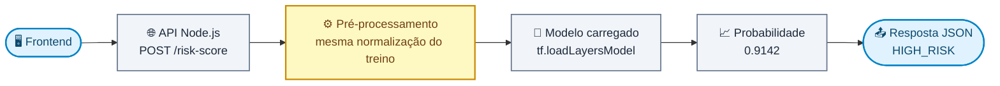

# 🧠 TFJS Credit Risk Classifier

Laboratório didático de classificação de risco de crédito com **Node.js**, **TensorFlow.js** e uma rede neural **MLP (Multilayer Perceptron)**.

Todo o ciclo de um projeto de Machine Learning supervisionado cabe em um único arquivo de código (`index.js`), do dado bruto até a inferência — sobre um **dataset real de crédito** ou sobre um dataset sintético gerado aqui:


O laço entre **Treinamento** e **Validação** é o coração do processo: a cada época o modelo é medido em dados que não usou para ajustar pesos, e o *early stopping* corta o ciclo quando essa medida para de melhorar. **Teste**, **Persistência** e **Predição** acontecem uma única vez, depois que o treino terminou.

> ⚠️ Finalidade **exclusivamente educacional**. O dataset real é de 1994 e serve de estudo, não de base para decisões financeiras.

---

## 📚 Documentação

O `README` cobre o essencial: o que o projeto é, como rodar e o que ainda falta. O resto — a medição de cada decisão — está em `docs/`:

| Documento | O que tem lá |
| --------- | ------------ |
| **[🧪 Dados: features, geração sintética e CSV](docs/dados-sinteticos.md)** | Como as features são definidas, como o dataset sintético é gerado (ruído, desbalanceamento, semente) e como os dados vão e voltam do CSV. |
| **[🏦 Dataset real: German Credit](docs/german-credit.md)** | O dataset da UCI, a codificação das colunas qualitativas, a auditoria por sexo e a comparação lado a lado com o sintético. |
| **[🧠 O modelo: arquitetura, regularização e treinamento](docs/modelo.md)** | A MLP, os dois freios contra overfitting medidos em grade, a configuração de treino e como os dados são divididos. |
| **[📊 Métricas de avaliação e ajuste do limiar](docs/metricas.md)** | Matriz de confusão, precision/recall/F1, curva ROC e AUC, e a escolha do corte por custo. |
| **[🔁 Validação cruzada e split estratificado](docs/validacao-cruzada.md)** | Por que um hold-out não basta, o que a estratificação trava e o que k dobras mudaram na conclusão do projeto. |
| **[⚖️ Mitigação da disparidade](docs/mitigacao.md)** | O limiar por grupo: o que ele corrige, o que ele cobra e por que o padrão é desligado. |
| **[🔮 Inferência, persistência e memória](docs/inferencia.md)** | Prever para um cliente novo, salvar e recarregar o modelo, e o gerenciamento de tensores. |
| **[🧩 API do módulo e exemplo de saída](docs/api.md)** | Tudo que o `index.js` exporta, e uma execução completa comentada. |
| **[✅ Testes e solução de problemas](docs/testes.md)** | A tabela de cobertura da suíte, alvo por alvo, e o que fazer quando o `tfjs-node` não instala. |

---

## 🎯 Objetivo

Treinar uma rede neural capaz de estimar a probabilidade de um cliente ser de **alto risco** de inadimplência.

A rede recebe as características financeiras do cliente — **57** no dataset real, **4** no sintético — e devolve **um único número entre `0` e `1`**:

| Saída da rede | Interpretação          | Classificação |
| ------------: | ---------------------- | ------------- |
|        `0.12` | 12% de chance de risco | ✅ BAIXO RISCO |
|        `0.91` | 91% de chance de risco | ⚠️ ALTO RISCO  |

O corte é feito em `0.5`:

```javascript
const DECISION_THRESHOLD = 0.5;

const classify = (probability) =>
  (probability >= DECISION_THRESHOLD ? 'ALTO RISCO' : 'BAIXO RISCO');
```

Esse limiar é uma **escolha de negócio**, não uma verdade do modelo — baixá-lo captura mais inadimplentes ao custo de mais falsos positivos.

---

## 🚀 Início rápido

**Requisitos:** Node.js **20 ou 22** (LTS). O projeto traz um `.nvmrc`, então basta:

```bash
nvm use
```

O `@tensorflow/tfjs-node` baixa binários nativos na instalação — o primeiro `npm install` demora.

> ⛔ **Não use Node 23 ou superior.** Veja [Solução de problemas](docs/testes.md#-solução-de-problemas).

```bash
git clone https://github.com/Felps03/tfjs-credit-risk-classifier.git
cd tfjs-credit-risk-classifier
npm install
npm start
```

`npm start` roda sobre o **[German Credit](docs/german-credit.md#-dataset-real-german-credit)**, um dataset real da UCI. Os dois CSVs vêm versionados, então isso funciona **offline** logo após o clone.

```bash
npm start                # dataset real (German Credit) — padrão
npm run start:synthetic  # dataset sintético gerado pelo projeto
npm run fetch:german     # rebaixa o dataset real da UCI e reconverte
npm run seed             # regenera o dataset sintético a partir do código
```

Uma execução mede **uma** divisão. Para a estimativa com barra de erro — k treinos, cada cliente pontuado por um modelo que não o viu — existe um comando à parte:

```bash
npm run cv               # 5 dobras estratificadas no dataset real
npm run cv:synthetic     # o mesmo no sintético
node index.js --cv=10    # escolhendo o k
```

É [essa medição](docs/validacao-cruzada.md#-validação-cruzada-e-split-estratificado) que responde "quanto o modelo acerta?" sem depender de qual sorteio calhou.

Os dois freios contra *overfitting* são ajustáveis pela linha de comando, para que o efeito possa ser **visto** em vez de lido:

```bash
node index.js --l2=0 --dropout=0   # a rede sem regularização nenhuma
node index.js --dropout=0.5        # só dropout, e forte
```

E a disparidade medida pela auditoria pode ser **corrigida** em vez de só reportada, com um limiar por grupo calibrado no treino:

```bash
npm start -- --mitigar             # a decisão passa a ler o sexo do cliente
```

A comparação entre as duas políticas aparece em toda execução, com ou sem a flag; o que a flag muda é qual delas decide. O padrão é **desligado**, e [a seção sobre mitigação explica por quê](docs/mitigacao.md#-mitigação-da-disparidade) — com números.

Cada fonte declara a **sua** dose — o dataset real vem com os freios ligados, o sintético não —, e as flags sobrescrevem o que a fonte declara. Cada execução imprime `Diferença treino − teste` logo abaixo das acurácias. É o termômetro do *overfitting*, e é o número que [a regularização existe para encolher](docs/modelo.md#-regularização-l2-e-dropout).

Os dados **não** mudam entre execuções, e agora nem entre máquinas: o CSV real é fixo, e o sintético é gerado por um [PRNG com semente](docs/dados-sinteticos.md#-geração-dos-dados-sintéticos) — `npm run seed` reproduz o arquivo versionado byte a byte. Os pesos iniciais da rede continuam aleatórios, então as métricas oscilam um pouco a cada rodada; é esperado, e é por isso que os números desta documentação são **médias de 15 execuções** com erro padrão.

### Estrutura

```text
tfjs-credit-risk-classifier/
├── index.js               # fontes de dados, modelo, treino, avaliação, persistência e predição
├── scripts/
│   ├── fetch-german.js    # baixa o German Credit da UCI e converte
│   └── seed.js            # regera o CSV sintético (ruído e balanço configuráveis)
├── test/
│   └── index.test.js      # testes com o runner nativo do Node
├── docs/                  # a documentação longa: medições, tabelas e decisões
│   ├── dados-sinteticos.md
│   ├── german-credit.md
│   ├── modelo.md
│   ├── metricas.md
│   ├── validacao-cruzada.md
│   ├── mitigacao.md
│   ├── inferencia.md
│   ├── api.md
│   └── testes.md
├── package.json
├── package-lock.json
├── .nvmrc                 # versão do Node suportada
├── .gitignore
├── data/
│   ├── german-credit.csv  # dataset REAL (UCI/Statlog), convertido e versionado
│   └── customers.csv      # dataset sintético versionado, reproduzível pela semente
├── model/                 # gerado por `npm start` — ignorado pelo git
│   ├── model.json         # topologia + training config
│   └── weights.bin        # pesos e estado do otimizador
└── README.md
```

### Testes

```bash
npm test           # roda a suíte uma vez
npm run test:watch # re-executa a cada alteração
```

São **295 testes** no runner nativo do Node (`node:test` + `node:assert`) — nenhuma dependência de desenvolvimento —, escritos em **Given / When / Then**. A [tabela de cobertura completa](docs/testes.md), alvo por alvo, está na documentação.

> ⛔ Se o `npm install` ou o `npm start` quebrarem, o culpado quase sempre é a versão do Node: veja [Solução de problemas](docs/testes.md#-solução-de-problemas).

---

## ⚠️ Limitações conhecidas

Coisas deliberadamente simplificadas — cada uma é um bom exercício de correção:

| Simplificação                                                  | Por que importaria em produção                              |
| -------------------------------------------------------------- | ----------------------------------------------------------- |
| **1.073 parâmetros para 640 linhas** de treino efetivo           | Capacidade muito acima do dado disponível. A [regularização](docs/modelo.md#-regularização-l2-e-dropout) corta a diferença treino−teste pela metade, mas **não** recupera AUC — o gargalo é o dado, não a capacidade |
| Dataset real com apenas **1.000 linhas**                         | Pouco dado para uma rede neural — boa parte da variação entre execuções vem daí |
| Todos os níveis one-hot mantidos (*dummy variable trap*)         | Inofensivo em rede neural, quebraria uma regressão linear |
| `savingsStatus` trata "desconhecido" como mais um nível          | Ausência de dado não é uma categoria como as outras; o certo seria um indicador de faltante separado |
| Mitigação da disparidade **desligada por padrão**                | O limiar por grupo existe e funciona ([medido](docs/mitigacao.md#-mitigação-da-disparidade)), mas exige ler o atributo protegido na decisão e, no *hold-out* de 200 linhas, corrige com a dose errada. Ligá-la é decisão de política |
| Mitigação limitada à **paridade demográfica**                    | Igualar aprovação é um critério entre vários; igualar FNR ou odds daria outra política, e as duas não podem valer juntas com taxas-base diferentes |
| Nada é feito contra o **vazamento do atributo protegido**         | O sexo é previsível a partir das features do modelo com AUC `0.699`; a mitigação compensa o efeito no fim da linha, sem remover a causa |
| CSV sem validação de esquema, faixas ou valores ausentes        | Dado real vem com coluna faltando, texto onde deveria haver número e `NaN` |
| Limiar escolhido no **mesmo** conjunto em que é medido           | Calibrar e avaliar no mesmo hold-out otimiza para aquele split; o certo é um conjunto de validação separado. A [mitigação](docs/mitigacao.md#-mitigação-da-disparidade) já faz certo — calibra no treino, audita no teste —, o ajuste do limiar ainda não |
| Custos de FP e FN fixos no código (`1` e `5`)                    | Aqui vêm da matriz oficial do dataset; em produção viriam de ticket médio, taxa de recuperação e margem |
| Modelo salvo sem versionar o **scaler** junto                    | Pesos novos com pré-processamento antigo → training-serving skew |
| `npm start` continua reportando **uma** divisão                  | O relatório completo — matriz, curva, limiar, auditoria — roda sobre um hold-out só, e a divisão fixa é reconhecidamente ruim. A estimativa honesta está a um comando de distância ([`npm run cv`](docs/validacao-cruzada.md#-validação-cruzada-e-split-estratificado)), mas não é o padrão |
| Regularização escolhida em uma grade medida no **mesmo** protocolo de avaliação | Trinta configurações comparadas sem conjunto de validação separado; o certo seria escolher em um conjunto e reportar em outro — o mesmo problema do [limiar](docs/metricas.md#-ajuste-do-limiar-de-decisão), algumas linhas acima |
| Nenhum tratamento para o **desbalanceamento** durante o treino   | O dataset agora tem 15,8% de positivos, mas o treino não usa `classWeight`, reamostragem nem *focal loss*; a única correção aplicada é [no limiar](docs/metricas.md#-ajuste-do-limiar-de-decisão), depois do fato |
| Ruído sintético **normal e independente** por coluna             | Erro real é enviesado (renda é subdeclarada, não sorteada em torno da verdade) e correlacionado entre colunas |
| Ruído de rótulo **simétrico**                                    | Na prática um mau pagador registrado como bom é bem mais comum que o contrário |

Duas limitações da versão anterior **deixaram de existir** com o dataset real:

| Era limitação | O que resolveu |
| ------------- | -------------- |
| ~~Normalização com constantes fixas em vez de estatísticas do treino~~ | `fitMinMaxScaler`, [medido só no treino](docs/german-credit.md#agora-a-normalização-precisa-ser-medida) |
| ~~Split por fatiamento sem embaralhar antes~~ | `shuffle` com [semente fixa](docs/german-credit.md#reprodutibilidade) antes do corte |
| ~~Categorias codificadas como ordinais~~ | [One-hot](docs/german-credit.md#por-que-one-hot-e-não-ordinal) nas 12 qualitativas |
| ~~8 das 20 colunas aproveitadas~~ | 19 colunas; a vigésima é [auditoria, não feature](docs/german-credit.md#a-coluna-que-o-modelo-não-recebeu) |
| ~~Dataset sintético limpo e quase equilibrado~~ | [Ruído e desbalanceamento](docs/dados-sinteticos.md#-geração-dos-dados-sintéticos) injetados, com o efeito de cada um medido |
| ~~Nenhuma defesa contra overfitting além do early stopping~~ | [L2 e dropout](docs/modelo.md#-regularização-l2-e-dropout), com a dose declarada por fonte e medida em grade |
| ~~CSV sintético gerado com `Math.random()`, irreprodutível~~ | Gerador com semente: `npm run seed` reconstrói o arquivo versionado byte a byte |
| ~~Split simples em vez de estratificado~~ | [`stratifiedSplitCustomers`](docs/validacao-cruzada.md#-validação-cruzada-e-split-estratificado): o baseline do teste passou a sair `0.7000` em **todas** as divisões |
| ~~Sem validação cruzada~~ | `npm run cv`: k dobras estratificadas, média com erro padrão, e a auditoria de disparidade rodando sobre os 1.000 clientes |

---

## 🛠️ Próximas evoluções

**Métricas e avaliação**
- [x] ~~matriz de confusão~~ — feito, veja [Matriz de confusão](docs/metricas.md#-matriz-de-confusão);
- [x] ~~precision, recall e F1-score~~ — feito, veja [Precision, recall e F1-score](docs/metricas.md#-precision-recall-e-f1-score);
- [x] ~~curva ROC e AUC~~ — feito, veja [Curva ROC e AUC](docs/metricas.md#-curva-roc-e-auc);
- [x] ~~ajuste do limiar de decisão a partir da curva~~ — feito, veja [Ajuste do limiar de decisão](docs/metricas.md#-ajuste-do-limiar-de-decisão).

**Modelo e dados**
- [x] ~~carregar dados de um CSV~~ — feito, veja [Carregando dados de um CSV](docs/dados-sinteticos.md#-carregando-dados-de-um-csv);
- [x] ~~usar um dataset real de crédito~~ — feito, veja [Dataset real: German Credit](docs/german-credit.md#-dataset-real-german-credit);
- [x] ~~codificar as categóricas com *one-hot* em vez de ordinal, e aproveitar as colunas restantes~~ — feito, veja [Por que one-hot e não ordinal](docs/german-credit.md#por-que-one-hot-e-não-ordinal);
- [x] ~~adicionar ruído e desbalanceamento aos dados sintéticos~~ — feito, veja [Geração dos dados sintéticos](docs/dados-sinteticos.md#-geração-dos-dados-sintéticos);
- [x] ~~regularização L2 e dropout~~ — feito, veja [Regularização: L2 e dropout](docs/modelo.md#-regularização-l2-e-dropout);
- [x] ~~mitigar a disparidade medida, não só reportá-la~~ — feito, veja [Mitigação da disparidade](docs/mitigacao.md#-mitigação-da-disparidade);
- [x] ~~validação cruzada e split estratificado~~ — feito, veja [Validação cruzada e split estratificado](docs/validacao-cruzada.md#-validação-cruzada-e-split-estratificado);
- [ ] comparar arquiteturas diferentes.

**Produto**
- [x] ~~testes automatizados~~ — feito, veja [Testes](#testes);
- [x] ~~salvar e recarregar o modelo (`model.save` / `tf.loadLayersModel`)~~ — feito, veja [Persistência do modelo](docs/inferencia.md#-persistência-do-modelo);
- [ ] API REST com endpoint `POST /risk-score`;
- [ ] frontend para simular clientes;
- [ ] inferência no navegador com TensorFlow.js.

### 🌐 Esboço da API

```http
POST /risk-score
Content-Type: application/json
```

```json
{
  "checkingStatus": 0, "durationMonths": 48, "creditHistory": 1, "creditAmount": 9000,
  "savingsStatus": 0, "employmentYears": 1, "installmentRate": 4, "age": 24
}
```

```json
{ "riskProbability": 0.8184, "classification": "HIGH_RISK" }
```



O ponto crítico: o serviço precisa aplicar **exatamente a mesma normalização** do treino. Divergência entre treino e inferência (*training-serving skew*) é uma das falhas mais comuns em ML em produção.

Com o dataset real isso ficou mais concreto: a escala não é mais um punhado de constantes no código, e sim um `scaler` **medido** durante o treino. Ou ele é salvo junto com os pesos, ou o serviço normaliza diferente do que a rede aprendeu.

---

## 📚 Conceitos demonstrados

`Redes neurais` · `Perceptron` · `MLP` · `Dense Layers` · `ReLU` · `Sigmoid` · `Classificação binária` · `Binary Crossentropy` · `Adam` · `Learning rate` · `Batch size` · `Epoch` · `Train/Validation/Test` · `Early Stopping` · `Overfitting` · `Normalização` · `Min-max scaling` · `Data leakage` · `Codificação ordinal` · `One-hot encoding` · `Dummy variable trap` · `Baseline da classe majoritária` · `Desbalanceamento de classes` · `Ruído de medição` · `Ruído de rótulo` · `Erro irredutível` · `Box-Muller` · `PRNG com semente` · `Quantil` · `Matriz de confusão` · `Precision/Recall/F1` · `Curva ROC` · `AUC` · `Matriz de custo` · `Ajuste de limiar` · `Reprodutibilidade` · `Validação cruzada k-fold` · `Amostragem estratificada` · `Regularização L2` · `Dropout` · `Fairness` · `Disparate impact` · `Regra dos quatro quintos` · `Paridade demográfica` · `Igualdade de erros` · `Mitigação por pós-processamento` · `Limiar por grupo` · `Inferência` · `Gerenciamento de tensores` · `Testes automatizados`

---

## 🔒 Aviso

Projeto criado para **estudo de redes neurais e TensorFlow.js**. O modelo **não deve ser usado para decisões financeiras reais**.

O dataset real é de **1994**, tem 1.000 registros de um único banco alemão e reflete as práticas de concessão daquele contexto — inclusive as discriminatórias. Ele serve para estudar o método, não para tirar conclusões sobre crédito hoje.

A [auditoria por sexo](docs/german-credit.md#a-coluna-que-o-modelo-não-recebeu) incluída aqui é uma demonstração didática de uma técnica, não um parecer. Avaliar viés em um sistema de crédito real exige análise causal, contexto jurídico e revisão humana — nada disso cabe em um `README`.

O mesmo vale, com força redobrada, para a [mitigação](docs/mitigacao.md#-mitigação-da-disparidade). Aplicar um limiar diferente por sexo é usar o atributo protegido na decisão, o que em vários ordenamentos jurídicos é ilegal **mesmo com intenção corretiva**. A flag `--mitigar` existe para que o efeito e o preço possam ser medidos, não para ser ligada em produção.

Modelos de crédito em produção exigem, entre outros pontos: dados representativos, validação estatística, análise de viés, explicabilidade, governança, monitoramento contínuo, segurança e conformidade regulatória.

---

## 📖 Referências

- *Deep Learning* — Ian Goodfellow, Yoshua Bengio, Aaron Courville
- *Deep Learning with Python* — François Chollet
- [TensorFlow.js — Documentação](https://www.tensorflow.org/js)
- [`@tensorflow/tfjs-node`](https://www.npmjs.com/package/@tensorflow/tfjs-node)
- Hofmann, H. (1994). **Statlog (German Credit Data)**. UCI Machine Learning Repository. [DOI: 10.24432/C5NC77](https://archive.ics.uci.edu/dataset/144/statlog+german+credit+data) — CC BY 4.0
- Barocas, S., Hardt, M., Narayanan, A. — [*Fairness and Machine Learning*](https://fairmlbook.org/) (sobre por que os critérios de justiça são incompatíveis entre si quando as taxas-base diferem)
- Box, G. E. P., Muller, M. E. (1958). **A Note on the Generation of Random Normal Deviates**. *Annals of Mathematical Statistics*, 29(2) — a transformação usada para gerar o [ruído de medição](docs/dados-sinteticos.md#ruído-de-medição-um-teto-que-nenhum-modelo-ultrapassa)
- Frénay, B., Verleysen, M. (2014). **Classification in the Presence of Label Noise: a Survey**. *IEEE Transactions on Neural Networks and Learning Systems*, 25(5) — por que rótulo errado dói mais na classe minoritária
- He, H., Garcia, E. A. (2009). **Learning from Imbalanced Data**. *IEEE Transactions on Knowledge and Data Engineering*, 21(9) — o problema que a [taxa de 15,8%](docs/dados-sinteticos.md#desbalanceamento-o-limiar-virou-um-quantil) introduz de propósito
- Hardt, M., Price, E., Srebro, N. (2016). **Equality of Opportunity in Supervised Learning**. *NeurIPS* — o pós-processamento por limiar de que a [mitigação](docs/mitigacao.md#-mitigação-da-disparidade) deste projeto é a variante mais simples
- Kohavi, R. (1995). **A Study of Cross-Validation and Bootstrap for Accuracy Estimation and Model Selection**. *IJCAI* — por que k dobras **estratificadas**, e não um hold-out, estimam acurácia
- Srivastava, N. et al. (2014). **Dropout: A Simple Way to Prevent Neural Networks from Overfitting**. *JMLR*, 15 — o freio que [não acrescenta parâmetro nenhum](docs/modelo.md#-regularização-l2-e-dropout)

---

## 📄 Licença

Uso livre para fins de estudo e experimentação.
