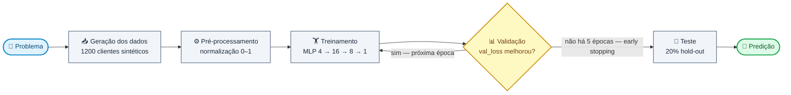
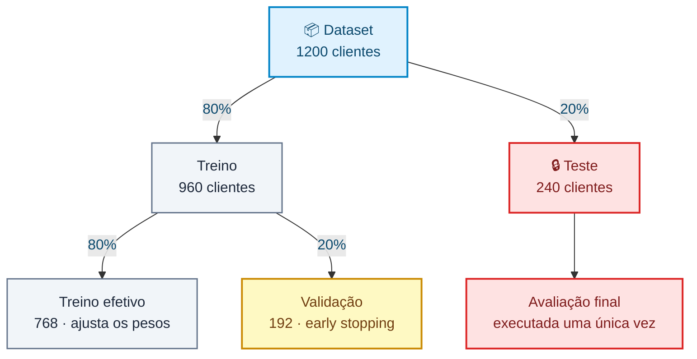

# 🧠 TFJS Credit Risk Classifier

Laboratório didático de classificação de risco de crédito com **Node.js**, **TensorFlow.js** e uma rede neural **MLP (Multilayer Perceptron)**.

Todo o ciclo de um projeto de Machine Learning supervisionado cabe em um único arquivo de código (`index.js`), do dado sintético até a inferência:



O laço entre **Treinamento** e **Validação** é o coração do processo: a cada época o modelo é medido em dados que não usou para ajustar pesos, e o *early stopping* corta o ciclo quando essa medida para de melhorar. **Teste** e **Predição** acontecem uma única vez, depois que o treino terminou.

> ⚠️ Dados **sintéticos**, finalidade **exclusivamente educacional**. Não use para decisões financeiras reais.

---

## 📑 Sumário

- [Objetivo](#-objetivo)
- [Início rápido](#-início-rápido)
- [Testes](#testes)
- [Solução de problemas](#-solução-de-problemas)
- [Features de entrada](#-features-de-entrada)
- [Geração dos dados sintéticos](#-geração-dos-dados-sintéticos)
- [Arquitetura da rede](#-arquitetura-da-rede)
- [Treinamento](#-treinamento)
- [Divisão dos dados](#-divisão-dos-dados)
- [Inferência](#-inferência)
- [API do módulo](#-api-do-módulo)
- [Exemplo de saída](#-exemplo-de-saída)
- [Gerenciamento de memória](#-gerenciamento-de-memória)
- [Limitações conhecidas](#-limitações-conhecidas)
- [Próximas evoluções](#-próximas-evoluções)

---

## 🎯 Objetivo

Treinar uma rede neural capaz de estimar a probabilidade de um cliente ser de **alto risco** de inadimplência.

A rede recebe quatro características financeiras e devolve **um único número entre `0` e `1`**:

| Saída da rede | Interpretação          | Classificação |
| ------------: | ---------------------- | ------------- |
|        `0.12` | 12% de chance de risco | ✅ BAIXO RISCO |
|        `0.91` | 91% de chance de risco | ⚠️ ALTO RISCO  |

O corte é feito em `0.5`:

```javascript
const DECISION_THRESHOLD = 0.5;

const classify = (probability) =>
  (probability >= DECISION_THRESHOLD ? 'ALTO RISCO' : 'BAIXO RISCO');
```

Esse limiar é uma **escolha de negócio**, não uma verdade do modelo — baixá-lo captura mais inadimplentes ao custo de mais falsos positivos.

---

## 🚀 Início rápido

**Requisitos:** Node.js **20 ou 22** (LTS). O projeto traz um `.nvmrc`, então basta:

```bash
nvm use
```

O `@tensorflow/tfjs-node` baixa binários nativos na instalação — o primeiro `npm install` demora.

> ⛔ **Não use Node 23 ou superior.** Veja [Solução de problemas](#-solução-de-problemas).

```bash
git clone https://github.com/Felps03/tfjs-credit-risk-classifier.git
cd tfjs-credit-risk-classifier
npm install
npm start
```

Cada execução gera um dataset novo e pesos iniciais novos, então os números **mudam a cada rodada** — isso é esperado.

### Estrutura

```text
tfjs-credit-risk-classifier/
├── index.js               # dataset, modelo, treino, avaliação e predição
├── test/
│   └── index.test.js      # testes com o runner nativo do Node
├── package.json
├── package-lock.json
├── .nvmrc                 # versão do Node suportada
├── .gitignore
└── README.md
```

### Testes

```bash
npm test           # roda a suíte uma vez
npm run test:watch # re-executa a cada alteração
```

Os testes usam o **runner nativo do Node** (`node:test` + `node:assert`) — nenhuma dependência de desenvolvimento — e são escritos no formato **Given / When / Then**:

```javascript
it('dada a probabilidade exatamente no limiar, quando classificada, então retorna ALTO RISCO', () => {
  // Given — o corte usa >=, então o limiar pertence à classe positiva
  const probability = DECISION_THRESHOLD;

  // When
  const label = classify(probability);

  // Then
  assert.equal(label, 'ALTO RISCO');
});
```

A suíte cobre o que é determinístico e verificável sem treinar a rede:

| Alvo                   | O que é verificado                                                          |
| ---------------------- | --------------------------------------------------------------------------- |
| `normalizeIncome`      | Piso, teto e meio da faixa mapeiam para `0`, `1` e `0.5`                      |
| `normalizeLatePayments`| `0` atrasos → `0`; máximo de atrasos → `1`                                    |
| `toFeatureVector`      | Vetor esperado, largura 4 e determinismo (proteção contra *skew*)             |
| `classify`             | Comportamento no limiar `0.5`, inclusive logo abaixo dele                     |
| `createDataset`        | Tamanho, features dentro de `[0, 1]`, rótulos binários, ambas as classes presentes |
| `splitDataset`         | Proporções, nada perdido e **ausência de sobreposição entre treino e teste**  |
| `buildModel`           | 3 camadas, entrada `[null, 4]`, saída `[null, 1]`, **225 parâmetros**, ativações e loss |

### 🩺 Solução de problemas

**`TypeError: (0 , util_1.isNullOrUndefined) is not a function`**

Você está em um Node novo demais. O **Node 23 removeu** os type-checkers legados do módulo `util` (depreciados desde o Node 4), e o `@tensorflow/tfjs-node@4.22.0` ainda os utiliza em 5 pontos do backend nativo.

| Node | `util.isNullOrUndefined` | Projeto |
| ---- | ------------------------ | ------- |
| 20 (LTS)  | presente  | ✅ funciona |
| 22 (LTS)  | presente  | ✅ funciona |
| 23        | removido  | ❌ quebra   |
| 24 (LTS)  | removido  | ❌ quebra   |

O `tfjs-node` não recebe release desde **janeiro de 2025**, e o `4.23.0-rc.0` mantém as mesmas chamadas — não há correção upstream. Por isso o projeto fixa **Node 22** no `.nvmrc` e declara `"engines": { "node": ">=20.0.0 <23.0.0" }`.

Solução:

```bash
nvm install 22 && nvm use
rm -rf node_modules package-lock.json && npm install
```

---

## 📥 Features de entrada

O cliente é descrito por quatro campos brutos:

| Campo               | Descrição                           | Faixa gerada     |
| ------------------- | ----------------------------------- | ---------------- |
| `income`            | Renda mensal do cliente             | `2.000 – 15.000` |
| `debtRatio`         | Percentual de endividamento         | `0.0 – 1.0`      |
| `latePayments`      | Quantidade de pagamentos atrasados  | `0 – 5`          |
| `creditUtilization` | Percentual de utilização do crédito | `0.0 – 1.0`      |

Dois deles precisam ser **normalizados** antes de entrar na rede, para que todas as features fiquem na mesma escala (`0` a `1`) e nenhuma domine o gradiente só por ter números maiores:

```javascript
const normalizeIncome = (income) => (income - INCOME_MIN) / INCOME_RANGE;

const normalizeLatePayments = (latePayments) => latePayments / MAX_LATE_PAYMENTS;
```

`debtRatio` e `creditUtilization` já nascem entre `0` e `1` e vão direto.

O vetor que a rede realmente enxerga é montado por uma única função:

```javascript
const toFeatureVector = ({
  income,
  debtRatio,
  latePayments,
  creditUtilization,
}) => [
  normalizeIncome(income),
  debtRatio,
  normalizeLatePayments(latePayments),
  creditUtilization,
];
```

> 🔑 `toFeatureVector` é a **fonte única de verdade** da normalização: quem a chama é tanto a geração do dataset quanto a inferência do cliente novo. Duplicar essa lógica em dois lugares é a origem clássica do *training-serving skew* — o modelo passa a receber, em produção, números em escala diferente da que viu no treino.

> 💡 Aqui as constantes de normalização (`2000`, `13000`, `5`) são conhecidas de antemão porque nós geramos os dados. **Em um projeto real elas devem ser calculadas apenas no conjunto de treino** e depois reaplicadas em validação/teste — caso contrário há vazamento de dados (*data leakage*).

---

## 🧪 Geração dos dados sintéticos

O projeto cria automaticamente **1.200 clientes** com características aleatórias. Para cada um, uma regra determinística define o rótulo:

```javascript
const riskScore =
  1.4 * debtRatio +
  1.2 * latePaymentsNormalized +
  1.0 * creditUtilization -
  0.8 * incomeNormalized;

const highRisk = riskScore > RISK_RULE_THRESHOLD ? 1 : 0;  // 1.35 · 0 = baixo, 1 = alto
```

**A rede neural nunca vê essa fórmula.** Ela recebe só as quatro features e os rótulos `0`/`1`, e precisa descobrir sozinha o padrão a partir dos exemplos. É exatamente por isso que a acurácia alta no teste é um resultado interessante: significa que a MLP reconstruiu, nos seus pesos, uma aproximação da regra escondida.

---

## 🧠 Arquitetura da rede

Uma **MLP** com duas camadas ocultas:


Total: **225 parâmetros treináveis** — é o que o `model.summary()` imprime ao rodar.

```javascript
const buildModel = () => {
  const model = tf.sequential();

  model.add(tf.layers.dense({ inputShape: [4], units: 16, activation: 'relu' }));
  model.add(tf.layers.dense({ units: 8, activation: 'relu' }));
  model.add(tf.layers.dense({ units: 1, activation: 'sigmoid' }));

  model.compile({
    optimizer: tf.train.adam(0.001),
    loss: 'binaryCrossentropy',
    metrics: ['accuracy'],
  });

  return model;
};
```

| Escolha       | Por quê                                                                                   |
| ------------- | ----------------------------------------------------------------------------------------- |
| **ReLU**      | Introduz não-linearidade barata e evita o desaparecimento de gradiente das camadas ocultas |
| **Sigmoid**   | Garante uma saída em `[0, 1]`, legível como probabilidade                                  |
| **16 → 8**    | Funil: capacidade suficiente para o padrão, pequena o bastante para não decorar o dataset  |

O `main()` chama `model.summary()` logo após construir o modelo, então a contagem de parâmetros por camada aparece no início de cada execução.

---

## ⚙️ Treinamento

```javascript
model.compile({
  optimizer: tf.train.adam(0.001),
  loss: 'binaryCrossentropy',
  metrics: ['accuracy'],
});

await model.fit(xTrain, yTrain, {
  epochs: 40,
  batchSize: 32,
  validationSplit: 0.2,
  shuffle: true,
  callbacks: [
    tf.callbacks.earlyStopping({ monitor: 'val_loss', patience: 5 }),
  ],
});
```

| Parâmetro            | Valor                  | Papel                                                            |
| -------------------- | ---------------------- | ---------------------------------------------------------------- |
| **Optimizer**        | Adam (`lr = 0.001`)    | Ajusta os pesos com taxa de aprendizado adaptativa por parâmetro  |
| **Loss**             | `binaryCrossentropy`   | Função de erro padrão para classificação binária (`0` ou `1`)     |
| **Métrica**          | `accuracy`             | Percentual de acertos — legível para humanos, não usada no treino |
| **Epochs**           | 40 (máximo)            | Quantas vezes o dataset inteiro passa pela rede                   |
| **Batch size**       | 32                     | Exemplos processados antes de cada atualização de pesos           |
| **Validation split** | 20% do treino          | Fatia usada só para medir generalização durante o treino          |
| **Shuffle**          | `true`                 | Embaralha a cada época, evitando que a ordem vire um viés         |

### ⏹️ Early Stopping

O treino monitora a `val_loss` e **para sozinho** se ela não melhorar por 5 épocas seguidas (`patience: 5`) — ou seja, raramente chega às 40 épocas.

É a defesa contra **overfitting**: o momento em que o modelo continua melhorando no treino enquanto piora na validação, porque passou a decorar exemplos em vez de aprender o padrão.

---

## 📊 Divisão dos dados



```javascript
const splitDataset = ({ features, labels }, trainRatio = 0.8) => {
  const trainSize = Math.floor(features.length * trainRatio);

  return {
    trainFeatures: features.slice(0, trainSize),
    trainLabels: labels.slice(0, trainSize),
    testFeatures: features.slice(trainSize),
    testLabels: labels.slice(trainSize),
  };
};
```

A segunda divisão — treino efetivo vs. validação — não aparece aqui: quem faz é o próprio `model.fit()`, via `validationSplit: 0.2`.

O conjunto de **teste nunca participa do treinamento nem do early stopping**. Ele é a única medida honesta de como o modelo se comporta com dados que jamais viu, e a suíte de testes verifica que não há sobreposição entre as duas fatias.

---

## 🔮 Inferência

Um cliente novo passa pela **mesma normalização** usada no treino:

```javascript
const newCustomer = {
  income: 3500,
  debtRatio: 0.72,
  latePayments: 3,
  creditUtilization: 0.88,
};

const input = tf.tensor2d([toFeatureVector(newCustomer)]);

const prediction  = model.predict(input);
const probability = prediction.dataSync()[0];

console.log('Classificação:', classify(probability));
```

Repare que é **a mesma `toFeatureVector`** usada na geração do dataset — não há uma segunda cópia da fórmula de normalização no caminho da inferência.

Renda baixa, endividamento alto, atrasos e crédito quase estourado — o modelo deve devolver uma probabilidade próxima de `1`.

---

## 🧩 API do módulo

O `index.js` só executa o treino quando chamado direto (`node index.js`); ao ser importado, apenas expõe suas funções:

```javascript
if (require.main === module) {
  main();
}
```

É isso que permite testar as partes sem treinar a rede. O que ele exporta:

| Export | Tipo | Papel |
| ------ | ---- | ----- |
| `INCOME_MIN`, `INCOME_RANGE`, `MAX_LATE_PAYMENTS` | constantes | Faixas usadas na normalização |
| `RISK_RULE_THRESHOLD` | constante | Corte `1.35` da regra que gera os rótulos |
| `DECISION_THRESHOLD` | constante | Corte `0.5` do classificador |
| `normalizeIncome`, `normalizeLatePayments` | função | Normalizações min-max individuais |
| `toFeatureVector` | função | Cliente bruto → vetor de 4 features |
| `classify` | função | Probabilidade → `'ALTO RISCO'` / `'BAIXO RISCO'` |
| `createDataset` | função | Gera `{ features, labels }` sintéticos |
| `splitDataset` | função | Divide em treino e teste |
| `buildModel` | função | Monta e compila a MLP |
| `main` | função async | Pipeline completo: treina, avalia e prevê |

---

## 📤 Exemplo de saída

```text
Test loss: 0.1321
Test accuracy: 0.9583

Probabilidade de alto risco: 0.9142
Classificação: ALTO RISCO
```

Os valores exatos não importam. O que se observa é o **comportamento**:

- ✅ `loss` de treino diminui ao longo das épocas;
- ✅ `val_loss` acompanha (se subir enquanto a de treino cai → overfitting);
- ✅ `accuracy` sobe;
- ✅ a acurácia de teste fica próxima da de validação → o modelo **generalizou**.

---

## 🧹 Gerenciamento de memória

Tensores do TensorFlow.js vivem fora do garbage collector do JavaScript e precisam ser liberados explicitamente:

```javascript
tf.dispose([
  xTrain, yTrain, xTest, yTest,
  input, prediction, lossTensor, accuracyTensor,
]);

model.dispose();
```

O `model.dispose()` é separado: libera os pesos, que não estão na lista de tensores avulsos.

Em um script curto isso é apenas boa prática; em uma API de longa duração, esquecer o `dispose` vaza memória a cada requisição. Para blocos intermediários, `tf.tidy()` faz a limpeza automaticamente.

---

## ⚠️ Limitações conhecidas

Coisas deliberadamente simplificadas — cada uma é um bom exercício de correção:

| Simplificação                                                  | Por que importaria em produção                              |
| -------------------------------------------------------------- | ----------------------------------------------------------- |
| Normalização com constantes fixas em vez de estatísticas do treino | Vazamento de dados                                       |
| Split por fatiamento (`slice`) sem embaralhar antes             | Seguro aqui (dados aleatórios), perigoso em dados ordenados  |
| Rótulos gerados por regra determinística e sem ruído            | Dados reais têm ruído, sobreposição de classes e desbalanceamento |
| Avaliação só por `accuracy`                                     | Em base desbalanceada, acurácia esconde o erro que importa   |
| Limiar fixo em `0.5`                                            | O corte deveria vir do custo real de falso positivo/negativo |
| Sem persistência do modelo                                      | Retreinar a cada execução é inviável                         |

---

## 🛠️ Próximas evoluções

**Métricas e avaliação**
- [ ] matriz de confusão;
- [ ] precision, recall e F1-score;
- [ ] curva ROC e AUC;
- [ ] ajuste do limiar de decisão a partir da curva.

**Modelo e dados**
- [ ] carregar dados de um CSV;
- [ ] usar um dataset real de crédito;
- [ ] adicionar ruído e desbalanceamento aos dados sintéticos;
- [ ] regularização L2 e dropout;
- [ ] comparar arquiteturas diferentes.

**Produto**
- [x] ~~testes automatizados~~ — feito, veja [Testes](#testes);
- [ ] salvar e recarregar o modelo (`model.save` / `tf.loadLayersModel`);
- [ ] API REST com endpoint `POST /risk-score`;
- [ ] frontend para simular clientes;
- [ ] inferência no navegador com TensorFlow.js.

### 🌐 Esboço da API

```http
POST /risk-score
Content-Type: application/json
```

```json
{ "income": 3500, "debtRatio": 0.72, "latePayments": 3, "creditUtilization": 0.88 }
```

```json
{ "riskProbability": 0.9142, "classification": "HIGH_RISK" }
```


O ponto crítico: o serviço precisa aplicar **exatamente a mesma normalização** do treino. Divergência entre treino e inferência (*training-serving skew*) é uma das falhas mais comuns em ML em produção.

---

## 📚 Conceitos demonstrados

`Redes neurais` · `Perceptron` · `MLP` · `Dense Layers` · `ReLU` · `Sigmoid` · `Classificação binária` · `Binary Crossentropy` · `Adam` · `Learning rate` · `Batch size` · `Epoch` · `Train/Validation/Test` · `Early Stopping` · `Overfitting` · `Normalização` · `Inferência` · `Gerenciamento de tensores` · `Testes automatizados`

---

## 🔒 Aviso

Projeto criado para **estudo de redes neurais e TensorFlow.js**. Os dados são sintéticos e o modelo **não deve ser usado para decisões financeiras reais**.

Modelos de crédito em produção exigem, entre outros pontos: dados representativos, validação estatística, análise de viés, explicabilidade, governança, monitoramento contínuo, segurança e conformidade regulatória.

---

## 📖 Referências

- *Deep Learning* — Ian Goodfellow, Yoshua Bengio, Aaron Courville
- *Deep Learning with Python* — François Chollet
- [TensorFlow.js — Documentação](https://www.tensorflow.org/js)
- [`@tensorflow/tfjs-node`](https://www.npmjs.com/package/@tensorflow/tfjs-node)

---

## 📄 Licença

Uso livre para fins de estudo e experimentação.
