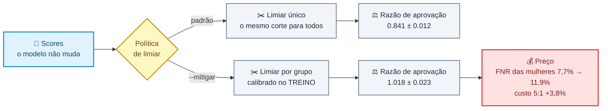

# ⚖️ Mitigação da disparidade

[⬅️ README](../README.md) · [Dados](dados-sinteticos.md) · [German Credit](german-credit.md) · [Modelo](modelo.md) · [Métricas](metricas.md) · [Validação cruzada](validacao-cruzada.md) · **Mitigação** · [Inferência](inferencia.md) · [API](api.md) · [Testes](testes.md)

---

## ⚖️ Mitigação da disparidade

A [auditoria](german-credit.md#a-coluna-que-o-modelo-não-recebeu) mede a diferença entre os grupos e para aí. Isso deixa o problema **documentado e intacto** — e um relatório que só descreve o próprio viés não é diferente, na prática, de não ter medido nada.

Esta seção age sobre o número. O lugar mais barato de agir é **depois** do modelo, no limiar: nenhum peso muda, nenhum treino é refeito, os *scores* continuam exatamente os mesmos. O que se move é **onde cada grupo é cortado**.



### O mecanismo

O limiar único marca uma fração `r` do conjunto inteiro. A mitigação pede que **cada grupo marque essa mesma fração `r`** — e para isso calcula, dentro de cada grupo, o corte que produz aquela taxa:

```javascript
const rateThreshold = (scores, rate) => {
  const sorted = [...scores].sort((first, second) => second - first);
  const marked = Math.round(rate * sorted.length);

  if (marked <= 0) return Infinity;   // marcar ninguém
  if (marked >= sorted.length) return 0;   // marcar todo mundo

  return (sorted[marked - 1] + sorted[marked]) / 2;
};

const fitGroupThresholds = (customers, scores, threshold) => {
  const rows = toAuditRows(customers, scores);
  const rate = safeDivide(
    rows.filter(({ score }) => score >= threshold).length,
    rows.length,
  );
  const thresholdOf = (female) => rateThreshold(
    rows.filter((row) => row.female === female).map(({ score }) => score),
    rate,
  );

  return { women: thresholdOf(true), men: thresholdOf(false) };
};
```

O corte cai no **ponto médio** entre a última linha marcada e a primeira que fica de fora. Escolher uma das pontas faria um *score* novo, chegando exatamente sobre a fronteira, decidir a própria sorte por um empate. Empate de verdade não tem saída: se os dois vizinhos têm o mesmo *score*, o ponto médio é esse valor e o `>=` marca os dois — a fração pedida vira um **piso**, e há teste fixando esse comportamento.

> ⚠️ Os clientes passados a `fitGroupThresholds` precisam ser os de **treino**. Calibrar no mesmo conjunto que será auditado devolve paridade por construção: a razão sai exatamente `1.000` — há um teste que fixa isso — e não significa absolutamente nada, porque a régua foi ajustada às respostas da prova. Calibrando fora, o número honesto é `1.0184` ± 0.0233.

### O que ele corrige

Auditar 200 clientes não dá para responder a essa pergunta — o `N` feminino do *hold-out* é 66. Então a medição usa a [validação cruzada](validacao-cruzada.md#-validação-cruzada-e-split-estratificado) do próprio projeto, **5 dobras repetidas 10 vezes**: todo cliente recebe um *score* de um modelo que não o viu no treino, e a auditoria roda sobre os **1.000** de uma vez. Os limiares de cada dobra saem das outras quatro.

| | Sem mitigação | Limiar por grupo |
| --- | ---: | ---: |
| **Razão de aprovação** | `0.8408` ± 0.0122 | **`1.0184`** ± 0.0233 |
| Distância da paridade (`\|razão − 1\|`) | `0.1592` ± 0.0122 | **`0.0577`** ± 0.0146 |
| Repetições fora de `0.80`–`1.25` | **2 de 10** | **0 de 10** |
| Mulheres marcadas ALTO | 69,5% ± 1,0 | 65,1% ± 1,1 |
| Homens marcados ALTO | 63,7% ± 1,0 | 65,6% ± 1,1 |
| Acurácia no limiar | `0.5917` ± 0.0069 | `0.5856` ± 0.0074 |

A correção **funciona**: a distância da paridade cai quase três vezes, e as duas repetições que violavam a regra dos quatro quintos deixam de violar. A acurácia mal se mexe — a diferença entre as duas colunas é menor que um erro padrão.

É o mesmo número que `npm run cv` imprime no fim da execução, com as duas auditorias lado a lado.

### O que ele custa

Nenhuma dessas duas linhas aparece na razão de aprovação, e as duas são o preço:

| | Sem mitigação | Limiar por grupo |
| --- | ---: | ---: |
| **FNR mulheres** (mau pagador que escapa) | `0.0771` ± 0.0061 | **`0.1193`** ± 0.0080 |
| **FNR homens** | `0.0953` ± 0.0064 | `0.0890` ± 0.0068 |
| Custo `5:1` nos 1.000 | `514.7` ± 4.8 | `534.4` ± 6.5 |

Antes da mitigação os dois grupos tinham a **mesma** taxa de inadimplente não pego (`7,7%` contra `9,5%`, a menos de dois erros padrão). Depois, a das mulheres sobe para `11,9%` e a dos homens cai para `8,9%` — a diferença passa a ser de três erros padrão, na direção oposta. A conta de erro sobe 3,8%.

Isso não é defeito de implementação — é o **teorema da impossibilidade** aparecendo em números. As taxas-base reais diferem (35,2% das mulheres do arquivo são inadimplentes contra 27,7% dos homens), e com taxas-base diferentes **paridade demográfica e igualdade de erros não podem valer ao mesmo tempo**. Igualar a aprovação exige desigualar o erro. O laboratório não escolhe qual dos dois critérios importa; ele mostra que escolher um é abrir mão do outro.

### Por que o padrão é desligado

Dois motivos, e o segundo é medido.

**Primeiro: a correção precisa LER o atributo protegido.** Para aplicar um corte diferente às mulheres é preciso saber quem são as mulheres — a mesma coluna que o modelo foi proibido de ver volta, agora na hora de decidir. Não há como escapar disso: corrigir uma diferença entre grupos exige conhecer o grupo. Em vários países usar sexo na decisão de crédito é ilegal **mesmo quando a intenção declarada é reduzir a diferença**. Ligar isso é decisão de política, não de engenharia, e o projeto não a toma sozinho.

**Segundo: na divisão que o projeto usa, a correção não transfere.** Repetindo a medição sobre o recorte real de `npm start` — 200 clientes auditados, 15 divisões:

| | Sem mitigação | Limiar por grupo |
| --- | ---: | ---: |
| Razão de aprovação | `0.9219` ± 0.0441 | `1.1537` ± 0.0782 |
| Distância da paridade | `0.1477` ± 0.0286 | **`0.2398`** ± 0.0608 |
| Divisões fora de `0.80`–`1.25` | 2 de 15 | **6 de 15** |
| FNR mulheres | `0.0812` ± 0.0143 | `0.1244` ± 0.0173 |
| Custo `5:1` | `96.5` ± 3.5 | `102.6` ± 3.5 |

**A mitigação piora o número que ela existe para melhorar** — a distância média da paridade sobe 60%, e as divisões fora da faixa dos quatro quintos passam de duas para seis. E o motivo não é o método: é o tamanho da amostra. O limiar feminino é um quantil estimado sobre ~250 mulheres do treino e aplicado a ~66 do teste, num ponto de operação em que dois terços de todo mundo é marcado — a taxa de *aprovação* que a regra dos 4/5 divide fica na casa dos 33%, e a razão de dois números pequenos balança muito. A correção acerta a direção e erra a dose, com sinal trocado: `1.15` em vez de `0.93`.

> 🔬 A conclusão não é "mitigação não funciona". É que **uma correção só pode ser aplicada onde pode ser medida** — e 66 pessoas não medem uma taxa com precisão suficiente para calibrar nada. Com os 1.000 clientes da validação cruzada, o mesmo código funciona.

Rodar com a política ligada é um argumento de distância:

```bash
npm start -- --mitigar
```

```text
Mitigação (limiares calibrados no TREINO, auditados no teste):
Política         | Limiar M | Limiar H | Razão aprov. | Acurácia | Custo
-----------------+----------+----------+--------------+----------+------
Limiar único     |   0.2591 |   0.2591 |        0.888 |   0.6700 |   102
Limiar por grupo |   0.2806 |   0.2396 |        1.032 |   0.6600 |   108
Política ativa: limiar por grupo — a decisão lê o sexo do cliente.
```

As duas linhas aparecem **sempre**, com ou sem a flag. A tabela sem a coluna de custo contaria meia história: a razão de aprovação sempre melhora quando se ajusta o limiar para ela — a pergunta é o que se perdeu no caminho.

### Por que a disparidade existe

A auditoria mostra *que* o modelo separa os grupos sem ter recebido a coluna. Dá para medir **quanto** o sexo vaza pelas outras 19: basta treinar a mesma rede, com a mesma configuração, para prever o **sexo** a partir das features que ela recebe.

**AUC = `0.6990` ± 0.0105.** Não é um vazamento total (`1.0`), mas está longe do acaso (`0.5`): idade, moradia, tempo de emprego e valor do crédito carregam o sinal, e a rede o recompõe sozinha. É *fairness through unawareness* falhando com um número em cima.

E o viés é **estimável fora da amostra** — o que explica por que o método funciona quando há dado suficiente. A diferença média de *score* entre os grupos é `0.0342` ± 0.0016 no treino e `0.0323` ± 0.0018 fora dele: praticamente o mesmo valor. O que não transfere na divisão pequena não é o viés; é o **quantil** usado para corrigi-lo.

### O que isso não conserta

O limiar por grupo iguala a taxa de aprovação. Ele não toca em nada do que está **antes**:

- **Os rótulos.** Se o `risk = 1` de 1994 já reflete decisões de crédito enviesadas, o alvo do treino vem contaminado — e nenhuma política de corte conserta um rótulo errado.
- **As taxas-base.** A diferença de 7,5 pontos entre os grupos continua no arquivo depois da mitigação, porque ela é do dado, não do modelo.
- **Os proxies.** A AUC de `0.699` para prever sexo não muda: o modelo continua reconstruindo o atributo. A mitigação compensa o efeito no fim da linha, não remove a causa.
- **A escolha do critério.** Igualar aprovação foi uma decisão. Igualar FNR seria outra, produziria outra tabela, e as duas não podem valer juntas.

> 🔬 E nada disso sai por acidente de outra escolha: a [regularização](modelo.md#-regularização-l2-e-dropout), medida nas mesmas 15 divisões, [não move a razão de aprovação](german-credit.md#um-número-só-não-basta) — `0.8995` ± 0.0460 sem os freios contra `0.9219` ± 0.0441 com eles. Disparidade não é *overfitting*, e não sai pelo mesmo remédio.

---

[⬅️ Voltar ao README](../README.md)
