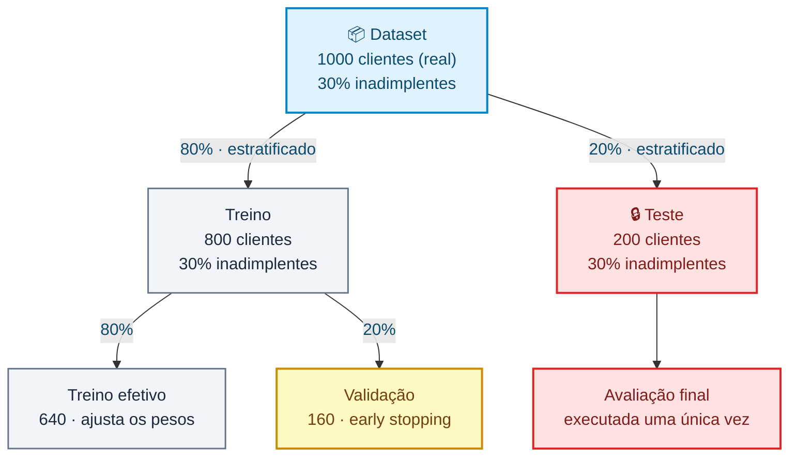

# 🧠 O modelo: arquitetura, regularização e treinamento

[⬅️ README](../README.md) · [Dados](dados-sinteticos.md) · [German Credit](german-credit.md) · **Modelo** · [Métricas](metricas.md) · [Validação cruzada](validacao-cruzada.md) · [Mitigação](mitigacao.md) · [Inferência](inferencia.md) · [Serviço](servico.md) · [API](api.md) · [Testes](testes.md)

---

## 🧠 Arquitetura da rede

Uma **MLP** com duas camadas ocultas:


As duas camadas em âmbar **não têm peso nenhum** e só existem durante o treino — o que elas fazem, e por que a contagem de parâmetros não muda por causa delas, está em [Regularização](#-regularização-l2-e-dropout).

Total: **1.073 parâmetros treináveis** no dataset real com one-hot (**465** na variante ordinal, **225** no sintético) — é o que o `model.summary()` imprime ao rodar.

> ⚠️ São 1.073 parâmetros para **640 linhas** de treino efetivo. Essa razão é desconfortável, e é o que motivou o item de [regularização](#-regularização-l2-e-dropout) — cuja medição, adiante, chega a uma conclusão menos confortável ainda.

A largura da entrada é o **único** ponto da rede que depende do dataset; a topologia é um argumento como qualquer outro:

```javascript
const HIDDEN_UNITS = [16, 8];

const buildModel = (inputSize = 4, options = {}) => {
  const {
    units = HIDDEN_UNITS,
    l2 = L2_LAMBDA,
    dropout = DROPOUT_RATE,
  } = options;
  const model = tf.sequential();

  const addHidden = (count, shape = {}) => {
    model.add(tf.layers.dense({
      ...shape,
      units: count,
      activation: 'relu',
      kernelRegularizer: createRegularizer(l2),
    }));

    if (dropout > 0) {
      model.add(tf.layers.dropout({ rate: dropout }));
    }
  };

  // A primeira camada é a única que declara o formato da entrada.
  units.forEach((count, index) => addHidden(
    count,
    index === 0 ? { inputShape: [inputSize] } : {},
  ));

  // A saída não leva dropout: descartar a única unidade que produz a
  // resposta não removeria um caminho redundante — apagaria a predição.
  //
  // Com `units: []` não há camada oculta nenhuma, e é a saída que passa
  // a declarar a entrada. O que sobra é uma regressão logística.
  model.add(tf.layers.dense({
    ...(units.length === 0 ? { inputShape: [inputSize] } : {}),
    units: 1,
    activation: 'sigmoid',
    kernelRegularizer: createRegularizer(l2),
  }));

  return compileModel(model);
};
```

| Escolha       | Por quê                                                                                   |
| ------------- | ----------------------------------------------------------------------------------------- |
| **ReLU**      | Introduz não-linearidade barata e evita o desaparecimento de gradiente das camadas ocultas |
| **Sigmoid**   | Garante uma saída em `[0, 1]`, legível como probabilidade                                  |
| **16 → 8**    | Funil, e a topologia de **menor custo médio** numa [comparação de oito](#-comparando-arquiteturas) em que nenhuma se distingue das outras em acurácia |
| **L2 + dropout** | Os dois freios contra decorar, [medidos em uma grade de 30 combinações](#-regularização-l2-e-dropout) |

```javascript
const model = buildModel(source.featureNames.length, { units, l2, dropout });   // 4, 19 ou 57
```

O `main()` chama `model.summary()` logo após construir o modelo, então a contagem de parâmetros por camada aparece no início de cada execução. E a topologia é escolhível pela linha de comando — `node index.js --units=64,32` —, o que existe para que a próxima pergunta possa ser respondida com medida em vez de convenção.

---

## 🔬 Comparando arquiteturas

"Qual arquitetura usar?" é a pergunta que mais se responde por **hábito** em projetos de rede neural: duas camadas ocultas, umas dezenas de unidades, afunilando. Num projeto que mede a normalização, o limiar e a dose de regularização, responder essa por costume seria a única exceção — então ela também é medida, com a mesma validação cruzada que mede o resto.

```bash
npm run arquiteturas                        # 8 topologias × 5 dobras = 40 treinos
node index.js --arquiteturas --repeticoes=3 # o triplo de medidas, com sementes diferentes
npm run arquiteturas:synthetic              # a mesma comparação no dataset sintético
```

A lista começa **deliberadamente no piso**. Uma regressão logística (`--units=0`) não é rede neural nenhuma: é uma soma ponderada das 57 features passando por uma sigmoide, 58 parâmetros ao todo. Se as camadas ocultas não baterem essa linha reta, elas não estão pagando o próprio custo — e "não estão" é uma resposta possível.

```text
Arquitetura         | Parâmetros | Épocas |        Acurácia |             AUC |       Custo
--------------------+------------+--------+-----------------+-----------------+------------
regressão logística |         58 |   40.0 | 0.7330 ± 0.0153 | 0.7692 ± 0.0158 | 100.2 ± 3.7
4                   |        237 |   39.0 | 0.7320 ± 0.0187 | 0.7697 ± 0.0235 |  98.2 ± 5.9
16                  |        945 |   28.4 | 0.7510 ± 0.0148 | 0.7779 ± 0.0193 | 100.2 ± 4.5
16 → 8 (padrão)     |       1073 |   28.4 | 0.7480 ± 0.0123 | 0.7812 ± 0.0154 |  94.4 ± 3.4
32 → 16             |       2401 |   21.4 | 0.7490 ± 0.0154 | 0.7802 ± 0.0178 |  97.6 ± 3.9
64 → 32             |       5825 |   19.4 | 0.7610 ± 0.0148 | 0.7760 ± 0.0189 | 101.6 ± 5.9
128 → 64            |      15745 |   12.0 | 0.7450 ± 0.0135 | 0.7797 ± 0.0184 |  98.8 ± 4.5
16 → 16 → 16        |       1489 |   22.8 | 0.7510 ± 0.0113 | 0.7776 ± 0.0177 |  96.8 ± 5.7

Baseline da classe majoritária: 0.7000
Protocolo: 5 dobras × 1 repetição(ões) = 5 medidas por arquitetura.
```

### O resultado é um empate

A regra para ler a tabela está impressa embaixo dela: **duas arquiteturas só se distinguem se a distância entre elas superar a soma dos erros padrão.** Aplicada aqui, ela não separa nada.

O extremo mais favorável a "rede maior é melhor" é comparar a pior acurácia com a melhor:

| | Acurácia | Erro padrão |
| --- | ---: | ---: |
| `4` (a pior) | 0.7320 | ± 0.0187 |
| `64 → 32` (a melhor) | 0.7610 | ± 0.0148 |
| **distância** | **0.0290** | **soma: 0.0335** |

A distância não cobre nem a soma dos erros. Se o par mais distante da tabela não se distingue, **nenhum par se distingue** — em acurácia, em AUC e em custo, as oito são a mesma medida vista oito vezes.

E aí está o número que vale o comando inteiro: **58 parâmetros empatam com 15.745.** Uma regressão logística sem camada oculta nenhuma entrega a mesma acurácia que uma rede com 271× mais parâmetros. As camadas ocultas deste projeto não estão pagando o próprio custo, e a razão é a mesma que aparece em todo o resto da documentação: **o gargalo são as 1.000 linhas, não a capacidade.**

### O que muda de verdade é quando o treino para

A única coluna que se move de forma sistemática é a das épocas:

```text
regressão logística   40.0 épocas   ← nunca acionou o early stopping
16 → 8                28.4
32 → 16               21.4
64 → 32               19.4
128 → 64              12.0          ← para em menos de um terço do tempo
```

Quanto mais capacidade, **mais cedo o early stopping corta** — porque mais capacidade decora mais rápido, a `val_loss` vira mais cedo, e a paciência de 5 épocas se esgota antes. A rede de 15.745 parâmetros não é interrompida por ser boa; é interrompida por começar a decorar na época 7.

O outro extremo diz o contrário e é honesto registrar: a regressão logística rodou as **40 épocas inteiras** sem nunca acionar a parada. Ela não convergiu — ela ficou sem orçamento. O empate dela com as outras é um empate com o treino truncado; dar-lhe mais épocas é um experimento que este comando ainda não faz.

### Então por que o padrão continua sendo 16 → 8

Empate em acurácia não é empate em tudo. `16 → 8` tem o **menor custo médio** da tabela (94.4 ± 3.4) e o menor erro padrão junto — e custo, não acurácia, é a métrica que este projeto otimiza, porque é ela que carrega o `FN = 5 × FP` da [matriz oficial do dataset](metricas.md#-ajuste-do-limiar-de-decisão).

Mesmo isso é frágil: 94.4 ± 3.4 contra 101.6 ± 5.9 do `64 → 32` é uma distância de 7.2 contra uma soma de erros de 9.3. **Também não se distingue.** O que a tabela autoriza a dizer é mais modesto do que "16 → 8 é a melhor":

> Entre oito topologias indistinguíveis, a escolhida é uma das menores, tem o melhor ponto estimado de custo e a menor dispersão. Na ausência de diferença medida, **o critério que sobra é o custo de manutenção** — e 1.073 parâmetros são mais baratos de treinar, servir e explicar que 15.745.

### Os limites desta medição

Três, e nenhum é detalhe:

- **5 medidas por arquitetura** é pouco. `--repeticoes=3` triplica para 15, com sementes de embaralhamento diferentes a cada repetição — repetir com a mesma semente mediria só a variação dos pesos iniciais, que já se sabe ser pequena perto da variação do sorteio.
- **A dose de regularização é a mesma para todas.** `L2 0.003` e `dropout 0.2` foram [escolhidos na grade](#-regularização-l2-e-dropout) *para a topologia padrão*. Uma rede de 15.745 parâmetros provavelmente pede uma dose maior, e comparar capacidades com um freio calibrado para uma delas favorece essa uma.
- **Escolher e medir no mesmo protocolo.** É a mesma limitação que o README já registra para o limiar e para a grade de regularização: o certo seria escolher a topologia num conjunto e reportá-la em outro. Aqui a comparação e a conclusão saem das mesmas 5 dobras.

Nenhum dos três muda a leitura principal — um empate tão largo não vira diferença com mais dobras —, mas os três mudam o que se pode afirmar sobre **qual** topologia é a melhor. A resposta medida é: por enquanto, nenhuma.

---

## 🛡️ Regularização: L2 e dropout

O modelo real tem **1.073 parâmetros para 640 linhas** de treino efetivo. Com mais parâmetros do que exemplos, decorar é o caminho mais barato para baixar o erro — e a conta chega no teste, não no treino.

Isso não é uma suspeita: dá para medir. Cada execução agora imprime as duas acurácias e a distância entre elas — abaixo, uma rodada de `node index.js --l2=0 --dropout=0`, que é a rede como ela era antes deste item:

```text
Train accuracy: 0.8025
Test accuracy: 0.7000
Diferença treino − teste: 0.1025
```

O modelo vai **10 pontos melhor no que já viu**. Essa diferença é o termômetro do *overfitting*, e é o número que os dois freios deste item existem para encolher.

### Os dois freios

| Freio       | O que faz                                            | Como                                                     |
| ----------- | ---------------------------------------------------- | -------------------------------------------------------- |
| **L2**      | Encarece pesos grandes                                | Soma `λ·Σw²` à loss do treino — o peso só sobrevive se render redução de erro suficiente para pagar a multa |
| **Dropout** | Impede que uma unidade dependa de uma vizinha específica | Desliga uma fração das unidades ocultas a cada passo, forçando a informação a ficar distribuída |

São ataques diferentes ao mesmo problema. O L2 **achata** os pesos de forma contínua, sem zerar nenhum; o dropout **quebra** as dependências entre unidades, sem tocar na magnitude.

```javascript
const createRegularizer = (l2 = L2_LAMBDA) =>
  (l2 > 0 ? tf.regularizers.l2({ l2 }) : null);
```

Três detalhes de implementação que mudam como o resto do projeto se lê:

1. **Dropout não tem parâmetro nenhum.** O `model.summary()` continua fechando em `1073`. Ele não acrescenta capacidade — só tira capacidade de uso durante o treino.

2. **Dropout está desligado na inferência.** `predict` e `evaluate` rodam em modo de avaliação, então duas predições do mesmo cliente dão o mesmo número. É por isso que a acurácia que o `fit` imprime época a época é **pessimista**: ela é medida com as unidades caindo. As duas acurácias que o `main` compara vêm ambas de `evaluate`, com o dropout desligado nas duas — é a comparação justa.

3. **No tfjs, a penalidade L2 entra na loss do treino, mas não na `val_loss` nem no `evaluate`.** Medido, não suposto: com os *mesmos pesos*, `evaluate` devolve exatamente a mesma loss com e sem regularizador. Duas consequências boas — o `Test loss` impresso continua sendo binary cross-entropy pura, comparável com o de antes deste item; e o [early stopping](#-early-stopping) continua monitorando generalização, não a multa.

A saída não leva dropout. Descartar a única unidade que produz a resposta não removeria um caminho redundante — apagaria a predição.

### A grade inteira

Os valores não vieram de convenção. Foram medidos: **6 valores de λ × 5 taxas de dropout**, 15 divisões cada, 450 treinos.

Primeiro a diferença treino − teste, que é o alvo declarado:

```text
diferença treino − teste          dropout
      λ    |   0.0     0.1     0.2     0.3     0.5
-----------+------------------------------------------
  0        | 0.0640  0.0584  0.0530  0.0574  0.0251
  0.0003   | 0.0588  0.0546  0.0594  0.0426  0.0173
  0.001    | 0.0547  0.0592  0.0556  0.0537  0.0183
  0.003    | 0.0501  0.0487  0.0491  0.0443  0.0297
  0.01     | 0.0361  0.0335  0.0288  0.0183 -0.0004
  0.03     | 0.0019  0.0000  0.0000  0.0000  0.0000
```

**Funciona exatamente como a teoria promete.** A diferença cai descendo a tabela (mais L2) e andando para a direita (mais dropout), e no canto inferior direito ela **zera** — o modelo passa a ir exatamente igual nos dois conjuntos. Guarde esse `0.0000` exato; ele volta duas subseções abaixo, e não significa o que parece.

Agora a AUC, que é a métrica que mede se o modelo presta:

```text
AUC (erro padrão típico: ±0.0085)   dropout
      λ    |   0.0     0.1     0.2     0.3     0.5
-----------+------------------------------------------
  0        | 0.7771  0.7760  0.7738  0.7714  0.7702
  0.0003   | 0.7742  0.7736  0.7709  0.7734  0.7722
  0.001    | 0.7752  0.7723  0.7750  0.7720  0.7756
  0.003    | 0.7741  0.7747  0.7726  0.7737  0.7700
  0.01     | 0.7757  0.7760  0.7738  0.7748  0.7731
  0.03     | 0.7714  0.7722  0.7694  0.7699  0.7680
```

**Nada acontece.** A grade inteira cabe entre `0.7680` e `0.7771` — uma faixa de `0.009`, pouco mais de **um** erro padrão. Trinta configurações, da rede solta à rede estrangulada, e nenhuma se distingue de nenhuma.

As duas tabelas juntas são o resultado deste item: **os freios encolheram a diferença de `0.0640` até zero sem mover a AUC um milímetro.**

### Por que `0.003` e `0.2`

Escolher a célula com a maior AUC de uma grade de 30 seria escolher ruído — a diferença entre a melhor e a pior não sobrevive ao erro padrão, e o "melhor" mudaria com outras 15 sementes. O critério honesto é o objetivo declarado do item: **encolher a diferença sem pagar por isso em outro lugar**.

| Configuração | Treino | Teste | Diferença | AUC | Custo mínimo |
| ------------ | -----: | ----: | --------: | --: | -----------: |
| `λ=0`, `drop=0` — sem freio | `0.8110` | `0.7470` | `0.0640` | `0.7771` | `96.9` |
| `λ=0`, `drop=0.2` — só dropout | `0.7950` | `0.7420` | `0.0530` | `0.7738` | `96.8` |
| `λ=0.003`, `drop=0` — só L2 | `0.7938` | `0.7437` | `0.0501` | `0.7741` | `97.3` |
| **`λ=0.003`, `drop=0.2` — o padrão** | `0.7954` | `0.7463` | **`0.0491`** | `0.7726` | `96.9` |
| `λ=0.03`, `drop=0.3` — exagero | `0.7000` | `0.7000` | `0.0000` | `0.7699` | `96.1` |

O padrão escolhido corta a diferença em **23%** (`0.0640` → `0.0491`) com acurácia e AUC indistinguíveis das de antes. Não é uma vitória; é a ausência de uma derrota, que era o máximo disponível.

E repare na última linha, porque ela é o melhor achado da tabela.

### Quando o modelo desiste e mesmo assim melhora

Com `λ = 0.03` a rede é esmagada: a diferença treino − teste vira **exatamente** `0.0000` — não "próximo de zero", zero mesmo, com erro padrão `0.0000` nas quinze divisões. E a acurácia de treino e a de teste saem as duas em `0.7000`, que é o piso da classe majoritária cravado. No limiar `0.5` esse modelo **não marca ninguém como inadimplente**. Como classificador, ele desistiu.

Um `0.0000` com erro padrão zero em quinze execuções não é convergência: é o mesmo modelo degenerado toda vez.

Não é figura de linguagem — foi conferido em cinco divisões:

```text
λ = 0     | marcados ALTO em 200 clientes: 40, 62, 43, 52, 37 | probabilidades 0.0086..0.9364 | AUC 0.7724
λ = 0.03  | marcados ALTO em 200 clientes:  0,  0,  0,  0,  0 | probabilidades 0.1883..0.4349 | AUC 0.7644
```

E aqui está o achado: as outras duas métricas **não desabaram junto**. A AUC fica em `0.7699` contra `0.7771` da rede solta, e o custo no limiar escolhido fica em `96.1` contra `96.9` — os dois indistinguíveis, dentro de um erro padrão.

Não há contradição. As probabilidades foram todas comprimidas para perto da taxa base e nenhuma cruza `0.5` — mas a **ordem** entre elas sobreviveu intacta, e é a ordem que a AUC mede. Um modelo que ordena bem e nunca cruza o limiar não é um modelo inútil: é um modelo com o corte no lugar errado, e [o corte é ajustável](metricas.md#-ajuste-do-limiar-de-decisão). Três números sobre o mesmo modelo — acurácia igual ao baseline, AUC intacta, custo intacto — e só o primeiro diz "desistiu".

É a mesma lição que a [matriz de confusão](metricas.md#-matriz-de-confusão), a [ROC](metricas.md#-curva-roc-e-auc) e o [desbalanceamento](dados-sinteticos.md#o-que-cada-botão-fez-com-as-métricas) já tinham ensinado, agora por um quarto caminho independente: **acurácia e capacidade de ordenar são coisas diferentes, e só uma delas paga a conta.**

### Cada dataset pede uma dose diferente

Se a mesma configuração ajuda um dataset e atrapalha outro, ela não é uma constante do laboratório — é uma propriedade da **fonte**. E as três fontes do projeto formam uma escala limpa:

| Fonte | Parâmetros | Linhas de treino | Razão | Diferença sem freio | Com freio | `\|w\|` médio sem → com |
| ----- | ---------: | ---------------: | ----: | ------------------: | --------: | ---------------------: |
| sintético  |   `225` | `768` | `0,3` | `0.0029` | `0.0032` | `0.4340` → `0.3162` |
| ordinal    |   `465` | `640` | `0,7` | `0.0260` | `0.0180` | `0.3171` → `0.2134` |
| one-hot    | `1.073` | `640` | `1,7` | `0.0527` | `0.0432` | `0.2961` → `0.2113` |

*(a coluna "com freio" aplica `λ = 0.003` e `dropout = 0.2` nas três fontes, para que a comparação seja da mesma dose. É o que as duas fontes do German passaram a usar; o sintético ficou com os freios desligados justamente por causa desta tabela.)*

O *overfitting* cresce com a razão parâmetros/linhas — `0.0029`, `0.0260`, `0.0527` — exatamente como se espera. E o L2 corta a magnitude média dos pesos em cerca de **30%** nos três casos: o mecanismo é o mesmo, o que muda é haver ou não algo para ele corrigir. No sintético ele achata os pesos igual e a diferença não se mexe, porque não havia diferença para encolher.

Por isso a regularização passou a ser declarada pela fonte, ao lado de tudo mais que muda de um dataset para o outro:

```javascript
const SYNTHETIC_SOURCE = {
  // ...
  // 225 parâmetros para 768 linhas: a capacidade já cabe no dado.
  regularization: { l2: 0, dropout: 0 },
};
```

A linha de comando continua tendo a última palavra — `--l2=` e `--dropout=` sobrescrevem o que a fonte declara, e o que não for passado fica como está:

```javascript
const { l2, dropout } = { ...source.regularization, ...overrides };
```

Ligar os freios do dataset real no sintético é um comando: `npm run start:synthetic -- --l2=0.003 --dropout=0.2`. A tabela acima diz o que vai acontecer.

### O que a regularização não conserta

Encolher a diferença treino − teste não trouxe generalização nenhuma. Vale entender por quê, porque o motivo é mais interessante que o resultado.

1. **O early stopping já estava fazendo o trabalho.** Ele entrou no projeto muito antes deste item e é, ele próprio, um regularizador: interrompe o treino no momento em que a `val_loss` para de melhorar, ou seja, exatamente quando decorar começaria a valer a pena. L2 e dropout chegaram para frear um carro que já estava freando.

2. **O teto é do dado, não do modelo.** A AUC de ~`0.78` é o que a literatura reporta para o German Credit com praticamente qualquer método. Nem [codificação correta](german-credit.md#one-hot-melhorou-o-modelo-não), nem 11 colunas a mais, nem agora regularização moveram esse número — três tentativas independentes esbarrando no mesmo limite. A conclusão é sobre o dataset.

3. **Overfitting é um diagnóstico, não uma condenação.** A diferença de 5 pontos (`0.0527` na média de 15 divisões) era real e mensurável. Ela simplesmente não estava *custando* nada de mensurável no teste — o que a rede decorou a mais não estava atrapalhando o que ela tinha aprendido.

Mas os freios funcionam, e dá para provar sem depender do dataset. Basta dar a eles um caso onde há de fato o que frear:

Uma rede propositalmente grande demais — `128 → 64`, **15.745 parâmetros** para as mesmas 640 linhas:

| `128 → 64`             | Épocas | Treino   | Teste    | Diferença | AUC      |
| ---------------------- | -----: | -------: | -------: | --------: | -------: |
| sem freio              | `12.5` | `0.8524` | `0.7427` | `0.1097`  | `0.7766` |
| só L2 (`0.003`)        | `14.6` | `0.8210` | `0.7417` | `0.0793`  | `0.7785` |
| só dropout (`0.2`)     | `13.3` | `0.8390` | `0.7470` | `0.0920`  | `0.7755` |
| os dois                | `15.0` | `0.8047` | `0.7500` | `0.0547`  | `0.7797` |
| os dois, forte         | `25.9` | `0.7000` | `0.7000` | `0.0000`  | `0.7694` |

A diferença cai de `0.1097` para `0.0547` — metade — e **cada freio sozinho já morde**: `0.0793` só com L2, `0.0920` só com dropout. Repare também na coluna de épocas: sem freio o early stopping desiste na **12ª** época; com os freios o treino segue mais longe, porque demora mais para a `val_loss` parar de melhorar.

A última linha é a mesma desistência da subseção anterior, agora com quinze vezes mais parâmetros: dose forte demais, e a rede volta a prever a classe majoritária para todo mundo — treino e teste em `0.7000` cravados.

E a AUC continua parada em `0.77` em todas as cinco linhas. Uma rede com **quinze vezes** mais parâmetros, com e sem regularização, chega ao mesmo lugar.

E no dataset **sintético**, onde a capacidade já cabe no dado, aplicar os mesmos freios **cobra**:

| Sintético, 225 parâmetros | Diferença | AUC | Custo mínimo |
| ------------------------- | --------: | --: | -----------: |
| 15 divisões, sem freio    | `0.0029` | `0.9718` ± 0.0028 | `23.7` ± 1.7 |
| 15 divisões, com os freios do real | `0.0032` | `0.9658` ± 0.0035 | `28.6` ± 2.4 |
| divisão fixa, sem freio   | `-0.0105` | `0.9749` ± 0.0005 | `18.4` ± 0.6 |
| divisão fixa, com os freios do real | `-0.0076` | `0.9682` ± 0.0013 | `26.7` ± 1.4 |

Não havia o que frear — a diferença já era indistinguível de zero — e frear **cobrou**: `21%` a mais de custo mínimo nas 15 divisões, `45%` na divisão fixa, com a AUC caindo em ambas. Na divisão fixa, onde só a inicialização varia e o erro padrão é dez vezes menor, a queda de AUC é de cinco erros padrão: `0.9749` → `0.9682`. É por isso que a fonte sintética declara os freios desligados.

Três desfechos diferentes, todos coerentes com a mesma explicação: **regularização paga onde há capacidade sobrando, e cobra onde não há.** O German Credit com 1.073 parâmetros fica no meio-termo desconfortável em que ela não faz mal nem faz bem.

> 🔬 Para reproduzir: `node index.js --l2=0 --dropout=0` desliga os dois freios e devolve exatamente a rede de antes deste item. A diferença treino − teste que o programa imprime volta a abrir.

---

## ⚙️ Treinamento

```javascript
model.compile({
  optimizer: tf.train.adam(0.001),
  loss: 'binaryCrossentropy',
  metrics: ['accuracy'],
});

await model.fit(xTrain, yTrain, {
  epochs: 40,
  batchSize: 32,
  validationSplit: 0.2,
  shuffle: true,
  callbacks: [
    tf.callbacks.earlyStopping({ monitor: 'val_loss', patience: 5 }),
  ],
});
```

| Parâmetro            | Valor                  | Papel                                                            |
| -------------------- | ---------------------- | ---------------------------------------------------------------- |
| **Optimizer**        | Adam (`lr = 0.001`)    | Ajusta os pesos com taxa de aprendizado adaptativa por parâmetro  |
| **Loss**             | `binaryCrossentropy`   | Função de erro padrão para classificação binária (`0` ou `1`)     |
| **Métrica**          | `accuracy`             | Percentual de acertos — legível para humanos, não usada no treino |
| **Epochs**           | 40 (máximo)            | Quantas vezes o dataset inteiro passa pela rede                   |
| **Batch size**       | 32                     | Exemplos processados antes de cada atualização de pesos           |
| **Validation split** | 20% do treino          | Fatia usada só para medir generalização durante o treino          |
| **Shuffle**          | `true`                 | Embaralha a cada época, evitando que a ordem vire um viés         |
| **L2**               | `λ = 0.003`            | Soma `λ·Σw²` à loss do treino: peso grande passa a custar caro     |
| **Dropout**          | `0.2`                  | Desliga 20% das unidades ocultas a cada passo — só durante o treino |

### ⏹️ Early Stopping

O treino monitora a `val_loss` e **para sozinho** se ela não melhorar por 5 épocas seguidas (`patience: 5`) — ou seja, raramente chega às 40 épocas.

É a defesa contra **overfitting**: o momento em que o modelo continua melhorando no treino enquanto piora na validação, porque passou a decorar exemplos em vez de aprender o padrão.

E é a **primeira** das três defesas do projeto, não a única — as outras duas são [L2 e dropout](#-regularização-l2-e-dropout). Vale registrar que ela já estava aqui antes delas, porque isso muda o que as outras duas ainda tinham para ganhar.

---

## 📊 Divisão dos dados



```javascript
// O corte cru — ainda exportado, e usado como contraste nos testes.
const splitCustomers = (customers, trainRatio = 0.8) => {
  const trainSize = Math.floor(customers.length * trainRatio);

  return {
    trainCustomers: customers.slice(0, trainSize),
    testCustomers: customers.slice(trainSize),
  };
};
```

O `main` não usa mais esse: usa a versão [estratificada](validacao-cruzada.md#-validação-cruzada-e-split-estratificado), que preserva a proporção de inadimplentes nos dois lados e faz o baseline do teste sair `0.7000` em qualquer sorteio. Três decisões estão embutidas na ordem das operações:

**1. Embaralhar antes de cortar.** Com dados sintéticos era indiferente — cada linha é sorteada de forma independente. Com dados reais não: um arquivo pode chegar ordenado por data, por agência ou pela própria classe, e um corte cru no meio separaria dois conjuntos que não representam a mesma população. O embaralhamento usa [semente fixa](german-credit.md#reprodutibilidade) para continuar reproduzível.

**2. Cortar antes de normalizar.** O split opera sobre clientes **brutos**, não sobre features já normalizadas. É o que permite medir a escala só no treino — se a normalização viesse antes, as estatísticas do teste já teriam vazado para dentro dela.

**3. Estratificar o corte.** Embaralhar acerta a proporção de classes em média e erra em cada execução. Estratificar acerta sempre — e o baseline, que é a régua de toda acurácia deste projeto, para de depender do sorteio.

```javascript
const customers = shuffle(await source.read(), createRandom(SHUFFLE_SEED));

const { trainCustomers, testCustomers } = stratifiedSplitCustomers(customers); // 1. corta
const scaler = source.fitScaler(trainCustomers);                               // 2. mede só o treino
```

A segunda divisão — treino efetivo vs. validação — não aparece aqui: quem faz é o próprio `model.fit()`, via `validationSplit: 0.2`.

O conjunto de **teste nunca participa do treinamento nem do early stopping**. Ele é a única medida honesta de como o modelo se comporta com dados que jamais viu, e a suíte de testes verifica que não há sobreposição entre as duas fatias.

---

[⬅️ Voltar ao README](../README.md)
